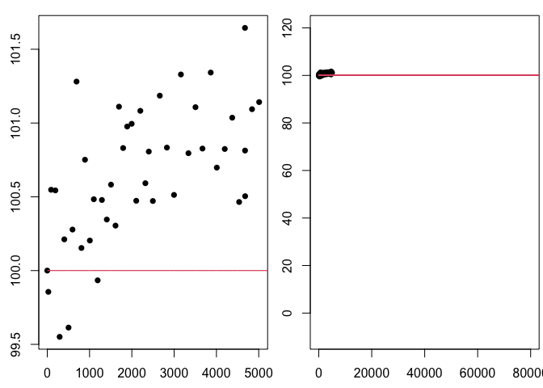

# Project Outline
This project outline and background information have been provided to assist you as you complete your project. You should assume the reader of your work has no knowledge or access to this information.  

How long does an LED light bulb last? Lumens are a measure of how much light you get from a bulb. When you first turn on an LED bulb, the lumen output slightly increases for a while, going above the initial brightness. While LEDs do not "burn out", after peaking the lumen output stays relatively constant before it starts to decrease in lumen output. In the bulb data we will use, lumen measures are normalized to the initial intensity of the bulb, so that we can compare different bulbs.  

In 2008, the US Department of Energy launched the Bright Tomorrow Lighting Prize (or L Prize) to encourage the development of high-efficiency replacement for the incandescent light bulb. To win the prize the bulb needed a lifetime longer than 25,000 hours (almost 3 years). [Source](https://en.wikipedia.org/wiki/L_Prize)  

We do not have three years of data on our bulbs so we will use mathematical models to predict the lifetime. Our work in this project relies on assumed mathematical models. We will (1) plot data provided, (2) explore how parameters change the behavior of several functions we will be using as models, (3) visually fit several deterministic models to data, and (4) use the fitted models to provide information about how long a LED bulb lasts. 

In this project, we'll be fitting the data to deterministic models, functions $f(t)$, that give the lumen output of LED bulbs (as a percent of the initial lumens) after $t$ hours. The input of the models is time, $t$, measured in hours since the bulb is turn on. The output of the models is bulb intensity, $f(t)$, measured as a percent of initial bulb intensity. By choosing to normalize bulb intensity in this way, we have fixed the initial output as 100\% of the original intensity, $f(0) = 100$. For this project, we will use 80\% of the initial intensity[^note] as the threshold for determining the lifetime of a light bulb. This means once the bulb intensity decreases below 80\% we will consider this the life of the bulb (in other words we will consider the bulb "burned out"). 


## Task 1: Background and Data
- Create an R Markdown file.
- Use the `seed=` argument in the `led_bulb()` function to set the seed and use the following code to read in the light bulb data.

```r
#Uncomment and run the line below once in the console to get the devtools package.
  #install.packages("devtools")

#Uncomment and run the line below once in the console to get the data4led package.
  #devtools::install_github("byuidatascience/data4led") 
    
#Use the code below to load the data4led package to your current R session.
    library(data4led)
    
#Use the code below to load the data for one randomly selected bulb. Enter the seed from the class list of seeds. Setting the seed fixes which randomly selected bulb you will be working with and makes your work reproducible.
    bulb <- led_bulb(1,seed = DDDD)
```

```
## Error in set.seed(seed): object 'DDDD' not found
```

This code creates a data frames is called "bulb". The bulb data frame contains measurements for one randomly selected bulb at many time points. You will need to set the seed so that you will have your own random, but reproducible, data with which to work. Please set the seed as the four digit number from the class list of assigned seeds.  
The bulb data frame, a table, includes the columns (1) "id", the identification number for your randomly selected bulb, (2) "hours", the number of hours since the bulb has turned on, (3) "intensity", the lumen output of the bulb, (4) "normalized_intensity", the lumen at that time divided by the lumen of your bulb at time 0, and (5) "percent_intensity", the bulb intenstity as a percent of the original lumen (notice the first row in this column is 100).  

- Use the `plot()` command in R to create a time vs. bulb intensity (as a percent of the original lumens) scatter plot for one light bulb. Make sure `hours` is on the horizontal axis ($x$-axis) and `percent_intensity` is on the vertical axis ($y$-axis). Use the bulb data frame.
    - **CHECK YOUR WORK:** Do you get a plot with 44 points? Is the horizontal axis from 0 to about 5000? Is the point $(0,100)$ on your plot?
- Organize your work into a **cohesive analysis** and submit it to Canvas.
    - All calculations are introduced with complete sentences (and paragraphs). Remember introductions come **BEFORE** (the calculation) and tell your reader what is coming.
    - All plots are introduced with complete sentences (and paragraphs). Remember introductions come **BEFORE** (the plot) and tell your reader what is coming.
    - All calculations are explained, interpreted, and described using complete sentences (and paragraphs). Explanations can come before or after a calculation, tell your reader what is important and what they should notice. Make connections and transitions.
    - All plots are explained, interpreted, and described using complete sentences (and paragraphs). Explanations can come before or after a plot, tell your reader what is important and what they should notice. Make connections and transitions.


## Task 2: Models and Parameter Exploration
- Create a new R Markdown file.
- Consider the following general models.
    - $f_0(x; a_0) = a_0$ where $x \geq 0$
    - $f_1(x; a_0,a_1) = a_0 + a_1x$ where $x \geq 0$
    - $f_2(x; a_0,a_1,a_2) = a_0 + a_1x + a_2x^2$ where $x \geq 0$
    - $f_3(x; a_0,a_1,a_2 ) = a_0 + a_1e^{-a_2x}$ where $x \geq 0$
    - $f_4(x; a_0,a_1,a_2) = a_0 + a_1x + a_2\ln(0.005x+1)$ where $x \geq 0$
    - $f_5(x; a_0,a_1,a_2) = (a_0+a_1x)e^{-a_2x}$ where $x \geq 0$

Notice that $f_0$ and $f_1$ could be considered submodels of $f_2$. What do we mean by submodel? Consider the model $f_2$ with $a_1 = 0$ and $a_2 = 0$ this is $f_0$. Similarly, the model $f_2$ with $a_2 = 0$ is $f_1$. Is is also true that $f_0$ could be called a submodel of $f_1$ with $a_1 = 0$.

- For each function, use the sliders in the Desmos files below to dynamically explore how changing the parameter changes the behavior of the function.
    - [Desmos file for function 0](https://www.desmos.com/calculator/zild585kv2)
    - [Desmos file for function 1](https://www.desmos.com/calculator/xwpdd6tfwa)
    - [Desmos file for function 2](https://www.desmos.com/calculator/sfm0h6cq1f)
    - [Desmos file for function 3](https://www.desmos.com/calculator/oazbfglkp2)
    - [Desmos file for function 4](https://www.desmos.com/calculator/fbdvpb9hdi)
    - [Desmos file for function 5](https://www.desmos.com/calculator/xx4kjeclv5)
- For each function, observe how changing the parameters changes the behavior of the function (or model). Try to summarize your observations in terms of transformations of functions (shifts, reflections, stretch) and the mathematical behavior of the function (increasing, decreasing, constant, positive, negative, nonnegative). Identify interesting parameter values (or ranges of values) where the behavior of function is different.

- From the functions $f_3$, $f_4$, and $f_5$, pick two functions to describe. In your narrative summarize your observations about the parameters ($a_0$, $a_1$ and $a_2$) in terms of transformations of functions (shifts, reflections, stretch) and the mathematical behavior of the functions (increasing, decreasing, constant, positive, negative, nonnegative). For the two functions you selected, use the `plot()` commands in R to plot at least two representative curves illustrating what you learned in your parameter exploration. Use the `par(mfrow())` command to organize your plots into one figure.
    - **CHECK YOUR WORK:** For each function you selected does your code produce 2 plots that show curves with different representative behavior?
- Organize your work into a **cohesive analysis** and submit it to Canvas.
    - All calculations are introduced with complete sentences (and paragraphs). Remember introductions come **BEFORE** (the calculation) and tell your reader what is coming.
    - All plots are introduced with complete sentences (and paragraphs). Remember introductions come **BEFORE** (the plot) and tell your reader what is coming.
    - All calculations are explained, interpreted, and described using complete sentences (and paragraphs). Explanations can come before or after a calculation, tell your reader what is important and what they should notice. Make connections and transitions.
    - All plots are explained, interpreted, and described using complete sentences (and paragraphs). Explanations can come before or after a plot, tell your reader what is important and what they should notice. Make connections and transitions.

- Remember to clearly specify, in your narrative (not just the code chunks), the parameter values you use in each plot so that your work is reproducible.


   
## Task 3: Fit the Models ("Visual" Method)
- Create a new R Markdown file.
- Consider the following general models.
    - $f_0(t; a_0) = a_0$ where $t \geq 0$
    - $f_1(t; a_0,a_1) = a_0 + a_1t$ where $t \geq 0$
    - $f_2(t; a_0,a_1,a_2) = a_0 + a_1t + a_2t^2$ where $t \geq 0$
    - $f_3(t; a_0,a_1,a_2 ) = a_0 + a_1e^{-a_2t}$ where $t \geq 0$
    - $f_4(t; a_0,a_1,a_2) = a_0 + a_1t + a_2\ln(0.005t+1)$ where $t \geq 0$
    - $f_5(t; a_0,a_1,a_2) = (a_0+a_1t)e^{-a_2t}$ where $t \geq 0$
    
Since we know that the percent of orignial lumens at $t=0$ is 100\% this tells us that $f(0) = 100$ for each function. For example:  

Since $f_0(0)$ must be 100, we know $a_0 = 100$. The fitted model $f_0$ is $f_0(t) = 100$ where $t \geq 0$.  

Since $f_2(0) = 100$, we know $f_2(0) = a_0 + a_1(0) + a_2(0^2) = a_0 + 0 + 0 = a_0$ so $a_0 = 100$.  

Since $f_5(0) = 100$, we know $f_5(0) = (a_0 + a_1(0))e^{-a_2(0)} = (a_0 + 0)(1) = a_0$ so $a_0 = 100$.  

**CAUTION:** The parameter $a_0$ is not always equal to 100.  

- Given $f_3(0) = 100$, find $a_0$. Note: $a_0 \neq 100$.
- Given $f_4(0) = 100$, find $a_0$.
- For all six model, $f_i(t)$, select parameter values to find a visual fit of the model to the data. Make sure to pick parameters so that $f_i(0) = 100$. State your six fitted models.
    - Remember to clearly specify, in your narrative (not just the code chunks), the parameter values for each fitted model (so that your work is reproducible).

- Use the `plot()` and `lines()` commands in R to plot each of your fitted models on top of the scatter plot of the data. Plot the model and data with the "zoomed in" window (defined by the values in the data) so you can see the fit of the model to the data and with the "zoomed out" window `xlim = c(0,80000)` and `ylim = c(-10,120)` so you can see the story the function tells. You should have **6 figures**, each with two plots.
    - **CHECK YOUR WORK:** When you evaluate your fitted function at 0, do you get 100? When you plot your function is it a good fit to the data (look at the "zoomed in" window)?
- Describe in 1-3 sentences the story told by each of the fitted functions, regardless of how preposterous (tell the story).

For example the following code plots the "zoomed in" and "zoomed out" plots of $f_0$ with the data. For the purposes of this example we will use the seed 2021, you should use your seed from the class list of assigned seeds.  

*Below is a plot of the fitted function $f_0(t) = 100$ with $t \geq 0$. This function is a horizontal line at 100\% intensity.*

```{.r .fold-hide}
    library(data4led)
    bulb <- led_bulb(1,seed = 2021)
    
    t <- bulb$hours
    y1 <- bulb$percent_intensity
    
    f0 <- function(x,a0=1){a0 + 0*x}
    x <- seq(0,100000,5)
    y2 <- f0(x,100)
    
    par(mfrow=c(1,2),mar=c(2.5,2.5,1,0.25))
    plot(t,y1,xlab="Hour", ylab="Intensity(%) ", pch=16)
    lines(x,y2,col=2)
    plot(t,y1,xlab="Hour", ylab="Intensity(%) ", pch=16, xlim = c(0,80000),ylim = c(-10,120))
    lines(x,y2,col=2)
```

<!-- -->

*This fitted model says the light bulb will stay on at its original intensity for all time, beginning when it is turned on. When we evaluate the fitted $f_0(t) = 100$ at $t=0$, we see below, $f_0(0) = 100$ as required by the normalization.*

```{.r .fold-hide}
    f0(0,100)
```

```
## [1] 100
```

- Organize your work into a **cohesive analysis** and submit it to Canvas.
    - All calculations are introduced with complete sentences (and paragraphs). Remember introductions come **BEFORE** (the calculation) and tell your reader what is coming.
    - All plots are introduced with complete sentences (and paragraphs). Remember introductions come **BEFORE** (the plot) and tell your reader what is coming.
    - All calculations are explained, interpreted, and described using complete sentences (and paragraphs). Explanations can come before or after a calculation, tell your reader what is important and what they should notice. Make connections and transitions.
    - All plots are explained, interpreted, and described using complete sentences (and paragraphs). Explanations can come before or after a plot, tell your reader what is important and what they should notice. Make connections and transitions.


## Task 4: Use the Fitted Models to Answer Questions
- Create a new R Markdown file.
- Find the exact solution, if possible, for where each of your six fitted models is at 80% of the initial intensity. 
    - This means solve the following equations $f_0(t) = 80$, $f_1(t) = 80$, $f_2(t) = 80$, $f_3(t) = 80$, $f_4(t) = 80$, and $f_5(t) = 80$ where $f_0$, $f_1$, $f_2$, $f_3$, $f_4$, and $f_5$ are your fitted functions.
*Write out your solutions and include a picture of each of your calculations (or you can use the Latex Cheat Sheet if you would like to try to type out your calculations).*
    - Remember to clearly specify, in your narrative (not just the calculation), the parameter values for each fitted model (so that your work is reproducible).
- Use the `uniroot()` function in R to find the approximate solution for where each of your six fitted models is at 80% of the initial intensity, $f_i(t) = 80$.
    - **CHECK YOUR WORK:** Compare your exact answers (found by hand) to your approximate answers (found using `uniroot()`). Make sure they match.
    - **CHECK YOUR WORK:** Use the [Shiny App](https://shiny.byui.edu/connect/#/apps/1432/access), to check your answers. 

- Are any of your fitted models inconsistent with the information we know about the behavior of LED bulbs? State which, if any, of your fitted models are inconsistent with the information given about the behavior of LED bulbs (provided in the introductory information above).
    - If a fitted model is inconsistent with known truth about a situation, it should not be used as a model in that situation.

- Organize your work into a **cohesive analysis** and submit it to Canvas.


## Project 1: Bringing it All Together (and answer a question)
- Create a new R Markdown file.
- Answer the question, "How long does an LED light bulb last?" 
    - Begin with background and an introduction to the question(s) you will be answering with the light bulb data.
    - Introduce the given data.
    - Introduce the six general models.
    - Describe how you will fit the models (maybe what it means to fit those models).
    - Provide the fitted models.
    - Describe interesting stories the fitted models tell, how the stories are different, if any of the stories inconsistent with known models, which models should be ignored moving forward and why, what information you find from the fitted models, how that information depends on assumptions, etc.
            - If a fitted model is inconsistent with known truth about a situation, it should not be used as a model in that situation. Are any of your fitted models inconsistent with the information we know about the behavior of LED bulbs (provided in the introductory information of this project)?
    - State the answer(s) to the question obtained from the fitted models consistent with the data.
- Describe in 4-6 sentences how the information you get from the data depends on the general model you assume. Why is this an important concept to understand when working with models and data?
    
    

- Organize your work into a **cohesive analysis** and submit it to Canvas. Your narrative should stand alone apart from the "project instructions" (meaning your reader should not need the instructions for the project to understand what you are doing or explaining) and separate from the individual Tasks (meaning you should not assume your reader has read any of your previous narratives). It is your job in the narrative to lead your reader from the background and question to given data and 6 general models, fitting those models, and answering a question about the data using those fitted models.


- Reflect on your work for this project. At the bottom of your report include the following in a brief (1-2 paragraph) reflection.
    - Identify/explain 2-3 key mathematical  ideas you learned (and would like to remember).
    - Identify/explain 1-3 soft skills you needed/improved/learned while working on the project.
        - List of some Soft Skills
            - Dedication
            - Following Directions
            - Motivation
            - Self-directed
            - Organization
            - Planning
            - Time Management
            - Willing to Accept Feedback
            - Perseverance
            - Good attitude
            - Meets deadlines
            - Willingness to learn


[^note]: This number is a simplified story for illustrative purposes only.
