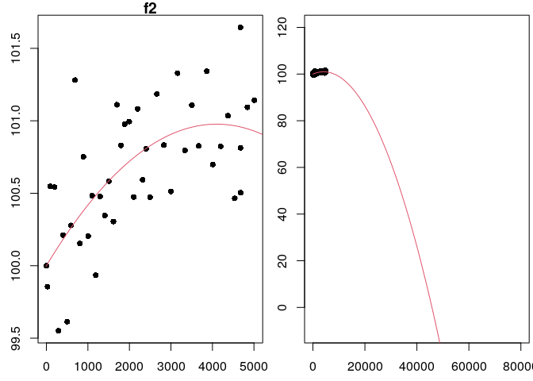
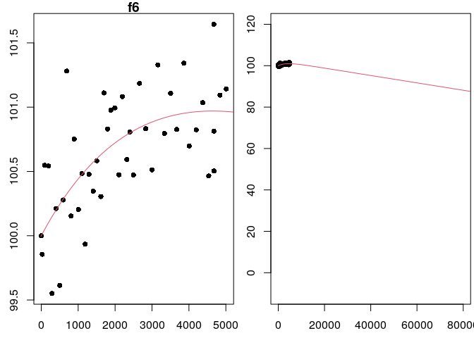

# Project Outline
This project outline and background information have been provided to assist you as you complete your project. You should assume the reader of your work has no knowledge or access to this information.  

How long does an LED light bulb last? Lumens are a measure of how much light you get from a bulb. When you first turn on an LED bulb, the lumen output slightly increases for a while, going above the initial brightness. While LEDs do not "burn out", after peaking the lumen output stays relatively constant before it starts to decrease in lumen output. In the bulb data we will use, lumen measures are normalized to the initial intensity of the bulb, so that we can compare different bulbs.  

In 2008, the US Department of Energy launched the Bright Tomorrow Lighting Prize (or L Prize) to encourage the development of high-efficiency replacement for the incandescent light bulb. To win the prize the bulb needed a lifetime longer than 25,000 hours (almost 3 years). [Source](https://en.wikipedia.org/wiki/L_Prize)  

We do not have three years of data on our bulbs so we will use mathematical models to predict the lifetime. Our work in this project relies on using loglikelihood functions to fit several assumed mathematical models. We will (1) use optimization to fit deterministic models to data and (2) use the fitted models to provide information about an LED bulb.

In this project, we'll be fitting the data to deterministic models, functions $f(t)$, that give the lumen output of LED bulbs (as a percent of the initial lumens) after $t$ hours. The input of the models is time, $t$, measured in hours since the bulb is turn on. The output of the models is bulb intensity, $f(t)$, measured as a percent of initial bulb intensity. By choosing to normalize bulb intensity in this way, we have fixed the initial output as 100\% of the original intensity, $f(0) = 100$. For this project, we will use 80\% of the initial intensity[^note] as the threshold for determining the lifetime of a light bulb. This means once the bulb intensity decreases below 80\% we will consider this the life of the bulb (in other words we will consider the bulb "burned out"). 


## Task 1: Determine the Objective Function
- Create an R Markdown file.
- Consider the following general models.
    - $f_1(t; a_1) = 100 + a_1t$ where $t \geq 0$
    - $f_2(t; a_1,a_2) = 100 + a_1t + a_2t^2$  where $t \geq 0$
    - $f_4(t; a_1,a_2) = 100 + a_1t + a_2\ln(0.005t+1)$  where $t \geq 0$
    - $f_5(t; a_1) = 100e^{-0.00005t} + a_1te^{-0.00005t}$  where $t \geq 0$
    - $f_6(t; a_1,a_2) = 100 + a_1t + a_2(1-e^{-0.0003t})$  where $t \geq 0$
- Assume the errors are independent and normally distributed (with mean of 0 and standard deviation of 1). Assume $(t_i,y_i)$ is a list of 44 data points to be provided. Show that the loglikelihood functions for the errors when fitting $f_1$, $f_2$, $f_4$, $f_5$, and $f_6$ to the 44 data points are as given below. *Write out your solutions (include all the steps) and include a picture of each of your calculations (or you can use the Latex Cheat Sheet if you would like to try to type out your calculations).*
    - $\ell_1(a_1; \mathbf{t},\mathbf{y}) = 44\ln\left(\frac{1}{\sqrt{2\pi}}\right) - \frac{1}{2}\sum_{i}^{44} (y_i - 100 - a_1t_i)^2$
    - $\ell_2(a_1,a_2; \mathbf{t},\mathbf{y}) = 44\ln\left(\frac{1}{\sqrt{2\pi}}\right) - \frac{1}{2}\sum_{i}^{44} (y_i - 100 - a_1t_i - a_2t_i^2)^2$
    - $\ell_4(a_1,a_2; \mathbf{t},\mathbf{y}) = 44\ln\left(\frac{1}{\sqrt{2\pi}}\right) - \frac{1}{2}\sum_{i}^{44} (y_i - 100 - a_1t_i - a_2\ln(0.005t_i+1))^2$
    - $\ell_5(a_1; \mathbf{t},\mathbf{y}) = 44\ln\left(\frac{1}{\sqrt{2\pi}}\right) - \frac{1}{2}\sum_{i}^{44} (y_i - 100e^{-0.00005t_i} - a_1t_ie^{-0.00005t_i})^2$
    - $\ell_6(a_1,a_2; \mathbf{t},\mathbf{y}) = 44\ln\left(\frac{1}{\sqrt{2\pi}}\right) - \frac{1}{2}\sum_{i}^{44} (y_i - 100 - a_1t_i - a_2(1-e^{-0.0003t}))^2$

The "answers" are provided. Your job is to lead your reader through your calculations to get to these answers. Make sure you include enough steps and explanations throughout your calculations so a reader at the calculus 1 level can understand your solution. What properties of logarithms and sums did you use? Be explicit.

- Organize your work into a **cohesive analysis** and submit it to Canvas.


## Task 2: Derivatives
- Create a new R Markdown file.
- Show that the first and second derivatives of $\ell_1(a_1; \mathbf{t}, \mathbf{y})$, the loglikelihood function for errors from the general model $f_1$, with respect to $a_1$ are as follows. *Write out your solutions and include a picture of each of your calculations (or you can use the Latex Cheat Sheet if you would like to try to type out your calculations).*
    - $\frac{d\ell_1}{da_1} = \left(\sum_{i=1}^{44} t_i(y_i-100)\right) - \left(\sum_{i=1}^{44} t_i^2\right) a_1$
    - $\frac{d^2\ell_1}{da_1^2} = -\sum_{i=1}^{44} t_i^2$
    
- Show that the first partials and second partials of $\ell_4(a_1, a_2; \mathbf{t}, \mathbf{y})$, the loglikelihood function for errors from the general model $f_4$, are as follows. *Write out your solutions and include a picture of each of your calculations (or you can use the Latex Cheat Sheet if you would like to try to type out your calculations).*
    - $\frac{\partial\ell_4}{\partial a_1} = \left(\sum_{i=1}^{44} t_i(y_i-100)\right) - \left(\sum_{i=1}^{44} t_i^2\right) a_1 - \left(\sum_{i=1}^{44} t_i\ln(0.005t_i + 1)\right) a_2$
    - $\frac{\partial\ell_4}{\partial a_2} = \left(\sum_{i=1}^{44} \ln(0.005t_i + 1)(y_i-100)\right) - \left(\sum_{i=1}^{44} t_i\ln(0.005t_i + 1)\right) a_1 - \left(\sum_{i=1}^{44} (\ln(0.005t_i + 1))^2\right) a_2$
    - $\frac{\partial^2\ell_4}{\partial a_1^2} = -\sum_{i=1}^{44} t_i^2$
    - $\frac{\partial^2\ell_4}{\partial a_2^2} = -\sum_{i=1}^{44} (\ln(0.005t_i + 1))^2$
    - $\frac{\partial^2\ell_4}{\partial a_2 \partial a_1} = -\sum_{i=1}^{44} t_i\ln(0.005t_i + 1)$

- Show that the first and second derivatives of $\ell_5(a_1; \mathbf{t}, \mathbf{y})$, the loglikelihood function for errors from the general model $f_5$, are as follows. *Write out your solutions and include a picture of each of your calculations (or you can use the Latex Cheat Sheet if you would like to try to type out your calculations).*
    - $\frac{d\ell_5}{da_1} = \left(\sum_{i=1}^{44} t_ie^{-0.00005t_i}(y_i-100e^{-0.00005t_i})\right) - \left(\sum_{i=1}^{44} (t_ie^{-0.00005t_i})^2\right) a_1$
    - $\frac{d^2\ell_5}{da_1^2} = -\sum_{i=1}^{44} (t_ie^{-0.00005t_i})^2$

The "answers" are provided. Your job is to lead your reader through your calculations to get to these answers. Make sure you include enough steps in and explanations throughout your calculation so a reader at the calculus 1 level can understand your solution. What properties of derivatives and sums did you use? Be explicit.

- Organize your work into a **cohesive analysis** and submit it to Canvas.


## Task 3: Fit the Model ("Maximum Likelihood" Method)
- Create a new R Markdown file.
- Use the `seed=` argument in the `led_bulb()` function to set the seed and use the following code to read in the light bulb data.
    
    ```r
    #Uncomment and run the line below once in the console to get the data4led package. You do not need to run this line if you already installed the data4led package in Project 1
        #devtools::install_github("byuidatascience/data4led") 
    
    #Use the code below to load the data4led package to your current R session.
    library(data4led)
    
    #Use the code below to load the data for one randomly selected bulb. Enter the seed from the class list of seeds. Setting the seed fixes which randomly selected bulb you will be working with and makes your work reproducible.
    bulb <- led_bulb(1,seed = DDDD)
    ```
    
    ```
    ## Error in set.seed(seed): object 'DDDD' not found
    ```
This code creates a data frames is called "bulb". The bulb data frame contains measurements for one randomly selected bulb at many time points. You will need to set the seed so that you will have your own random, but reproducible, data with which to work. Please set the seed as the four digit number from the class list of assigned seeds.  
The bulb data frame, a table, includes the columns (1) "id", the identification number for your randomly selected bulb, (2) "hours", the number of hours since the bulb has turned on, (3) "intensity", the lumen output of the bulb, (4) "normalized_intensity", the lumen at that time divided by the lumen of your bulb at time 0, and (5) "percent_intensity", the bulb intenstity as a percent of the original lumen (notice the first row in this column is 100). 

- Set the first derivative of $\ell_1(a_1; \mathbf{t}, \mathbf{y})$ with respect to $a_1$ equal to zero and solve for $a_1$.
  - Use the second derivative test to confirm you have actually found a maximum of the associated loglikelihood function.
- Set the partial derivatives of $\ell_4(a_1, a_2; \mathbf{t}, \mathbf{y})$ to zero and solve the resulting system of equations for $a_1$ and $a_2$. 
  - Use the second derivative test to confirm you have actually found a maximum of the associated loglikelihood function.
- Set the first derivative of $\ell_5(a_1; \mathbf{t}, \mathbf{y})$ with respect to $a_1$ equal to zero and solve for $a_1$.
  - Use the second derivative test to confirm you have actually found a maximum of the associated loglikelihood function.
- Write down each of the fitted models, $f_i(t)$ where $i = 1, 2, 4, 5, 6$, with the parameters values rounded to 3 decimal places as needed. 
  - The computation for fitting $f_2$ and $f_6$ were completed in class (or provided to you). You may adapt the code provided below, for the fitted models $f_2$ and $f_6$, to your bulb data.

Consider $f_2(t; a_1, a_2) = 100 + a_1t + a_2t^2$. The loglikelihood function is $\ell_2(a_1,a_2; \mathbf{t},\mathbf{y}) = 44\ln\left(\frac{1}{\sqrt{2\pi}}\right) - \frac{1}{2}\sum_{i=1}^{44} (y_i - 100 - a_1t_i - a_2t_i^2)^2$ as shown in Task 1. Adapt the following code to fit $f_2$ to your bulb data. For the purposes of this example we will use the seed 2021. You will need to use your seed from the class list of assigned seeds.


```r
library(data4led)
bulb <- led_bulb(1,seed=2021)
    #Remember to use your assigned seed!

t <- bulb$hours
y <- bulb$percent_intensity

C1.2 <- sum((y-100)*t)
C2.2 <- sum(t^2)
C3.2 <- sum(t^3)
C4.2 <- sum((y-100)*t^2)
C5.2 <- sum(t^4)

best.a2 <- (C2.2*C4.2 - C3.2*C1.2)/(C2.2*C5.2 - C3.2^2)
best.a1 <- (C1.2 - C3.2*best.a2)/C2.2

best.a2
```

```
## [1] -5.809922e-08
```

```r
best.a1
```

```
## [1] 0.000476463
```

```r
f2 <- function(x,a0=0,a1=0,a2=1){
  a0 + a1*x + a2*x^2
}

a0.2 <- 100
a1.2 <- best.a1
a2.2 <- best.a2

x <- seq(-10,800001,2)
par(mfrow=c(1,2),mar=c(2.5,2.5,1,0.25))
plot(t,y,xlab="Hour ", ylab="Intensity(%) ", pch=16,main='f2')
lines(x,f2(x,a0=a0.2,a1=a1.2,a2=a2.2),col=2)
plot(t,y,xlab="Hour ", ylab="Intensity(%) ", pch=16, xlim = c(-10,80000),ylim = c(-10,120))
lines(x,f2(x,a0=a0.2,a1=a1.2,a2=a2.2),col=2)
```

<!-- -->

Consider $f_6(t; a_1, a_2) = 100 + a_1t + a_2(1 - e^{-0.0003t})$. The loglikelihood function is $\ell_6(a_1,a_2; \mathbf{t},\mathbf{y}) = 44\ln\left(\frac{1}{\sqrt{2\pi}}\right) - \frac{1}{2}\sum_{i=1}^{44} (y_i - 100 - a_1t_i - a_2(1 - e^{-0.0003t_i}))^2$ as shown in Task 1. Adapt the following code to fit $f_2$ to your bulb data. For the purposes of this example we will use the seed 2021, but you will need to use your seed from the class list of assigned seeds.


```r
library(data4led)
bulb <- led_bulb(1,seed=2021)
    #Remember to use your assigned seed!

t <- bulb$hours
y <- bulb$percent_intensity

C1.6 <- sum((y-100)*t)
C2.6 <- sum(t^2)
C3.6 <- sum(t*(1-exp(-0.0003*t)))
C4.6 <- sum((y-100)*(1-exp(-0.0003*t)))
C5.6 <- sum((1-exp(-0.0003*t))^2)

best.a2 <- (C2.6*C4.6 - C3.6*C1.6)/(C2.6*C5.6 - C3.6^2)
best.a1 <- (C1.6 - C3.6*best.a2)/C2.6

best.a2
```

```
## [1] 2.390855
```

```r
best.a1
```

```
## [1] -0.0001781382
```

```r
f6 <- function(x,a0=100,a1=0,a2=1){
  a0 + a1*x + a2*(1-exp(-0.0003*x))
}

a0.6 <- 100
a1.6 <- best.a1
a2.6 <- best.a2

x <- seq(-10,800001,2)
par(mfrow=c(1,2),mar=c(2.5,2.5,1,0.25))
plot(t,y,xlab="Hour ", ylab="Intensity(%) ", pch=16,main='f6')
lines(x,f6(x,a0=a0.6,a1=a1.6,a2=a2.6),col=2)
plot(t,y,xlab="Hour ", ylab="Intensity(%) ", pch=16, xlim = c(-10,80000),ylim = c(-10,120))
lines(x,f6(x,a0=a0.6,a1=a1.6,a2=a2.6),col=2)
```

<!-- -->

- **CHECK YOUR WORK:** 
    - Plot the data and each of your fitted functions. Does it look like you have found a function that fits your bulb data?
    - Use this [Shiny App](https://shiny.byui.edu/connect/#/apps/4494a10f-1d8f-4743-82da-c779b1918968/access) to check your answers.   

**Note:** when using fitted models it is best practice not to round in any preliminary calculations, so make sure you use all known decimal places for the parameter values, NOT the rounded values, when you use the fitted model.

- Organize your work into a **cohesive analysis** and submit it to Canvas.


## Project 2: Bringing it All Together (and answer a question)
- Create a new R Markdown file.
- Answer the question, "How long does an LED light bulb last?" 
    - Begin with background and an introduction to the question(s) you will be answering with the light bulb data.
    - Introduce the given data.
    - Introduce the five general models.
        - Restrict the domain for all models to be nonnegative.
    - Describe how you will fit the models (maybe what it means to fit those models).
    - State the fitted models.
        - The work to fit $f_2(t)$ and $f_6(t)$ was completed in class and the code only needs to be adapted to find the fits to your specific data.
    - Use each of the five fitted models to predict the intensity of a light bulb as a percent of the original intensity after 25,000 hours. 
    - Use the `uniroot()` function in R to find the approximate solution for where each of your five fitted models is at 80% of the initial intensity, solve the equation $f_i(t) = 80$ for each of the five fitted models.
    - Describe in 4-6 sentences how the information you get from the data depends on the general model you assume. Why is this an important concept to understand when working with models and data?
    - If a fitted model is inconsistent with known truth about a situation, it should not be used as a model in that situation. Are any of your fitted models inconsistent with the information we know about the behavior of LED bulbs (provided in the introductory information of this project)?
- Organize your work into a **cohesive analysis** and submit it to Canvas. Your narrative should stand alone apart from the "project instructions" (meaning your reader should not need the instructions for the project to understand what you are doing or explaining) and separate from the individual Tasks (meaning you should not assume your reader has read any of your previous narratives). It is your job in the narrative to lead your reader from the background and question to given data and 5 general models, fitting those models, and answering a question about the data using those fitted models.

- Reflect on your work for this project. At the bottom of your report include the following in a brief (1-2 paragraph) reflection.
    - Identify/explain 2-3 key mathematical  ideas you learned (and would like to remember).
    - Identify/explain 1-3 soft skills you needed/improved/learned while working on the project.
        - List of some Soft Skills
            - Dedication
            - Following Directions
            - Motivation
            - Self-directed
            - Organization
            - Planning
            - Time Management
            - Willing to Accept Feedback
            - Perseverance
            - Good attitude
            - Meets deadlines
            - Willingness to learn


[^note]: This number is a simplified story for illustrative purposes only.
