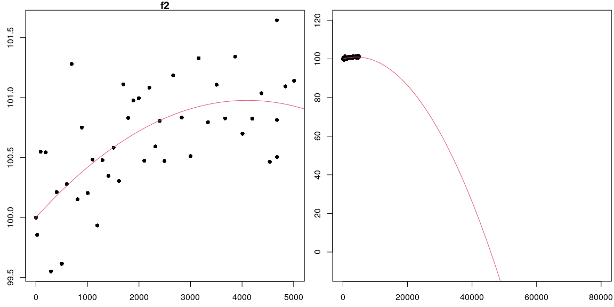
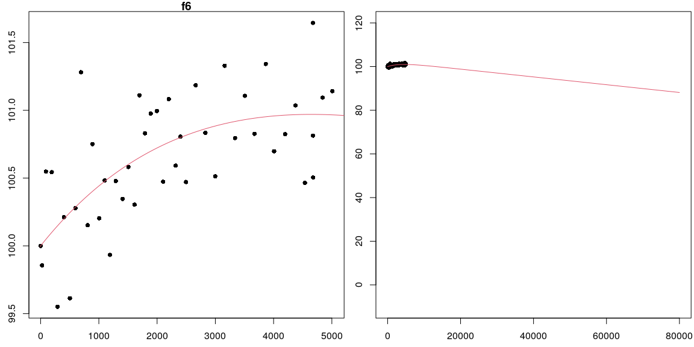

## Background
In this task we'll be using the maximum likelihood method to fit 2 deterministic models that give the lumen output of LED bulbs (as a percent of the initial lumens) after t hours. The input of the models is time, $t$, measured in hours since the bulb is turn on. The output of the models is bulb intensity, $f_i(t)$, measured as a percent of initial bulb intensity. By choosing to normalize the bulb intensity in this way, we have fixed the initial output as 100% of the original intensity, so we have $f(0)=100$.

Our goal is to use the data in the data4led package (along with our assigned seed) to find the coefficients for each model using the maximimum likelihood method. 

## General setup

WHile we will only focus on $f_2$ and $f_6$ in this document, the five models of interest in our overall study are

- $f_1(t;a_1)=100+a_1t$ where $t\geq 0$,
- $f_2(t;a_1,a_2)=100+a_1t+a_2t^2$ where $t\geq 0$,
- $f_4(t;a_1,a_2)=100+a_1t+a_2\ln(0.005t+1)$ where $t\geq 0$,
- $f_5(t;a_1)=100e^{−0.00005t}+a_1te^{−0.00005t}$ where $t\geq 0$, and
- $f_6(t;a_1,a_2)=100+a_1t+a_2(1−e^{−0.0003t})$ where $t\geq 0$.

We will assume the errors are independent and normally distributed (with mean of 0 and standard deviation of 1), which is needed to develop the likelihood function.  
We will use $(t_i,y_i)$ from the data4led package, using the seed 2021, as provided in the code block below. 


```r
#devtools::install_github("byuidatascience/data4led")
library(data4led)
bulb <- led_bulb(1,seed=2021)
t <- bulb$hours
y <- bulb$percent_intensity
```

We'll be solving several linear systems of the form 
$$\left\{
\begin{array}{ll}
b_1-c_{1,1}a_1 - c_{1,2}a_2 = 0 \\ 
b_2-c_{2,1}a_1 + c_{2,2}a_2 = 0
\end{array} 
\right.$$
The code chunk below provides a function for solving these linear systems.


```r
critical_points <- function(c.11,c.12,c.21,c.22,b.1,b.2){
y <- (c.11*b.2 - c.21*b.1)/(c.11*c.22 - c.21*c.12)
x <- (b.1-c.12*y)/c.11
c(x,y)
}
```

The relevant derivatives for each of the models was already provided in a previous task. As we proceed through the rest of this document, this is how each section will proceed. 

- We'll introduce the function and state the relevant derivatives.
- We'll find the critical values/points by solving a system of equations. This provides us with the "best" parameters for our model. 
- We'll verify that the parameters correspond to maximum loglikelihood using the second derivative test. 
- We'll finish by graphing the best fit model, overlayed on to the data, to verify that our solution visually fits.  

### Fitting $f_2$

For the model $f_2(t;a_1,a_2)=100+a_1t+a_2t^2$ where $t\geq 0$, we already found the following:

- Loglikelihood: $\ell_2(a_1,a_2; \mathbf{t},\mathbf{y}) = 44\ln\left(\frac{1}{\sqrt{2\pi}}\right) + \sum_{i=1}^{44} \left(-\frac{1}{2}(y_i - 100 - a_1t_i - a_2t_i^2)^2\right)$
- $\frac{\partial \ell_2}{\partial a_1} = \left(\sum_{i=1}^{44} (y_i - 100)t_i\right) - \left(\sum_{i=1}^{44}t_i^2\right)a_1 - \left(\sum_{i=1}^{44}t_i^3\right)a_2$
- $\frac{\partial \ell_2}{\partial a_2} = \left(\sum_{i=1}^{44} (y_i - 100)t_i^2\right) - \left(\sum_{i=1}^{44}t_i^3\right)a_1 - \left(\sum_{i=1}^{44}t_i^4\right)a_2$
- $\frac{\partial^2 \ell_2}{\partial a_1^2} = - \left(\sum_{i=1}^{44}t_i^2\right)$
- $\frac{\partial^2 \ell_2}{\partial a_1\partial a_2} = - \left(\sum_{i=1}^{44}t_i^3\right)$
- $\frac{\partial^2 \ell_2}{\partial a_2^2} = - \left(\sum_{i=1}^{44}t_i^4\right)$

To find the critical points, we must find where all first partials are simultaneously zero.  This means we must solve the system of equations 
$$\left\{
\begin{array}{ll}
\left(\sum_{i=1}^{44} (y_i - 100)t_i\right) - \left(\sum_{i=1}^{44}t_i^2\right)a_1 - \left(\sum_{i=1}^{44}t_i^3\right)a_2 &= 0 \\ 
\left(\sum_{i=1}^{44} (y_i - 100)t_i^2\right) - \left(\sum_{i=1}^{44}t_i^3\right)a_1 - \left(\sum_{i=1}^{44}t_i^4\right)a_2 &= 0.
\end{array} 
\right.$$
This fits the form of the system of two equations from our introduction. The next code block solves this system by using the function we already included.


```r
c.11 <- sum(t^2) 
c.12 <- sum(t^3) 
c.21 <- sum(t^3) 
c.22 <- sum(t^4) 
b.1 <- sum((y-100)*t)
b.2 <- sum((y-100)*t^2)
a.2 <- critical_points(c.11,c.12,c.21,c.22,b.1,b.2)
data.frame(a1 = a.2[1],a2=a.2[2])
```

```
##            a1            a2
## 1 0.000476463 -5.809922e-08
```
Our critical points is 
$a_1 = 4.7646301\times 10^{-4}$ 
and 
$a_2 = -5.809922\times 10^{-8}$. 
The second derivative test requires we compute 
$$D = \left(\frac{\partial^2 \ell_2}{\partial a_1^2}\right)\left(\frac{\partial^2 \ell_2}{\partial a_2^2}\right)-\left(\frac{\partial^2 \ell_2}{\partial a_1\partial a_2}\right)^2.$$ 
The compuations are given in the code block below. 


```r
la1a1 <- -c.11
la2a2 <- -c.22
la1a2 <- -c.12
D <- la1a1*la2a2-la1a2^2
data.frame(D=D, l_a1a1=la1a1)
```

```
##             D     l_a1a1
## 1 1.23003e+23 -328767530
```

Because $D = 1.2300296\times 10^{23}>0$ and $\ell_{a1a1} = -3.2876753\times 10^{8} <0$, then we know that our critical point corresponds to a maximum of $\ell_2$, as desired. We have found the coefficients $a_1$ and $a_2$ that yield a best fit for $f_2$, and our model is 
$$f_2(t;a_1,a_2)=100+4.7646301\times 10^{-4}t+-5.809922\times 10^{-8}t^2 \text{ where }t\geq 0.$$

As a check, we can plot the data along with this model, shown below, to verify that these coefficients do indeed provide a great visual fit for the model. 


```r
f <- function(x,a0=0,a1=0,a2=1){
  a0 + a1*x + a2*x^2
}

a0.2 <- 100
a1.2 <- a.2[1]
a2.2 <- a.2[2]

x <- seq(-10,80001,2)
par(mfrow=c(1,2),mar=c(2.5,2.5,1,0.25))
plot(t,y,xlab="Hour ", ylab="Intensity(%) ", pch=16,main='f2')
lines(x,f(x,a0=a0.2,a1=a1.2,a2=a2.2),col=2)
plot(t,y,xlab="Hour ", ylab="Intensity(%) ", pch=16, xlim = c(-10,80000),ylim = c(-10,120))
lines(x,f(x,a0=a0.2,a1=a1.2,a2=a2.2),col=2)
```

<!-- -->


### Fitting $f_6$

For the model $f_6(t;a_1,a_2)=100+a_1t+a_2(1−e^{−0.0003t})$ where $t\geq 0$, we already found the following:

- Loglikelihood: $\ell_6(a_1,a_2; \mathbf{t},\mathbf{y}) = 44\ln\left(\frac{1}{\sqrt{2\pi}}\right) + \sum_{i=1}^{44} \left(- \frac{1}{2}\right)(y_i - 100 - a_1t_i - a_2(1-e^{-0.0003t_i}))^2$
- $\frac{\partial \ell_6}{\partial a_1} = \left(\sum_{i=1}^{44} t_i(y_i - 100)\right) - a_1\left(\sum_{i=1}^{44}t_i^2\right) - a_2\left(\sum_{i=1}^{44}t_i(1-e^{-0.0003t_i})\right)$
- $\frac{\partial \ell_6}{\partial a_2} = \left(\sum_{i=1}^{44} (1-e^{-0.0003t_i})(y_i - 100)\right) - a_1\left(\sum_{i=1}^{44}t_i(1-e^{-0.0003t_i})\right) - a_2\left(\sum_{i=1}^{44}(1-e^{-0.0003t_i})^2\right)$
- $\frac{\partial^2 \ell_6}{\partial a_1^2 } = - \left( \sum_{i=1}^{44}t_i^2 \right)$
- $\frac{\partial^2 \ell_6}{\partial a_1\partial a_2} = - \left(\sum_{i=1}^{44}t_i(1-e^{-0.0003t_i})\right)$
- $\frac{\partial^2 \ell_6}{\partial a_2^2} = - \left(\sum_{i=1}^{44}(1-e^{-0.0003t_i})^2\right)$

To find the critical points, we must find where all first partials are simultaneously zero.  This means we must solve the system of equations 
$$\left\{
\begin{array}{ll}
\left(\sum_{i=1}^{44} t_i(y_i - 100)\right) - a_1\left(\sum_{i=1}^{44}t_i^2\right) - a_2\left(\sum_{i=1}^{44}t_i(1-e^{-0.0003t_i})\right) &= 0 \\ 
\left(\sum_{i=1}^{44} (1-e^{-0.0003t_i})(y_i - 100)\right) - a_1\left(\sum_{i=1}^{44}t_i(1-e^{-0.0003t_i})\right) - a_2\left(\sum_{i=1}^{44}(1-e^{-0.0003t_i})^2\right) &= 0.
\end{array} 
\right.$$
This fits the form of the system of two equations from our introduction. The next code block solves this system by using the function we already included.


```r
c.11 <- sum(t^2) 
c.12 <- sum(t*(1-exp(-.0003*t))) 
c.21 <- sum(t*(1-exp(-.0003*t))) 
c.22 <- sum((1-exp(-.0003*t))^2) 
b.1 <- sum((y-100)*t)
b.2 <- sum((y-100)*(1-exp(-.0003*t)))
a.6 <- critical_points(c.11,c.12,c.21,c.22,b.1,b.2)
data.frame(a1 = a.6[1],a2=a.6[2])
```

```
##              a1       a2
## 1 -0.0001781382 2.390855
```
Our critical points is 
$a_1 = -1.7813815\times 10^{-4}$ 
and 
$a_2 = 2.3908549$. 
The second derivative test requires we compute 
$$D = \left(\frac{\partial^2 \ell_6}{\partial a_1^2}\right)\left(\frac{\partial^2 \ell_6}{\partial a_2^2}\right)-\left(\frac{\partial^2 \ell_6}{\partial a_1\partial a_2}\right)^2.$$  
The compuations are given in the code block below. 


```r
la1a1 <- -c.11
la2a2 <- -c.22
la1a2 <- -c.12
D <- la1a1*la2a2-la1a2^2
data.frame(D=D, l_a1a1=la1a1)
```

```
##          D     l_a1a1
## 1 73001831 -328767530
```

Because $D = 7.3001831\times 10^{7}>0$ and $\ell_{a1a1} = -3.2876753\times 10^{8} <0$, then we know that our critical point corresponds to a maximum of $\ell_6$, as desired. We have found the coefficients $a_1$ and $a_2$ that yield a best fit for $f_6$, and our model is 
$$f_6(t;a_1,a_2)=100+-1.7813815\times 10^{-4}t+2.3908549(1−e^{−0.0003t}) \text{ where }t\geq 0.$$

As a check, we can plot the data along with this model, shown below, to verify that these coefficients do indeed provide a great visual fit for the model. 


```r
f <- function(x,a0=0,a1=0,a2=1){
  a0 + a1*x + a2*(1-exp(-0.0003*x ))
}

a0.2 <- 100
a1.2 <- a.6[1]
a2.2 <- a.6[2]

x <- seq(-10,80001,2)
par(mfrow=c(1,2),mar=c(2.5,2.5,1,0.25))
plot(t,y,xlab="Hour ", ylab="Intensity(%) ", pch=16,main='f6')
lines(x,f(x,a0=a0.2,a1=a1.2,a2=a2.2),col=2)
plot(t,y,xlab="Hour ", ylab="Intensity(%) ", pch=16, xlim = c(-10,80000),ylim = c(-10,120))
lines(x,f(x,a0=a0.2,a1=a1.2,a2=a2.2),col=2)
```

<!-- -->

## Conclusions

We have obtained the coeffiecients that provide the best fit for $f_2$ and $f_6$.  The corresponding functions, with all coefficients rounded to 3 significant figures, are 

- $f_2(t;a_1,a_2)=100+4.76\times 10^{-4}t+-5.81\times 10^{-8}t^2 \text{ where }t\geq 0.$
- $f_6(t;a_1,a_2)=100+-1.78\times 10^{-4}t+2.39(1−e^{−0.0003t}) \text{ where }t\geq 0.$

The remaining 3 functions are left for the students in the course to practice applying the maximum likelihood method and writing a cohesive narrative. 
 
