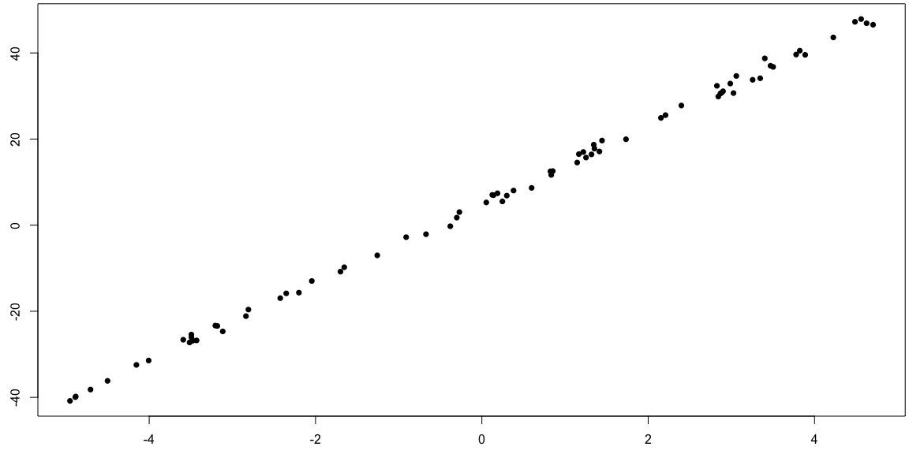
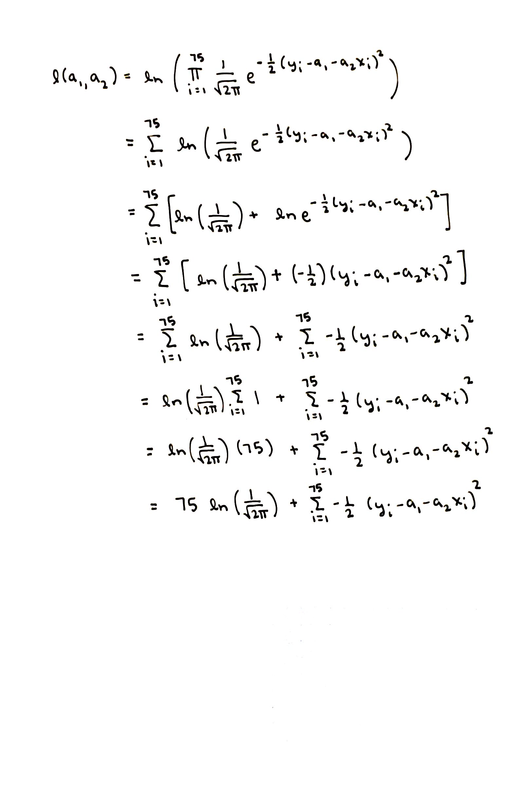
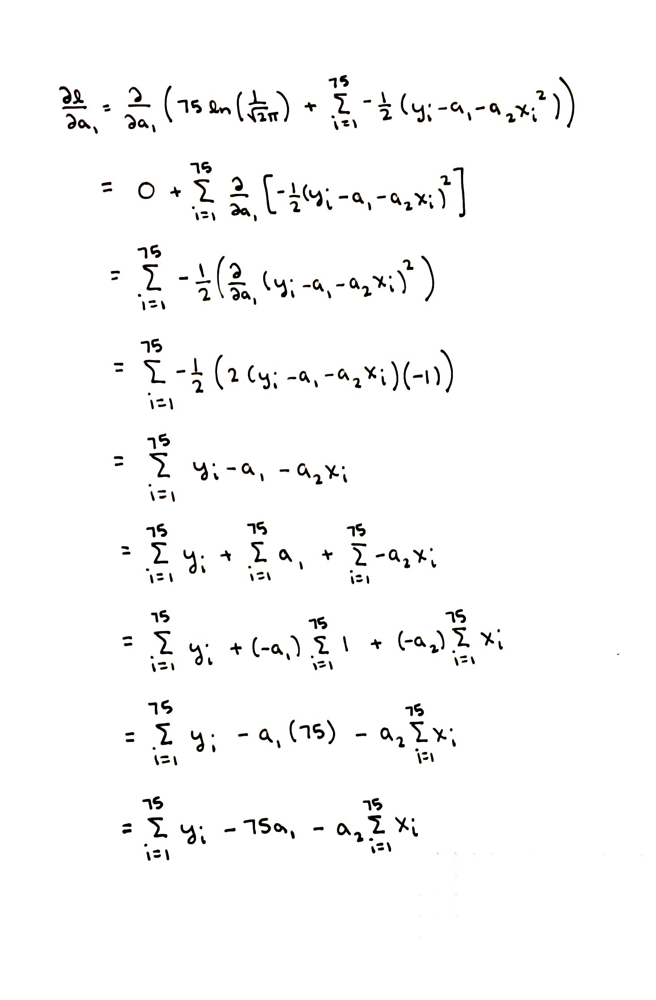
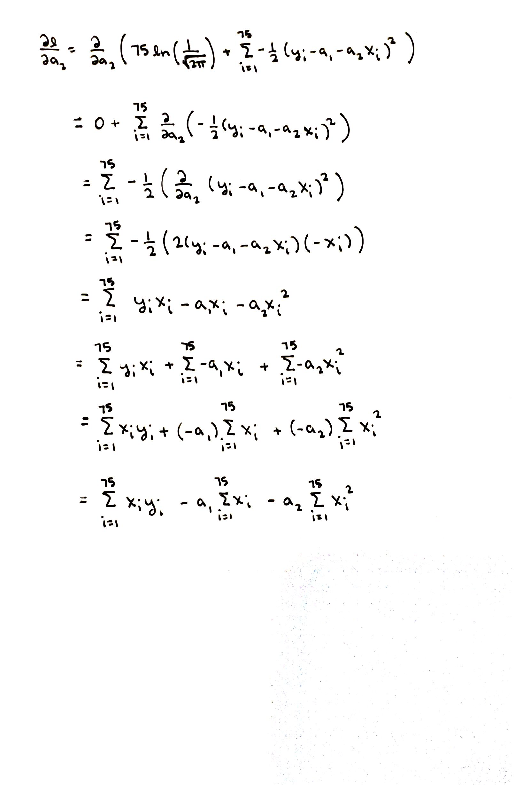
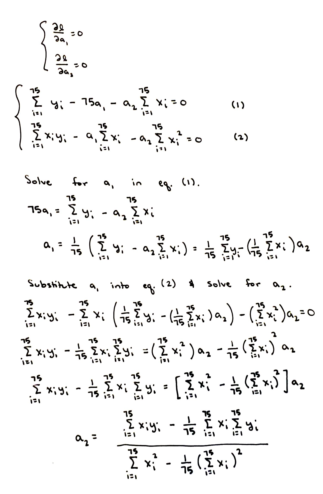
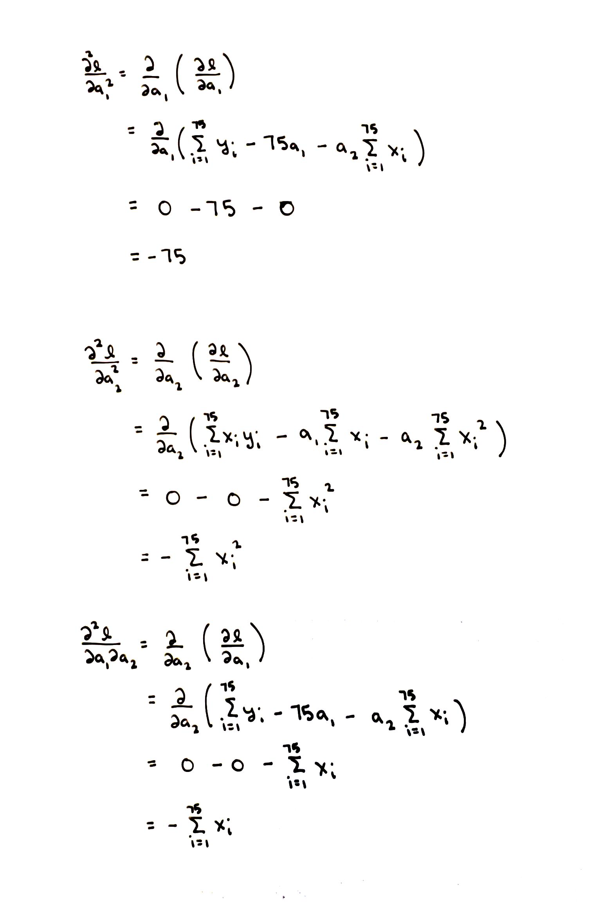

```r
# Use this R-Chunk to import all your datasets!
set.seed(1106)
A <- runif(1,-10,10)
B <- runif(1,-10,10)
x <- runif(75,-5,5)
y <- A + B*x + rnorm(length(x),0,1)

data.ex2 <- as.data.frame(cbind(input = x, measurement = y))
```

# Learning Task Description
Below are several examples of optimization problems (we have seen in class) with worked out solutions. Our task is to determine the steps for an optimization problem by comparing and contrasting these solutions.

## Example 1
A company is building square-bottomed boxes with no tops. The material for the bottom costs \$2 per cm$^2$ and the material for the sides costs \$1 per cm$^2$. What is the box of largest volume the company can build for \$96?

### Identify the Function of Interest 
Let the length (and width) of the bottom of the box be represented by $x$. Let the height of the box be represented by $h$. We see that there will be 4 sides each of area $xh$ cm$^2$ and 1 bottom of area $x^2$ cm$^2$. 

We calculate the cost of the box, 

cost = 4(price$_{\text{side}}$)(area$_{\text{side}}$) + 1(price$_{\text{bottom}}$)(area$_{\text{bottom}}$). 

We see $C(x,h) = 4(1)(xh) + 1(2)(x^2) = 4xh + 2x^2$.

We are interested finding the box of largest volume, in other words we want to maximize volume. We know the volume of the box is $V(x,h) = x^2h$. Using $C(x,y) = 96$ and $V(x,h)$, we can rewrite the formula for the volume as a function in one variable. 

Since $C(x,h) = 96$, we see $96 = 4xh + 2x^2$. 

Thus we see $h = \frac{96-2x^2}{4x} = \frac{48-x^2}{2x}$.

Subsituting $h$ into $V(x,h)$ we have the volume of the box as a function of one variable $V(x) = x^2(\frac{48-x^2}{2x}) = 24x - \frac{1}{2}x^3$. We would like to find the maximum of $V(x)$.


### Optimize
We will take the derivative of $V(x)$, find the critical values, and verify that $V(x)$ has a maximum using the second derivative test.

We see $\frac{dV}{dx} = 24 - \frac{3}{2}x^2$. Setting the $\frac{dV}{dx} = 0$ we find the critical values.

Since $\frac{dV}{dx} = 0$, we see 

$24 - \frac{3}{2}x^2 = 0$ and $x^2 = 16$. 

Thus $x = 4$ or $x = -4$.

We know $\frac{d^2V}{dx^2} = -3x$. Since $\frac{d^2V}{dx^2}(4) = -12 < 0$, we know there is a local maximum of $V(x)$ when $x=4$. Since $\frac{d^2V}{dx^2}(-4) = 12 > 0$, we know there is a local minimum of $V(x)$ when $x=-4$.

### Answer the Question
Since $V(x)$ has a maximum when $x=4$, we know $V(4) = 24(4) - \frac{1}{2}(4)^3 = 128$ is the maximum volume. Thus the box of largest volume the company can build for \$96 is a box that is 128 cm$^3$.


## Example 2
Assuming the example data (recorded in the data frame data.ex2) can be described by the following relationship model $r(x) = a_1 + a_2x$ where $x$ is the input variable and $r(x)$ is the measurement. Fit the model $r(x)$ to the example data by finding the parameters $a_1$ and $a_2$ so the loglikelihood function of the errors is maximized.

This data set consists of 75 ordered pairs, with first coordinate named input and second coordinate named measurement. We visualize this data set with the scatterplot shown here.

```r
par(mfrow=c(1,1),mar=c(2.5,2.5,0.25,0.25))
plot(data.ex2$input,data.ex2$measurement,pch=16)
```

<!-- -->
We see the data seems to have a linear relationship, so assuming the model $r(x)$ has some merit in this situation.

### Identify the Function of Interest 
We want to maximize the loglikelihood function, so we will find a formula for the loglikelihood function in this situation. We begin by calculating a formula for the errors between the values the model predicts for a given input, $\widehat{y}_i = r(x_i)$, and the data, $y_i = \text{data.ex2\$measurement}_i$. 

We see the $i$th error is error$_i = y_i - \widehat{y}_i = y_i - (a_1 + a_2x_i) = y_i - a_1 - a_2x_i$.

We assume the errors are normally distributed with mean of zero and standard deviation of one. This means the probability (density) model, $f(\text{error}; a_1, a_2) = \frac{1}{\sqrt{2\pi}}e^{-\frac{1}{2}\text{error}^2}$, describe the distribution for each of the individual error. This probability model provide probaility information that can be used to calculate the probability of certain values for each individual error.

We assume the errors are independent. This means the probability (density) model, $g(\text{errors}; a_1, a_2) = \prod_{i=1}^{75} \frac{1}{\sqrt{2\pi}}e^{-\frac{1}{2}\text{error}_i^2}$, describes the distribution of the collection of 75 errors.

Since we are thinking of the parameters $a_1$ and $a_2$ as the the variable, rather than the errors, we write this distribution, $g(\text{errors}; a_1, a_2)$, as the likelihood function, $L(a_1, a_2; \text{input}, \text{measurement}) = \prod_{i=1}^{75} \frac{1}{\sqrt{2\pi}}e^{-\frac{1}{2}(y_i - a_1 - a_2x_i)^2}$. Notice the order of the data and the parameters swiches between the distribution, $g$, and the likelihood function, $L$.

We take the natural log of the likelihood function to find the loglikelihood function, $\ell(a_1, a_2; \text{input}, \text{measurement}) = \ln(\prod_{i=1}^{75} \frac{1}{\sqrt{2\pi}}e^{-\frac{1}{2}(y_i - a_1 - a_2x_i)^2})$. Using the properties of logs and sums we simplify this to find the loglikelihood function, $\ell(a_1, a_2; \text{input}, \text{measurement}) = 75\ln(\frac{1}{\sqrt{2\pi}}) + \sum_{i=1}^{75}-\frac{1}{2}(y_i - a_1 - a_2x_i)^2$. See the detailed calculation below.

We would like to find the maximum of $\ell(a_1,a_2)$.

### Optimize
We will take the first partial derivatives of $\ell(a_1,a_2)$, find the critical points, and verify that $\ell(a_1,a_2)$ has a maximum using the second derivative test.

We see $\frac{\partial \ell}{\partial a_1} = \sum_{i=1}^{75}-\frac{1}{2}(y_i - a_1 - a_2x_i)(-1)$. See the details in the calculation below.

Thus $\frac{\partial \ell}{\partial a_1} = \sum_{i=1}^{75}y_i - 75 a_1 - a_2\sum_{i=1}^{75}x_i$.

We see $\frac{\partial \ell}{\partial a_2} = \sum_{i=1}^{75}-\frac{1}{2}(y_i - a_1 - a_2x_i)(-x_i)$. See the detailed calculation below.


Thus $\frac{\partial \ell}{\partial a_2} = \sum_{i=1}^{75}x_iy_i - a_1\sum_{i=1}^{75}x_i - a_2\sum_{i=1}^{75}x_i^2$.

We solve the system $\frac{\partial \ell}{\partial a_1} = 0$ and $\frac{\partial \ell}{\partial a_2} = 0$ to find the critical points. See the details in the calculation below.


We see $a_2 = \frac{\sum_{i=1}^{75}x_iy_i- \frac{1}{75}\sum_{i=1}^{75}x_i\sum_{i=1}^{75}y_i}{\sum_{i=1}^{75}x_i^2-\frac{1}{75}(\sum_{i=1}^{75}x_i)^2}$ and $a_1 = \frac{1}{75}(\sum_{i=1}^{75}y_i - a_2\sum_{i=1}^{75}x_i)$.

Computing $a_1$ and $a_2$ in R, we see $a_1 \approx 5.004$ and $a_2 \approx 9.122$.


```r
x <- data.ex2$input
y <- data.ex2$measurement

a2.best <- (sum(x*y)-sum(x)*sum(y)/length(x))/(sum(x^2)-sum(x)^2/length(x))
a1.best <- (sum(y)-a2.best*sum(x))/length(x)
a1.best
```

```
## [1] 5.003881
```

```r
a2.best
```

```
## [1] 9.122137
```

We compute the second partials as see $\frac{\partial^2 \ell}{\partial a_1^2} = -75$, $\frac{\partial^2 \ell}{\partial a_2^2} = -\sum_{i=1}^{75}x_i^2$, and $\frac{\partial^2 \ell}{\partial a_1a_2} = -\sum_{i=1}^{75}x_i$. See the DETAILED calculations below.


We compute $D = \ell_{a_1a_1}(5.002,9.112)\ell_{a_2a_2}(5.002,9.112) - (\ell_{a_1a_2}(5.002,9.112))^2 = -75(-\sum_{i=1}^{75}x_i^2) - (-\sum_{i=1}^{75}x_i)^2 = 45189.87$.


```r
D <- length(x)*sum(x^2) - sum(x)^2
D
```

```
## [1] 45189.87
```

We compute $\ell_{a_1a_1}(5.002,9.112) = -75$. Since $D > 0$ and $\ell_{a_1a_1}(5.002,9.112) < 0$. The second derivative test tell us that $\ell(a_1,a_2)$ has a local maximum at $(5.002,9.112)$.

### Answer the Question
The specific model $r(x) = 5.002 + 9.112x$ is the a fit to the example data found by maximizing the loglikelihood to find $a_1$ and $a_2$.

## NOTE
Solving for $a_1$ and $a_2$, the parameters of a line $r(x) = a_1 + a_2x$, using the process shown in Example 2 gives the same values for $a_1$ and $a_2$ that solving the Least Squares regression problem for $a_1$ and $a_2$ gives. 
- If you have experience with the Least Squares regression problem, can you figure out why this is true?
- Even if you don't have any experience with the Least Squares regression problem, you can use the process shown in Example 2, to solve for the maximum of the loglikelihood function, to answer the question on the Knewton Alta assignment "2 -- Least Squares Prediction and Extrapolation".
