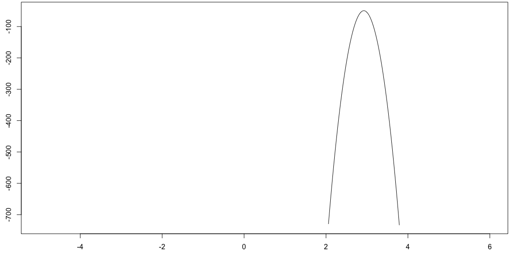

```r
# Use this R-Chunk to import all your datasets!
```
<!-- #Color Format -->
# Learning Task Description
Below  there are several writing samples. Our task is to identify which of these samples have met the following subset of the General Specs for Projects in Math 119.

* All plots and calculations are introduced, explained, interpreted, and described using complete sentences (and paragraphs). Provide an analysis.

* Mathematical notation and terminology is used properly.

* Enough information is included so that work is reproducible.


## Sample 1
We know $n = 15$ and $x=2$. The likelihood function is $b(p) = 105p^2(1-p)^{13}$. We take the derivative, find the critical values, plug the critical values into the second derivative and find that at $p=\frac{2}{15}$, $b(p)$ has a maxmimum.

## Sample 2
$n = 15$

$x=2$

$b(p) = 105p^2(1-p)^{13}$

$p=\frac{2}{15}$

## Sample 3 
A quality engineer tests the calibration of a machine that packs ice cream into containers. And tells us that in a sample of 15 containers, 2 were underfilled. We assume the probability model, $b(x;p,n) = \frac{n!}{x!(n-x)!}p^x(1-p)^{ (n-x)}$ where $n$ is a positive integer, $x \in \{0, 1, 2, 3, ... , n\}$ and $0 \leq p \leq 1$. We know $n = 15$ and $x=2$. We would like to find the value $p$ that best describes the data provided by the quality engineer. The likelihood function is $b(p) = 105p^2(1-p)^{13}$. 

We take the derivative, find the critical values by setting the derivative to zero (in this case the derivative is never undefined since the likelikhood function is a polynomial), and plug the critical values into the second derivative to determine the best value of $p$. We consider the value of $p$ that maximizes the likelihood function to be the best value of $p$.

Since $b'(p) = 105(1-p)^{12}(2p-15p^2)$, we determine the critical value are $p = 0$, $\frac{2}{15}$, and $1$. Because $b''(p) = 210(1-p)^{11}(105p^2-28p+1)$, we find $b''(0) > 0$, $b''(\frac{2}{15}) < 0$, and $b''(1) = 0$. See the values $b''(0)$, $b''(\frac{2}{15})$, and $b(1)$ computed below.


```r
b.2der <- function(x){210*(1-x)^(11)*(105*x^2-28*x+1)}
b.2der(0)
```

```
## [1] 210
```

```r
b.2der(2/15)
```

```
## [1] -37.70895
```

```r
b.2der(1)
```

```
## [1] 0
```

This tells us that the likelihood function has a local maximum when $p=\frac{2}{15}$, a local minimum when $p=0$, and we don't know from this information what is happening at $p=1$. By checking the sign of the first derivative, we learn that $b(p)$ is increasing on the interval $(0,\frac{2}{15})$ and decreasing on the interval $(\frac{2}{15},1)$. We used the test points $p = \frac{1}{15}$ and $0.9$ to determine the sign of the first derivative, see the values $b'(\frac{1}{15})$ and $b'(0.9)$ below. 


```r
b.der <- function(x){105*(1-x)^(12)*(2*x-15*x^2)}
b.der(1/15)
```

```
## [1] 3.058717
```

```r
b.der(0.9)
```

```
## [1] -1.08675e-09
```

Thus the absolute maximum of $b(p)$ on the interval $[0, 1]$ is $b(\frac{2}{15}) \approx 0.2905$. This tells us $p = \frac{2}{15}$ best describes the data provided by the quality engineer. We have determined the probability the ice cream machine underfills a container is $\frac{2}{15} \approx 0.133$. If this is the intended value for the probability that the ice cream machine underfills the container then the machine does not need to be adjusted.


##Sample 4

```r
set.seed(0406)
m <- runif(1,-3,3)
x <- runif(50,0,10)
y <- m*x + runif(length(x),0,1)

logL <- function(m,x,y){
  log(prod((1/sqrt(2*pi))*exp(-(y-m*x)^2/2)))
}

x.val <- seq(-5,6,0.01)
y.logL <- as.vector(as.numeric(lapply(x.val,FUN=logL,x=x,y=y)))

par(mar=c(2.5,2.5,0.25,0.25))
plot(x.val,y.logL,type='l')
```

<!-- -->

##Sample 5

```r
set.seed(0406)
m <- runif(1,-3,3)
x <- runif(50,0,10)
y <- m*x + runif(length(x),0,1)

logL <- function(m,x,y){
  log(prod((1/sqrt(2*pi))*exp(-(y-m*x)^2/2)))
}

x.val <- seq(-5,6,0.01)
y.logL <- as.vector(as.numeric(lapply(x.val,FUN=logL,x=x,y=y)))

par(mar=c(2.5,2.5,0.25,0.25))
plot(x.val,y.logL,type='l')
```

<!-- -->

We have 50 measurements for the amount a manufacturing plant spent in operating costs, in thousands of dollars, and the profit of the plant, in thousands of dollars. We assume $f(x) = mx$ is a model that describes the relationship between operating costs and profit. We would like to find the value $m$ that best describes the data provided by the manufacturing plant.

To answer this questions we will use the loglikelihood function, $l(m) = 50\ln(\frac{1}{\sqrt{2\pi}}) + \sum_{i=1}^{50} -\frac{1}{2}(f(x_i) - mx_i)^2$, shown above. We see that the loglikelihood function has a local maximum between \$2000 and \$4000.

We will take the derivative, find the critical values by setting the derivative to zero (in this case the derivative is never undefined since the loglikelikhood function is a polynomial), and plug the critical values into the second derivative to find the optimimum. We consider the value of $m$ that maximizes the loglikelihood function to be the best value of $m$.

##Sample 6
We have 50 measurements for the amount a manufacturing plant spent in operating costs, in thousands of dollars, and the profit of the plant, in thousands of dollars. We assume $f(x) = mx$ is a model that describes the relationship between operating costs and profit. We would like to find the value $m$ that best describes the data provided by the manufacturing plant.

To answer this questions we will use the loglikelihood function, $l(m) = 50\ln(\frac{1}{\sqrt{2\pi}}) + \sum_{i=1}^{50} -\frac{1}{2}(f(x_i) - mx_i)^2$, shown below. We see that the loglikelihood function has a local maximum between \$2000 and \$4000.

We will take the derivative, find the critical values by setting the derivative to zero (in this case the derivative is never undefined since the loglikelikhood function is a polynomial), and plug the critical values into the second derivative to find the optimimum. We consider the value of $m$ that maximizes the loglikelihood function to be the best value of $m$.

```r
set.seed(0406)
m <- runif(1,-3,3)
x <- runif(50,0,10)
y <- m*x + runif(length(x),0,1)

logL <- function(m,x,y){
  log(prod((1/sqrt(2*pi))*exp(-(y-m*x)^2/2)))
}

x.val <- seq(-5,6,0.01)
y.logL <- as.vector(as.numeric(lapply(x.val,FUN=logL,x=x,y=y)))

par(mar=c(2.5,2.5,0.25,0.25))
plot(x.val,y.logL,type='l')
```

<!-- -->

##Sample 7
We have 50 measurements for the amount a manufacturing plant spent in operating costs, in thousands of dollars, and the profit of the plant, in thousands of dollars. We assume $f(x) = mx$ is a model that describes the relationship between operating costs and profit. We would like to find the value $m$ that best describes the data provided by the manufacturing plant.


```r
set.seed(0406)
m <- runif(1,-3,3)
x <- runif(50,0,10)
y <- m*x + runif(length(x),0,1)
```

To answer this questions we will use the loglikelihood function, $l(m) = 50\ln(\frac{1}{\sqrt{2\pi}}) + \sum_{i=1}^{50} -\frac{1}{2}(f(x_i) - mx_i)^2$, shown below. 


```r
logL <- function(m,x,y){
  log(prod((1/sqrt(2*pi))*exp(-(y-m*x)^2/2)))
}

x.val <- seq(-5,6,0.01)
y.logL <- as.vector(as.numeric(lapply(x.val,FUN=logL,x=x,y=y)))

par(mar=c(2.5,2.5,0.25,0.25))
plot(x.val,y.logL,type='l')
```

<!-- -->
We see that the loglikelihood function has a local maximum between \$2000 and \$4000.

We will take the derivative, find the critical values by setting the derivative to zero (in this case the derivative is never undefined since the loglikelikhood function is a polynomial), and plug the critical values into the second derivative to find the optimimum. We consider the value of $m$ that maximizes the loglikelihood function to be the best value of $m$.


##Sample 8
We have 50 measurements for the amount a manufacturing plant spent in operating costs, in thousands of dollars, and the profit of the plant, in thousands of dollars.  We compute statistics to numerically summarize information from data. We use sum notation to write down the formulas for many statistics. A couple statistics are calculated below. 


```r
set.seed(0406)
m <- runif(1,-3,3)
x <- runif(50,0,10)
y <- m*x + runif(length(x),0,1)
```

1. We have $\sum_{i=1}^{50} x_iy_i = x_1y_1 + x_2y_2 + x_3y_3 + ... + x_{49}y_{49} + x_{50}y_{50}$.
Subsituting $x_i$ and $y_i$ we see $\sum_{i=1}^{50} x_iy_i =  4.8(13.8) + 0.2(0.5) + 2.9(8.9) + ... + 1.9(5.5) + 7.1(21.1)$.

2. We have $\sum_{i=1}^{50} x_i = x_1 + x_2 + x_3 + ... + x_{49} + x_{50}$.
Subsituting $x_i$ we see $\sum_{i=1}^{50} x_i =  4.8 + 0.2 + 2.9 + ... + 1.9 + 7.1$.

These statistics are calculated using R below.

```r
sum(x*y)
```

```
## [1] 5332.153
```

```r
sum(x)
```

```
## [1] 254.824
```
##Sample 9
We have 50 measurements for the amount a manufacturing plant spent in operating costs, in thousands of dollars, and the profit of the plant, in thousands of dollars. We compute statistics to summarize information from data. Statistics also appear in calculations used to determine an optimal parameter value given data. We use sum notation to write down the formulas for many statistics. A couple statistics are calculated below.


```r
set.seed(0406)
m <- runif(1,-3,3)
x <- runif(50,0,10)
y <- m*x + runif(length(x),0,1)
```

The first six operating costs are shown below followed by the last six operating costs.

```r
head(x)
```

```
## [1] 4.824143 9.003227 1.514620 8.165406 8.046453 3.116584
```

```r
tail(x)
```

```
## [1] 9.2548829 1.0804208 9.6642658 0.2291110 6.9744993 0.5555151
```
The first six profit values are shown below followed by the last six profit values.

```r
head(y)
```

```
## [1] 14.592372 26.045448  5.193508 24.073573 23.130593  9.411301
```

```r
tail(y)
```

```
## [1] 26.873339  3.094920 28.052295  1.280468 20.821869  1.668930
```
We consider $\sum_{i=1}^{50} x_iy_i = x_1y_1 + x_2y_2 + x_3y_3 + ... + x_{49}y_{49} + x_{50}y_{50}$.
Subsituting $x_i$ and $y_i$ we see $\sum_{i=1}^{50} x_iy_i =  4.824(14.592) + 9.003(26.045) + 1.515(5.194) + ... + 6.974(10.822) + 0.556(1.669)$.

We use R to quickly calculate the this sum and see that $\sum_{i=1}^{50} x_iy_i$ as shown below.

```r
sum(x*y)
```

```
## [1] 5332.153
```
This is a statistic that may not have a lot of pratical meaning for the reader but we will see it again when looking for optimal parameter values when fitting various models to this data.

The first six operating costs are shown below followed by the last six operating costs.

```r
head(x)
```

```
## [1] 4.824143 9.003227 1.514620 8.165406 8.046453 3.116584
```

```r
tail(x)
```

```
## [1] 9.2548829 1.0804208 9.6642658 0.2291110 6.9744993 0.5555151
```

We consider $\sum_{i=1}^{50} x_i = x_1 + x_2 + x_3 + ... + x_{49} + x_{50}$.
Subsituting $x_i$ we see $\sum_{i=1}^{50} x_i =  4.824 + 9.003 + 1.515 + ... + 6.974 + 0.556$.

We use R to quickly calculate the this sum and see that $\sum_{i=1}^{50} x_i$ as shown below.

```r
sum(x)
```

```
## [1] 254.824
```
This is the total amount spent on operating costs over all 50 measurements. 
