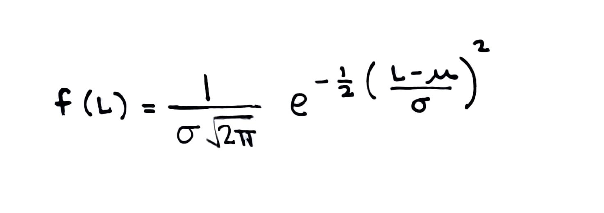

```{r, echo=FALSE}
knitr::opts_chunk$set(echo = TRUE, message = FALSE, warning = FALSE)
```

```{r load_libraries, include=FALSE}
# Use this R-Chunk to load all your libraries!
  #read in the tidyverse library if you want to use ggplot()
#install.packages("tidyverse") # run this line once in console to get package
#library(tidyverse)
#library(ggplot2)

#devtools::install_github('byuidatascience/data4led') # run this line once in console to get package
library(data4led)
```

```{r load_data}
# Use this R-Chunk to import all your datasets!
dist <- led_time(2100)
  #The dist object is a data frame with measurements for all the bulbs at a selected time.
```
<!-- #Color Format -->
# Project 1 Task 4 - Examples and Nonexamples
Below I have included 2 nonexamples (what is not an analysis) and 2 examples (what an analysis look like) using the Modeling Measurement section (task 4) of Project 1 as the subject matter. 

## BackGround (for Project 1)

](https://upload.wikimedia.org/wikipedia/commons/4/4e/Philips_LED_bulbs.jpg){width=250px}

How long does an LED light bulb last? The US Department of Energy launched the Bright Tomorrow Lighting Prize (or L Prize) in 2008 to "spur lighting manufacturers to develop high-quality, high-efficiency solid-state lighting products to replace the common incandescent light bulb." In addition to requiring less than 10 watts, the winning bulb needed to have a lifetime longer than 25,000 hours.  Phillips won the prize in 2011, after undergoing 18 months of rigorous testing.  Note however that there are only 8760 hours in a year (24 hours a day for 365 days), which means it takes almost 100% uptime for 3 years to hit 25,000 hours. How do we know the bulb met the hours requriment with only 18 months of testing? This is where modeling comes into play. 

It turns out that when you first turn on an LED bulb, the lumen output slightly increases for a while, going above 100% of the initial brightness. After peaking above 100%,the lumen output stays relatively constant before it starts a slow decent downwards.  

In this project, we'll be using the data to analyze the function $f(t)$ that gives the lumen output of LED bulbs (as a percent of the original lumens) after $t$ hours. 

# Nonexample 1

This is NOT an analysis. Plots are created but not introduced or explained.

## Modeling Measurement

```{r}
hist(100*dist$percent_intensity, probability = TRUE, xlab="Bulb Intensity (percent of original lumens)", ylab="Density", main = "Histogram of Bulb Intensity")

```

```{r}
f <- function(L,m=0,s=1){
  1/(s*sqrt(2*pi))*exp(-0.5*((L-m)/s)^2)
}

hist(100*dist$percent_intensity, probability = TRUE, xlab="Bulb Intensity (percent of original lumens)", ylab="Density", main = "Histogram of Bulb Intensity")
x <- seq(90,120,0.01)
lines(x,f(x,m=101.57,s=0.59),col=2)

hist(100*dist$percent_intensity, probability = TRUE, xlab="Bulb Intensity (percent of original lumens)", ylab="Density", main = "Histogram of Bulb Intensity")
x <- seq(90,120,0.01)
lines(x,f(x,m=100,s=2),col=3)
```


# Nonexample 2

This is NOT an analysis. There are sentence but still the plots are not introduced and explained.

## Modeling Measurement
This is a density histogram of the data.
```{r}
hist(100*dist$percent_intensity, probability = TRUE, xlab="Bulb Intensity (percent of original lumens)", ylab="Density", main = "Histogram of Bulb Intensity")

```

The good fit is shown in red. The parameters are $\mu = 101.57$ and $\sigma = 0.59$. The poor fit is shown in green. The parameters are $\mu = 100$ and $\sigma = 2$.
```{r}
f <- function(L,m=0,s=1){
  1/(s*sqrt(2*pi))*exp(-0.5*((L-m)/s)^2)
}

hist(100*dist$percent_intensity, probability = TRUE, xlab="Bulb Intensity (percent of original lumens)", ylab="Density", main = "Histogram of Bulb Intensity")
x <- seq(90,120,0.01)
lines(x,f(x,m=101.57,s=0.59),col=2)

hist(100*dist$percent_intensity, probability = TRUE, xlab="Bulb Intensity (percent of original lumens)", ylab="Density", main = "Histogram of Bulb Intensity")
x <- seq(90,120,0.01)
lines(x,f(x,m=100,s=2),col=3)
```

We see that there is variation in the bulb intensity of the light bulbs.


# Example 1

This IS an analysis. Each plot is introduced with complete sentences. Each plot is explained, interpreted, and described with complete sentences.The reader is led through the information and attention is directed to the important details and how that are related to the question being explored.

## Modeling Measurement
We have been exploring the relationship between the time a light bulb has been in use and its brightness (measured as the percent of its original intensity). Up to this point we have looked at the data from a single light bulb. We know that there is error and variation in measurement. Here we consider the intensity measurements of 202 bulbs after they have been in use for 2104 hours (or approximately 3 months of continual use). Below is a density histogram of this data.
```{r}
hist(100*dist$percent_intensity, probability = TRUE, xlab="Bulb Intensity (percent of original lumens)", ylab="Density", main = "Histogram of Bulb Intensity")

```
This histogram shows the percent intensity for the buls are between 99% and 104%. This means that most of the bulbs are brighter after 3 months of use. This is consistent with the background information that LED bulbs initially get brighter before their lumen output decreases.

We consider the probability function {width=250px}. This probability funtion is a model of measurement. From this model we can determine the probabilities associated with different intensities. 

By changing the parameters $\mu$ and $\sigma$ in $f(L)$ we can fit this model of measurement to the data shown in the histogram above. After some trial and error we find some parameters so that $f(L)$ is a good visual fit our data. In the plot below shows this good visual fit of $f(L)$ to the data in red. The parameters are $\mu = 101.57$ and $\sigma = 0.59$. 
```{r}
f <- function(L,m=0,s=1){
  1/(s*sqrt(2*pi))*exp(-0.5*((L-m)/s)^2)
}

hist(100*dist$percent_intensity, probability = TRUE, xlab="Bulb Intensity (percent of original lumens)", ylab="Density", main = "Histogram of Bulb Intensity")
x <- seq(90,120,0.01)
lines(x,f(x,m=101.57,s=0.59),col=2)


```
Notice that the peak of the curve happens at the same place and is close to the same height as the peak in the histogram. Notice that the sides of the curve follow approximately the histogram as we move away from the center in both directions. These are the characteristics we looked for in a good visual fit.

We include a poor visual fit, shown in green, for comparison. The parameters we selected in this case are $\mu = 100$ and $\sigma = 2$. 
```{r}
hist(100*dist$percent_intensity, probability = TRUE, xlab="Bulb Intensity (percent of original lumens)", ylab="Density", main = "Histogram of Bulb Intensity")
x <- seq(90,120,0.01)
lines(x,f(x,m=100,s=2),col=3)
```
Notice the peak of the curve is to the left of the peak of the histogram. Notice the peak of the curve is much lower than the peak of the histogram. Notice the curve is much more spread out than the histogram.

We can use functions like $f_1(t)$, $f_2(t)$, $f_3(t)$, $f_4(t)$, and $f_5(t)$ to predict behavior. These function describe the relationship of how bright a light bulb is depending on how long it has been used. When we measure the brightness of a light bulb there is variation in that measurement. Models like $f(L)$ are used to describe the variation in a meaurement. We see here that when we measure many different light bulbs after they have been in use for approximately 3 months we see that most of these light bulbs are brighter than they were when they were first turned on but these measurement are still spread out between 99% and 104% of each bulbs original intensity. Functions describing relationship can not give us this information because they model average behavior used to make predictions.


# Example 2

This IS an analysis. Each plot is introduced with complete sentences. Each plot is explained, interpreted, and described with complete sentences.The reader is led through the information and attention is directed to the important details and how that are related to the question being explored.

However, this example includes more information than is really needed.

## Modeling Measurement
We have been exploring the relationship between the time a light bulb has been in use and its brightness (measured as the percent of its original intensity). Up to this point we have looked at the data from a single light bulb. We know that there is error and variation in measurement. Here we consider the intensity measurements of 202 bulbs after they have been in use for 2104 hours (or approximately 3 months of continual use). 

Histograms are plots where the data is binned into discrete categories. The width of a bin multiplied by the density (the height) gives the proportion of total observations in that bin. Below is a density histogram of this data. 
```{r}
hist(100*dist$percent_intensity, probability = TRUE, xlab="Bulb Intensity (percent of original lumens)", ylab="Density", main = "Histogram of Bulb Intensity")

```
This histogram shows the percent intensity for the buls are between 99% and 104%. This means that most of the bulbs are brighter after 3 months of use. This is consistent with the background information that LED bulbs initially get brighter before their lumen output decreases.

We consider the probability function {width=250px}. This probability funtion is a model of measurement. It is called the Normal Probability Density function. The parameter $\mu$ describes the average of all possible intensity measurement. The parameter $\sigma$ describes the standard deviation, or spread of all possible intensity measurement. We have assumed that the intensity measurements follow this distribution, or measurement model. From this model we can determine the probabilities associated with different intensities. 

By changing the parameters $\mu$ and $\sigma$ in $f(L)$ we can fit this model of measurement to the data shown in the histogram above. We started with $\mu = 100$ and $\sigma = 1$ as our parameters, this was not a very good fit. The curve was too far to the left. So we tried $\mu = 101.5$ and $\sigma = 1$, but this still was not a good fit. The curve was too short. Then we tried $\mu = 101.5$ and $\sigma = 2$. The curve was even shorter. After some continued trial and error we found some parameters so that $f(L)$ is a good visual fit our data. In the plot below shows this good visual fit of $f(L)$ to the data in red. The parameters are $\mu = 101.57$ and $\sigma = 0.59$. 
```{r}
f <- function(L,m=0,s=1){
  1/(s*sqrt(2*pi))*exp(-0.5*((L-m)/s)^2)
}

hist(100*dist$percent_intensity, probability = TRUE, xlab="Bulb Intensity (percent of original lumens)", ylab="Density", main = "Histogram of Bulb Intensity")
x <- seq(90,120,0.01)
lines(x,f(x,m=101.57,s=0.59),col=2)


```
Notice that the peak of the curve happens at the same place and is close to the same height as the peak in the histogram. Notice that the sides of the curve follow approximately the histogram as we move away from the center in both directions. These are the characteristics we looked for in a good visual fit.

We include a poor visual fit, shown in green, for comparison. The parameters we selected in this case are $\mu = 100$ and $\sigma = 2$. 
```{r}
hist(100*dist$percent_intensity, probability = TRUE, xlab="Bulb Intensity (percent of original lumens)", ylab="Density", main = "Histogram of Bulb Intensity")
x <- seq(90,120,0.01)
lines(x,f(x,m=100,s=2),col=3)
```
Notice the peak of the curve is to the left of the peak of the histogram. Notice the peak of the curve is much lower than the peak of the histogram. Notice the curve is much more spread out than the histogram.

We can use functions like $f_1(t)$, $f_2(t)$, $f_3(t)$, $f_4(t)$, and $f_5(t)$ to predict behavior. These function describe the relationship of how bright a light bulb is depending on how long it has been used. Each of these functions tell a different story. Each of these functions describe features we see in the scatterplot of our data. In our scatterplot the brightness of the bulbs seems to stay about the same for the first 5000 hours, but extending the story of a constant brightness forever does not make sense with our understanding of how light bulbs really work, eventually losing brightness and dying. Each of these other models of the relationship between how long a light bulb has been in use and how bright that light bulb is also have features that can be seen in the data. When we select one of these models we are choosing to believe the story it tells about how the brightness of a light bulbs will be determined by how long it is in use. But none of these functions can describe the different measurement we see for different bulbs at any given time point.

When we measure the brightness of a light bulb there is variation in that measurement. Models like $f(L)$ are used to describe the variation in a meaurement. We see here that when we measure many different light bulbs after they have been in use for approximately 3 months we see that most of these light bulbs are brighter than they were when they were first turned on but these measurement are still spread out between 99% and 104% of each bulbs original intensity. Functions describing relationship can not give us this information because they model average behavior used to make predictions.