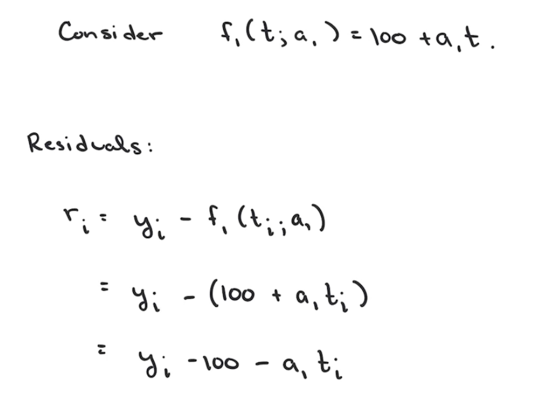
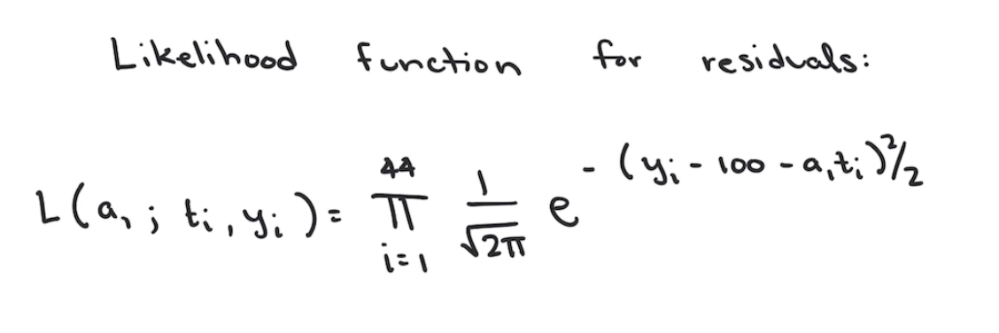
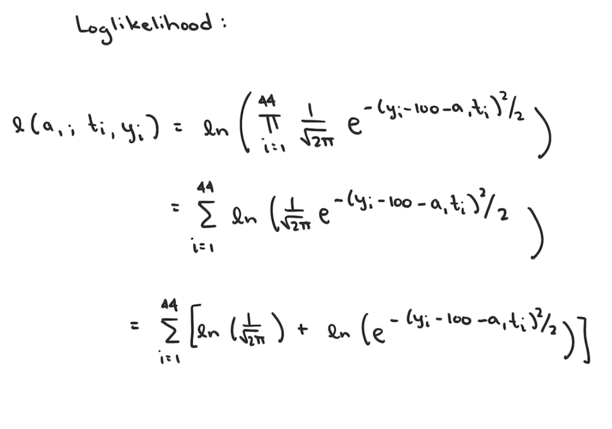
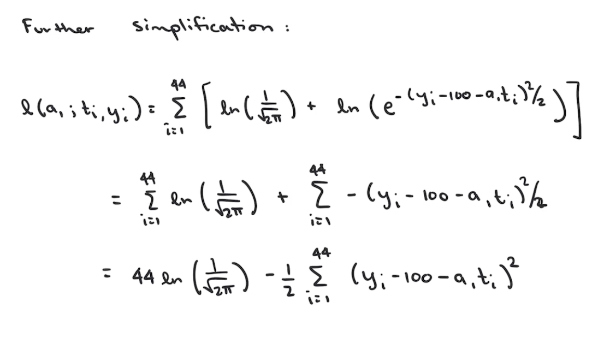

```{r include=FALSE}
knitr::opts_chunk$set(echo = TRUE, message = FALSE, warning = FALSE)
```

In order to write the likelihood function for $f_1(t;a_1) = 100 + a_1t$ we need to calculated the residuals. We calculate the residuals (or errors) by subtracting the predicted value from the observed value. This calculation is show below in general for the ith data point.





