You can download a copy of the Rmd for this file from 

* https://byuistats.github.io/M119/derivatives-intro.Rmd

This file depends on some custom functions for making plots.
While you do not need to reproduce the code below, feel free to explore it after class if you are interested. 


```{.r .fold-hide}
# We use these functions in the work below. 

#This function will plot a function given the center x value, width, and height. 
my_plot_fun_cen <- function(f,center,width=20,height=NA,n=100,...){
  x <- seq(center - width/2,center+width/2,width/n)
  y <- f(x)
  b <- f(center)
  #original_par <- par(no.readonly = TRUE)
  #par(mar=c(2,2,0.25,0.25))
  
  if(is.na(height)){
    plot(x,y,type="l",...)
  } else {
    plot(x,y,type="l",ylim = c(b-height/2,b+height/2),...)
  }
  #par(original_par)#resets par
}

#This draws a gray dashed box centered at (a,b) with a given width and height. 
my_polypath_cen <- function(a,b,width,height=width,lty = 2, border = "gray",...){
  x <- c(a-width/2,a-width/2,a+width/2,a+width/2)
  y <- c(b-height/2,b+height/2,b+height/2,b-height/2)
  polypath(x,y,lty=lty,border=border,...)
}

#This code plots a function given the center, width, and height desired.
#Then it multiplies the width and height by the scale to create a zoomed in plot.
#This is done 3 total times, making a 2 by 2 grid of plots. 
zoom_in <- function(f, center, width=10, height = width, scale = 1/4,...){
  a <- center
  b <- f(center)
  w <- width
  h <- height
  r <- scale

  #We will be making graphs appear in a 2 by 2 grid.
  #Save the original par settings to reset them at the end. 
  original_par <- par(no.readonly = TRUE)
  
  par(mfrow=c(2,2),mar=c(2,2,0.25,0.25))
  #Plot function
  my_plot_fun_cen(f,center,width,height,...)
  points(a,b,pch=16,col=2)
  my_polypath_cen(a,b,w*r,h*r,...)
  #Zoom in by multiplying the width and height by the scale. 
  my_plot_fun_cen(f,center,w*r,h*r,...)
  points(a,b,pch=16,col=2)
  my_polypath_cen(a,b,w*r^2,h*r^2,...)
  #Zoom in again
  my_plot_fun_cen(f,center,w*r^2,h*r^2,...)
  points(a,b,pch=16,col=2)
  my_polypath_cen(a,b,w*r^3,h*r^3,...)
  #And Zoom in one last time. 
  my_plot_fun_cen(f,center,w*r^3,h*r^3,...)
  points(a,b,pch=16,col=2)

  par(original_par)#resets par
}

linearization <- function(x,f,a,m){
  f(a) + m*(x - a)
}

linearization_plot <- function(f,a,slope,width=10,height=width,n=1000,scale=1/4,...){
  original_par <- par(no.readonly = TRUE)
  b <- f(a)
  w <- width
  h <- height
  x <- seq(a-w/2,a+w/2,w/n)

  par(mfrow=c(1,2),mar=c(2,2,0.25,0.25))
  my_plot_fun_cen(f,a,width,height,...)
  points(a,b,pch=16,col=2)
  lines(x,linearization(x,f,a,slope),col=3)
  my_plot_fun_cen(f,a,width*scale,height*scale,...)
  points(a,b,pch=16,col=2)
  lines(x,linearization(x,f,a,slope),col=3)
  par(original_par)#resets par
  
}

slope_table <- function(f,c,dx,n=4){
  x <- seq(c-n*dx,c+n*dx,dx)
  data.frame(c=c,x=x,Deltax = x-c,fc=f(c),fx=f(x),Deltay = f(x)-f(c), slope=(f(x)-f(c))/(x-c))
}

Df_approx <- function(c,f,dx){
  #Average of right and left difference quotients
  ((f(c+dx)-f(c))/dx+(f(c-dx)-f(c))/-dx)/2
}

plot_f_with_der <- function(f,xlim,ylim=NA,tlines=NA,n=100){
  original_par <- par(no.readonly = TRUE)
  a <- xlim[[1]]
  b <- xlim[[2]]
  dx <- (b-a)/n
  x <- seq(a,b,(b-a)/n)
  y <- f(x)
  Dy <- Df_approx(x,f,dx/10)
  par(mar=c(2,2,0.25,0.25))
  if(all(is.na(ylim))){
    plot(x,y,xlim=xlim,type = "l")
    lines(x,Dy,xlim=xlim, type = "l", col = 2)
  } else {
    plot(x,y,xlim=xlim,type = "l",ylim = ylim)
    lines(x,Dy,xlim=xlim, type = "l", col = 2, ylim=ylim)
  }
  for (t in tlines){
    lines(x,f(t)+Df_approx(t,f,dx/10)*(x-t),col=3)
    lines(c(t,t),c(f(t),Df_approx(t,f,dx/10)),lty=3)
    points(t,f(t),col=2)
  }
  lines(x,y,xlim=xlim,type = "l")
  lines(x,Dy,xlim=xlim, type = "l", col = 2)
  par(original_par)#resets par
}
```

## Graphical Exploration

Let's start by picking a function. You can choose one from the list below (by uncommenting it), or you can code in your own.


```r
f <- function(x){x^4 -10*x^2 +3*x}
```

Let's pick a point $x=c$ at which we care to explore the function, and then graph it. 


```r
c <- 3
my_plot_fun_cen(f,c)
```

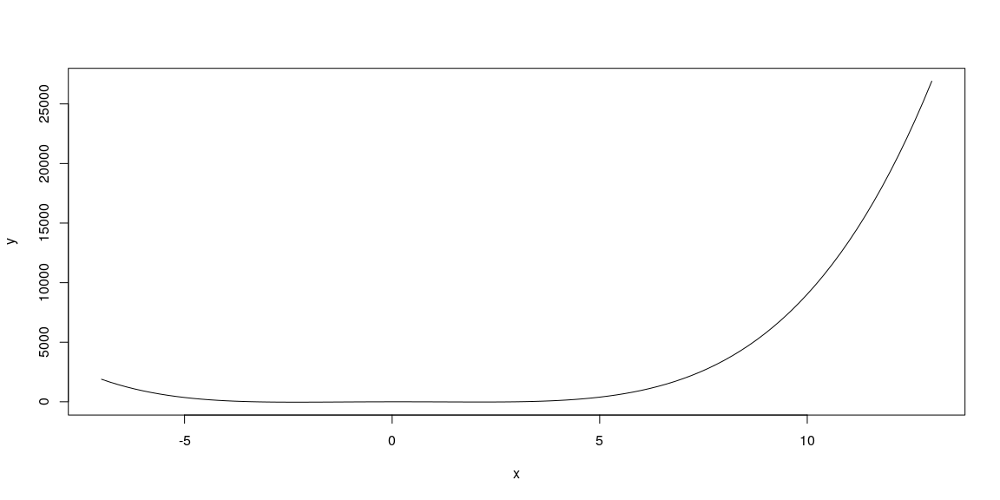<!-- -->

We may need to adjust the viewing width and height to have a decent plot.
The plots we'll explore are all centered at the point $x=c$, so the 
width and height will force $(c,f(c))$ to be the center of the plot. 
The code below will graph the function. 


```r
width <- 8
height <- 160  
my_plot_fun_cen(f,c,width,height=height)
```

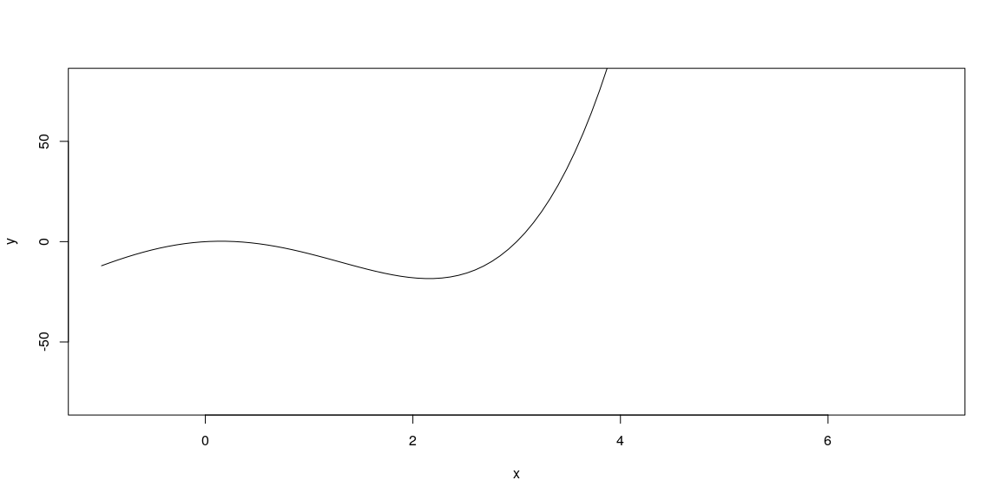<!-- -->

The plot below shows what happens if we repeatedly zoom in on the central point. Each plot (read left-to-right, top-to-bottom) zooms in by the scale provided (set a 1/4 initially).  The gray rectangles provide a visual of the region shown by the next plot. 


```r
zoom_in(f,c,width, height, scale = 1/4)
```

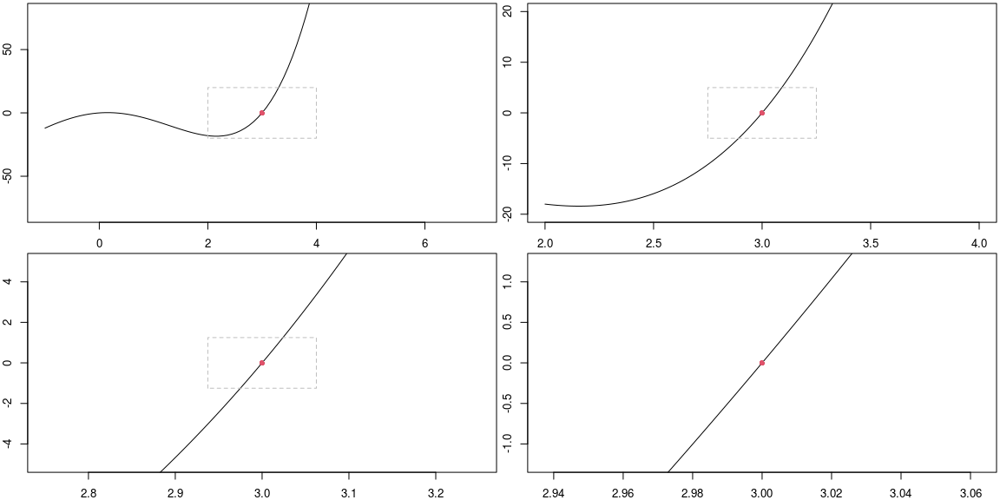<!-- -->

The reason for the plot above is to notice that as we zoom in, the graph of the function appears to be just a straight line.  The slope of this line is what we call the derivative of the function at the point $x=c$. 
We will write $f'(c)$ for the derivative of $f$ at $x=c$, and sometimes we read this as "f prime at c."

### Exercises

For each function below, with provided center, adjust the width and height to obtain a reasonable viewing window to examine the function near that point.  Then run the zoom_in function above to verify (or not) that as you zoom in, the function appears to become a straight line. 

1. Use `f <- function(x){exp(2*x)-1}` centered at $x=0$. The code below has been adapted to this function. 
1. Use `f <- function(x){sign(x-1)*(abs(x-1))^(1/3)}` centered at $x=2$. Adapt the code below. 
1. Use `f <-function(x){3*log(x-2)}` centered at $x=2.75$.
1. Use `f <- function(x){abs(x+4)}` centered at $x=1$.
1. Use `f <- function(x){abs(x+4)}` centered at $x=-4$. Explain why there is no derivative to this function at $x=-4$.
1. Use `f <- function(x){sign(x-1)*(abs(x-1))^(1/3)}` centered at $x=1$. Is there a derivative to this function at $x=1$?


```r
#f <- function(x){x^4 -10*x^2 +3*x}
f <- function(x){exp(2*x)-1}
#f <- function(x){sign(x-1)*(abs(x-1))^(1/3)}
#f <- function(x){3*log(x-2)}
#f <- function(x){abs(x+4)}
# Feel free to enter your own. 
```


```r
c <- 0
my_plot_fun_cen(f,c)
```

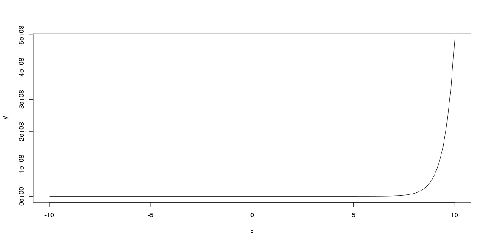<!-- -->

```r
width <- 10
height <- 10
my_plot_fun_cen(f,c,width,height=height)
```

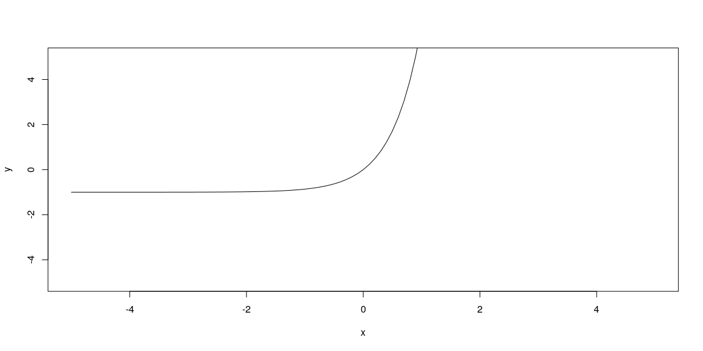<!-- -->

```r
zoom_in(f,c,width, height, scale = 1/4)
```

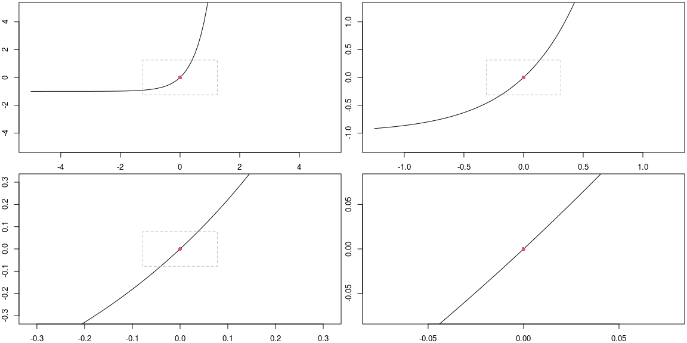<!-- -->

## Numerical Exploration of the Derivative

When we zoomed in on the function near $x=c$, we saw that the graph appeared to be basically just a line. The derivative of $f$ at $x=c$, so $f'(c)$, is the slope of this line.  This is the green line you see below, where the plot on the right is what happens if we zoom in by the given scale (so that the green line and the function are almost indistinguishable). 


```r
f <- function(x){x^4 -10*x^2 +3*x}
c <- 3
width <- 8
height <- 160

linearization_plot(f,c,Df_approx(c,f,width/100),width,height,scale = 1/4)
```

<!-- -->

This line has many names.  We will refer to it as the linearization of $f$ at $x=c$, and also as the tangent line to $f$ at $x=c$. Note that the equation of this line, using the point-slope form of a line, is given by $$y-f(c) = f'(c)(x-c).$$
The equation above is a common way we write an equation for the tangent line to $f$ at $x=c$.  
When we solve the above equation for $y$, we obtain the linearization $L(x)$ of $f$ at $x=c$ as function 
$$y = L(x;c) = f(c)+f'(c)(x-c).$$

To estimate the derivative of $f$ at $x=c$, we can calculate the slope of lines that pass through the point $(c,f(c)) =(3,0)$ and other points on the function that are close to this central point. The table below computes the slope of the line through $(c,f(c))$ and $(c+dx*i,f(c+dx*i))$ for several values of $i$, where you should see NaN when $i=0$ as we cannot divide by zero. Our goal is to determine a value to replace the NaN below by a number that seems to fill in the pattern given by the other numbers. 


```r
dx <- 0.0001
slope_table(f,c,dx,n=4)
```

```
##   c      x Deltax fc          fx      Deltay   slope
## 1 3 2.9996 -4e-04  0 -0.02039296 -0.02039296 50.9824
## 2 3 2.9997 -3e-04  0 -0.01529604 -0.01529604 50.9868
## 3 3 2.9998 -2e-04  0 -0.01019824 -0.01019824 50.9912
## 4 3 2.9999 -1e-04  0 -0.00509956 -0.00509956 50.9956
## 5 3 3.0000  0e+00  0  0.00000000  0.00000000     NaN
## 6 3 3.0001  1e-04  0  0.00510044  0.00510044 51.0044
## 7 3 3.0002  2e-04  0  0.01020176  0.01020176 51.0088
## 8 3 3.0003  3e-04  0  0.01530396  0.01530396 51.0132
## 9 3 3.0004  4e-04  0  0.02040704  0.02040704 51.0176
```

We can adjust the value $dx$, making is smaller if needed, until we obtain a reasonable estimate for the slope of the tangent line. 
Once the values in the right most column above are all close together, then we can average together the two numbers above and below NaN to obtain a reasonable approximation for $f'(c)$.  For the example above, this gives the value in the following code chunk (remember to make $dx$ smaller until the numbers in the above table are very close together).


```r
mean(
  (f(c+dx)-f(c))/dx,
  (f(c-dx)-f(c))/(-dx))
```

```
## [1] 51.0044
```

Once you believe you have a reasonable estimate for the derivative of $f$ at $x=c$, enter your value in the code chunk below and evaluate it. 
The linearization of $f$ at $x=c$ should appear as a green line that is tangent to the curve at $x=c$. Then you can use this plot to visually check that your estimate of the derivative seems reasonable.


```r
#Enter your estimate for f'(c)
derivative_of_f_at_c <- 51

linearization_plot(f,c,derivative_of_f_at_c,width,height,scale = 1/4)
```

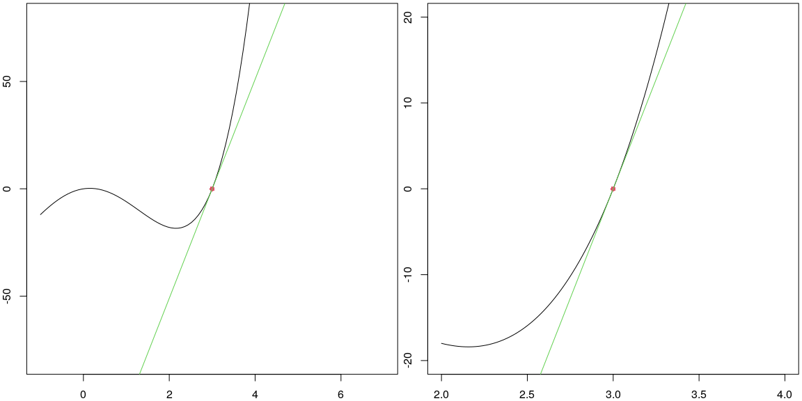<!-- -->

If the green line above appears tangent to the curve, then you've got a reasonable approximation for $f'(c)$.

### Exercises

For each function below, with center at $x=c$, construct a slope table (so use `slope_table`) with sufficiently small $dx$ to obtain an approximation to $f'(c)$.  
Then use `linearization_plot` to verify (or not) that your value for $f'(c)$ is reasonable. You can use the code below the problems to complete this exercise. 

1. Use `f <- function(x){exp(2*x)-1}` centered at $x=0$.
1. Use `f <- function(x){sign(x-1)*(abs(x-1))^(1/3)}` centered at $x=2$.
1. Use `f <-function(x){3*log(x-2)}` centered at $x=2.75$.
1. Use `f <- function(x){abs(x+4)}` centered at $x=1$.
1. Use `f <- function(x){abs(x+4)}` centered at $x=-4$.
1. Use `f <- function(x){sign(x-1)*(abs(x-1))^(1/3)}` centered at $x=1$.


```r
f <- function(x){exp(2*x)-1}
c <- 0
dx <- 0.01 #Change as needed
slope_table(f,c,dx,n=4)
```

```
##   c     x Deltax fc          fx      Deltay    slope
## 1 0 -0.04  -0.04  0 -0.07688365 -0.07688365 1.922091
## 2 0 -0.03  -0.03  0 -0.05823547 -0.05823547 1.941182
## 3 0 -0.02  -0.02  0 -0.03921056 -0.03921056 1.960528
## 4 0 -0.01  -0.01  0 -0.01980133 -0.01980133 1.980133
## 5 0  0.00   0.00  0  0.00000000  0.00000000      NaN
## 6 0  0.01   0.01  0  0.02020134  0.02020134 2.020134
## 7 0  0.02   0.02  0  0.04081077  0.04081077 2.040539
## 8 0  0.03   0.03  0  0.06183655  0.06183655 2.061218
## 9 0  0.04   0.04  0  0.08328707  0.08328707 2.082177
```

```r
mean( #This provides a reasonable guess for f'(c),
      #provided the values in the table above are close. 
  (f(c+dx)-f(c))/dx,
  (f(c-dx)-f(c))/(-dx))
```

```
## [1] 2.020134
```

```r
#Enter your estimate for f'(c). 
derivative_of_f_at_c <- 4
width <- 10
height <- 10
linearization_plot(f,c,derivative_of_f_at_c,width,height,scale = 1/4)
```

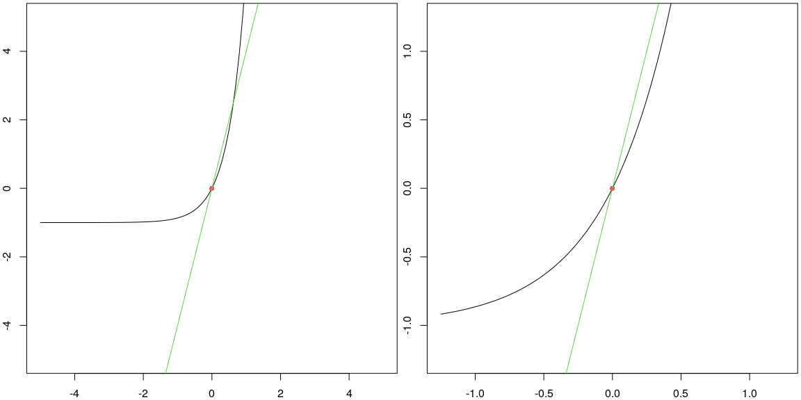<!-- -->

## Finding the Derivative as a Function 

We can repeat the above computations to estimate the derivative of a function at $x=c$ for various points $c$.
For example, for the function $f(x) = x^2$, the plot below shows the value of the derivative (in red) at every point $x=c$ for $c$ from $-3$ to $3$. The linearization to the function is shown in green for each $c$ in $\{-2,-1,1.5,3\}$, with these points circled in red and then a dashed line connecting the point $(c,f(c))$ to the point $(c,f'(c))$. The height of the red function at $x$ is the derivative of the black function at $x$.     


```r
f <- function(x){x^2}
xlim <- c(-3,3)
ylim <- c(-9,9)
tlines <- c(-2,-1,1.5,3)
plot_f_with_der(f,xlim,ylim,tlines)
```

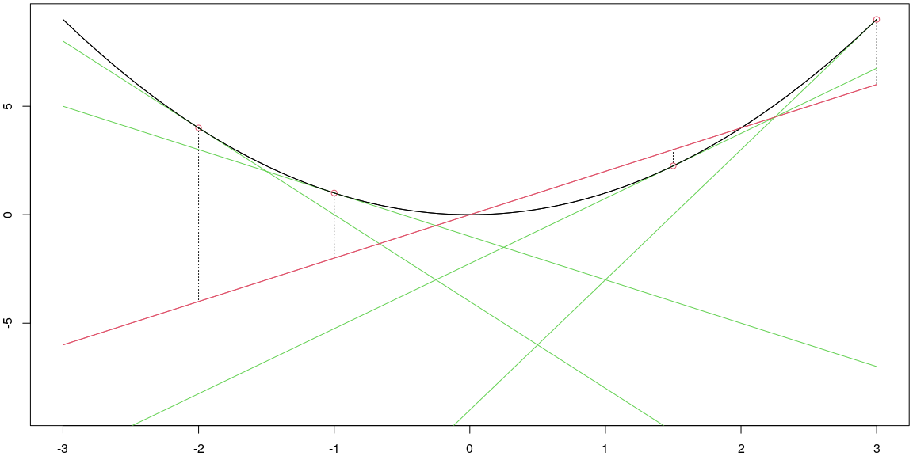<!-- -->

The red line above is a visual representation of the derivative of $f$ as a function of $x$. Some notations people use for the derivaive of $f$ are  $$f'(x) , \frac{df}{dx}, \text{ and } \frac{d}{dx}[f(x)].$$
We'll use each of these notations throughout the semester. 

In our class, we'll learn rules to compute the derivatives exactly for power functions, exponential functions, and logarithmic functions. In addition we'll learn how to compute derivatives of functions obtained from others through multipilcation by a constant, sums/differences, products/quotients, and function composition. 
The prep for tomorrow has you learn a few of these rules. 

Let's examine how to obtain one of these rules through a visual and graphical exploration. 
Consider the fuction $f(x) = x^2$. 
The plot below shows the function $f(x)$ (in black) along with its derivative $f'(x)$ (in red) on the same plot.


```r
f <- function(x){x^2}
xlim <- c(-3,3)
ylim <- c(-9,9)
plot_f_with_der(f,xlim,ylim,)
```

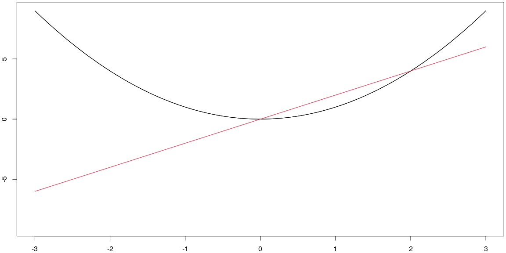<!-- -->

Notice that the derivative appears to be the graph of a line.  
We can numerically approximate the derivate at various points, using the process from above.  


```r
x <- seq(-3,3,1)
dx <- 0.0001
Df_at_x <- Df_approx(x,f,dx)
data.frame(x = x, Df_at_x = Df_at_x)
```

```
##    x Df_at_x
## 1 -3      -6
## 2 -2      -4
## 3 -1      -2
## 4  0       0
## 5  1       2
## 6  2       4
## 7  3       6
```

In the table above, notice that given $x$, we see that $f'(x)$ is twice $x$.  We can summarize this as $$\frac{d}{dx}[x^2] = 2x.$$

### Exercises

Repeat the computations in this section with each function $f(x)$ below to obtain the derivative $f'(x)$. This may require some pattern recognition to guess the function $f'(x)$ from a table of values. 

1. Let  $f(x) = 5x$. The code below has already been updated to help you complete this one.  
1. Let $f(x) = x^2+5x$. Adapt the code below. 
1. Let $f(x) = 3x^2$. 
1. Let $f(x) = x^3$.


```r
f <- function(x){5*x}
xlim <- c(-3,3)
ylim <- c(-9,9)
plot_f_with_der(f,xlim,ylim,)
```

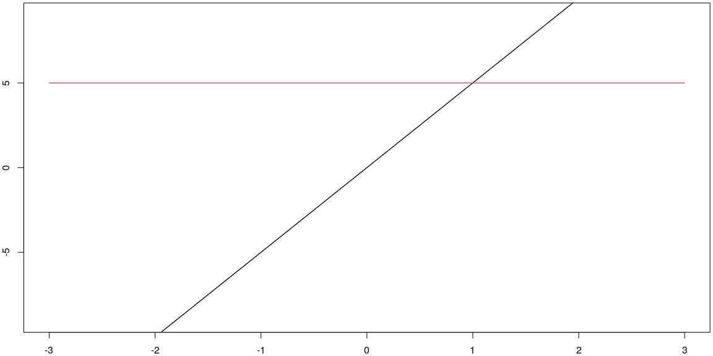<!-- -->

```r
x <- seq(-3,3,1)
dx <- 0.0001
Df_at_x <- Df_approx(x,f,dx)
data.frame(x = x, Df_at_x = Df_at_x)
```

```
##    x Df_at_x
## 1 -3       5
## 2 -2       5
## 3 -1       5
## 4  0       5
## 5  1       5
## 6  2       5
## 7  3       5
```


## An algebraic approach to finding the derivative

We obtained the rule above by examining a graph, making a table, and then summarizing our work. Let's explore an algebraic way to obtain the same result.  We can compute the slope from $(x,f(x))$ to $(x+dx,f(x+dx))$ by computing
$$\begin{align*}
\frac{\text{change in y}}{\text{change in x}}
&=\frac{f(x+dx)-f(x)}{(x+dx)-(x)}\\
&=\frac{f(x+dx)-f(x)}{dx}\\
&=\frac{(x+dx)^2-(x)^2}{dx}\\
&=\frac{(x^2+2xdx+dx^2)-x^2}{dx}\\
&=\frac{2xdx+dx^2}{dx}\\
&=2x+dx.
\end{align*}$$

Our goal was to make the change in $x$ really small, which means this slope, assuming $dx$ is really small, is basically just $2x$. This matches the derivative we obtained above through visual and graphical means. 

We computed and simplified the quantity $\frac{f(x+dx)-f(x)}{dx}$ above. 
This quantity is called the difference quotient of a function. By letting $dx$ approach zero (a formal process we have not yet fully defined), we obtain the derivative of $f$ at $x$.  It's common to write this process using the notation
$$f'(x) = \lim_{dx\to 0}\frac{f(x+dx)-f(x)}{dx}.$$ 

### Exercises

Repeat the algebraic computations in this section with each function $f(x)$ below to obtain the derivative $f'(x)$.

1. Let $f(x) = 5x$.  
1. Let $f(x) = x^2+5x$.  
1. Let $f(x) = 3x^2$.  
1. Let $f(x) = x^3$.  
1. Let $f(x) = 3$.
1. Let $f(x) = c$ for some constant $c$.
1. Let $f(x) = cx$ for some constant $c$.
1. Let $f(x) = cx^2$ for some constant $c$.
1. Let $f(x) = cx^3$ for some constant $c$.
1. Let $f(x) = 1/x$.

