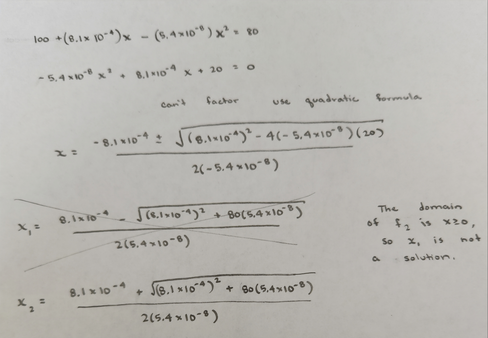

```{r setup, include=FALSE}
knitr::opts_chunk$set(echo = TRUE)
```

## How long does a LED bulb last?
We fit the general model $f(x; a_2, a_1, a_0) = a_2x^2 + a_1x + a_0$ with $x \geq 0$ to our data by selecting parameters to find a visual fit. 

We will used the fitted model $f_1(x) = 100 + 0.0067x$ with $x \geq 0$ to predicts when the bulb will "burn out".
$$\begin{align*}
f_1(x) &= 80 \\
100 + 0.0067x &= 80 \\
0.0067x &= -20 \\
x &= -\frac{20}{0.0067} \\
&\approx -2985.075
\end{align*}$$
Since the domain of $f_1$ is $x \geq 0$, we see there is no solution and we the fitted model $f_1$ predicts the bulb will never burn out. While the fitted model $f_1$ does show the bulb initially increases in intensity consistent with what we know about LED bulbs, the model does not show the intensity of the bulb will start to decreases. Since the fitted model $f_1$ is inconsistent with what we know about LED and we will not use this model in the future.

We will used the fitted model $f_2(x) = 100 + (8.1\times 10^{-4})x - (5.4\times 10^{-8})x^2$ with $x \geq 0$ to predicts the when bulb will "burn out".

We see the exact solution is $x = \frac{0.00081 + \sqrt{0.00081^2 + 80(0.000000054)}}{2(0.000000054)} \approx 28154.79$. So the fitted model $f_2$ predicts the bulb will last approximately 28155 hours.
We can verify this exact answer using the uniroot() solver in R.

```{r}
f2 <- function(x){-5.4e-8*x^2 + 8.1e-4*x + 100}
f2.shift <- function(x){f2(x) - 80}

uniroot(f2.shift,c(1000,30000))$root
```
We can also find the extraneous solution numerically in R with uniroot().
```{r}
f2 <- function(x){-5.4e-8*x^2 + 8.1e-4*x + 100}
f2.shift <- function(x){f2(x) - 80}

uniroot(f2.shift,c(-20000,-3000))$root
```
The fitted model $f_2$ is consistent with what we know about LED bulb and predicts a bulb will last approximately 28155 hours. 