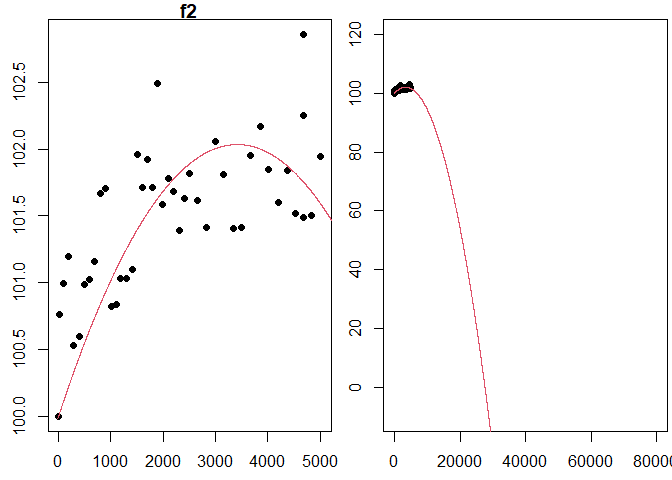
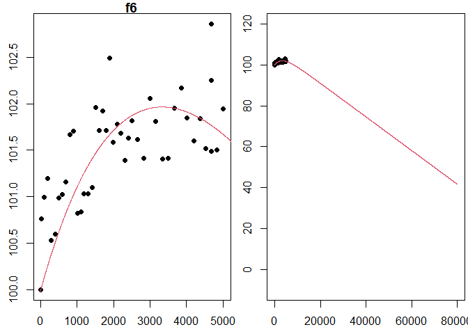

# Project Outline
This project outline and background information have been provided to assist you as you complete your project. You should assume the reader of your work has no knowledge or access to this information.  

How long does an LED light bulb last? Lumens are a measure of how much light you get from a bulb. When you first turn on an LED bulb, the lumen output slightly increases for a while, going above the initial brightness. While LEDs do not "burn out", after peaking the lumen output stays relatively constant before it starts to decrease in lumen output. In the bulb data we will use, lumen measures are normalized to the initial intensity of the bulb, so that we can compare different bulbs.  

In 2008, the US Department of Energy launched the Bright Tomorrow Lighting Prize (or L Prize) to encourage the development of high-efficiency replacement for the incandescent light bulb. To win the prize the bulb needed a lifetime longer than 25,000 hours (almost 3 years). [Source](https://en.wikipedia.org/wiki/L_Prize)  

We do not have three years of data on our bulbs so we will use mathematical models to predict the lifetime. Our work in this project relies on using loglikelihood functions to fit several assumed mathematical models. We will (1) use optimization to fit deterministic models to data and (2) use the fitted models to provide information about an LED bulb.

In this project, we'll be fitting the data to deterministic models, functions $f(t)$, that give the lumen output of LED bulbs (as a percent of the initial lumens) after $t$ hours. The input of the models is time, $t$, measured in hours since the bulb is turn on. The output of the models is bulb intensity, $f(t)$, measured as a percent of initial bulb intensity. By choosing to normalize bulb intensity in this way, we have fixed the initial output as 100\% of the original intensity, $f(0) = 100$. For this project, we will use 80\% of the initial intensity[^note] as the threshold for determining the lifetime of a light bulb. This means once the bulb intensity decreases below 80\% we will consider this the life of the bulb (in other words we will consider the bulb "burned out"). 


## Task 1: Determine the Objective Function

- Create an R Markdown file.

- Consider the following general models.
  - $f_1(t; a_1) = 100 + a_1t$ where $t \geq 0$
  - $f_2(t; a_1,a_2) = 100 + a_1t + a_2t^2$  where $t \geq 0$
  - $f_4(t; a_1,a_2) = 100 + a_1t + a_2\ln(0.005t+1)$  where $t \geq 0$
  - $f_5(t; a_1) = 100e^{-0.00005t} + a_1te^{-0.00005t}$  where $t \geq 0$
  - $f_6(t; a_1,a_2) = 100 + a_1t + a_2(1-e^{-0.0003t})$  where $t \geq 0$
  
  Assume the errors are independent and normally distributed (with mean of 0 and standard deviation of 1). Assume $(t_i,y_i)$ is a list of 44 data points to be provided. Show that the loglikelihood functions for the errors when fitting $f_1$, $f_2$, $f_4$, $f_5$, and $f_6$ to the 44 data points are as given below. *Write out your solutions (include all the steps) and include a picture of each of your calculations (or you can use LaTeX if you would like to type your calculations).* Here is a [computation](https://byuistats.github.io/M119/m119-docs/project2_bmw.html) done for $\ell_1$ that you are welcome to use for guidance.
    - $\ell_1(a_1; \mathbf{t},\mathbf{y}) = 44\ln\left(\frac{1}{\sqrt{2\pi}}\right) - \frac{1}{2}\sum_{i=1}^{44} (y_i - 100 - a_1t_i)^2$
    - $\ell_2(a_1,a_2; \mathbf{t},\mathbf{y}) = 44\ln\left(\frac{1}{\sqrt{2\pi}}\right) - \frac{1}{2}\sum_{i=1}^{44} (y_i - 100 - a_1t_i - a_2t_i^2)^2$
    - $\ell_4(a_1,a_2; \mathbf{t},\mathbf{y}) = 44\ln\left(\frac{1}{\sqrt{2\pi}}\right) - \frac{1}{2}\sum_{i=1}^{44} (y_i - 100 - a_1t_i - a_2\ln(0.005t_i+1))^2$
    - $\ell_5(a_1; \mathbf{t},\mathbf{y}) = 44\ln\left(\frac{1}{\sqrt{2\pi}}\right) - \frac{1}{2}\sum_{i=1}^{44} (y_i - 100e^{-0.00005t_i} - a_1t_ie^{-0.00005t_i})^2$
    - $\ell_6(a_1,a_2; \mathbf{t},\mathbf{y}) = 44\ln\left(\frac{1}{\sqrt{2\pi}}\right) - \frac{1}{2}\sum_{i=1}^{44} (y_i - 100 - a_1t_i - a_2(1-e^{-0.0003t_i}))^2$

  The final answers above are provided to help you know when you're finished. Your job is to lead your reader through your calculations to get to these answers. Make sure you include enough steps, including explanations, throughout your calculations so a reader at the calculus 1 level can understand your solution. What properties of logarithms and sums did you use? Be explicit.

- Organize your work into a [**cohesive analysis**](https://byuistats.github.io/M119/specs_detail.html) and submit the html file on Canvas. 


## Task 2: Derivatives
- Create a new R Markdown file.
- Show that the first and second derivatives of $\ell_1(a_1; \mathbf{t}, \mathbf{y})$, the loglikelihood function for errors from the general model $f_1$, with respect to $a_1$ are as follows. *Write out your solutions and include a picture of each of your calculations (or you can use LaTeX if you would like to type your calculations).*
    - $\frac{d\ell_1}{da_1} = \left(\sum_{i=1}^{44} t_i(y_i-100)\right) - \left(\sum_{i=1}^{44} t_i^2\right) a_1$
    - $\frac{d^2\ell_1}{da_1^2} = -\sum_{i=1}^{44} t_i^2$
    
- Show that the first partials and second partials of $\ell_4(a_1, a_2; \mathbf{t}, \mathbf{y})$, the loglikelihood function for errors from the general model $f_4$, are as follows. *Write out your solutions and include a picture of each of your calculations (or you can use LaTeX if you would like to type your calculations).* Here is a [similar computation](https://byuistats.github.io/M119/m119-docs/PDloglikelihoodFn6.html) done for $\ell_6$, which you are welcome to use for guidance. 
    - $\frac{\partial\ell_4}{\partial a_1} = \left(\sum_{i=1}^{44} t_i(y_i-100)\right) - \left(\sum_{i=1}^{44} t_i^2\right) a_1 - \left(\sum_{i=1}^{44} t_i\ln(0.005t_i + 1)\right) a_2$
    - $\frac{\partial\ell_4}{\partial a_2} = \left(\sum_{i=1}^{44} \ln(0.005t_i + 1)(y_i-100)\right) - \left(\sum_{i=1}^{44} t_i\ln(0.005t_i + 1)\right) a_1 - \left(\sum_{i=1}^{44} (\ln(0.005t_i + 1))^2\right) a_2$
    - $\frac{\partial^2\ell_4}{\partial a_1^2} = -\sum_{i=1}^{44} t_i^2$
    - $\frac{\partial^2\ell_4}{\partial a_2^2} = -\sum_{i=1}^{44} (\ln(0.005t_i + 1))^2$
    - $\frac{\partial^2\ell_4}{\partial a_2 \partial a_1} = -\sum_{i=1}^{44} t_i\ln(0.005t_i + 1)$

- Show that the first and second derivatives of $\ell_5(a_1; \mathbf{t}, \mathbf{y})$, the loglikelihood function for errors from the general model $f_5$, are as follows. *Write out your solutions and include a picture of each of your calculations (or you can use LaTeX if you would like to type your calculations).*
    - $\frac{d\ell_5}{da_1} = \left(\sum_{i=1}^{44} t_ie^{-0.00005t_i}(y_i-100e^{-0.00005t_i})\right) - \left(\sum_{i=1}^{44} (t_ie^{-0.00005t_i})^2\right) a_1$
    - $\frac{d^2\ell_5}{da_1^2} = -\sum_{i=1}^{44} (t_ie^{-0.00005t_i})^2$


- Organize your work into a [**cohesive analysis**](https://byuistats.github.io/M119/specs_detail.html) and submit the html file on Canvas. 
  - The final answers above are provided to help you know when you're finished. Your job is to lead your reader through your calculations to get to these answers. Make sure you include enough steps, including explanations, throughout your calculations so a reader at the calculus 1 level can understand your solution. What properties of derivatives and sums did you use? Be explicit.


## Task 3: Fit the Model ("Maximum Likelihood" Method)
- Create a new R Markdown file.
- Use the `seed=` argument in the `led_bulb()` function to set the seed and use the following code to read in the light bulb data.
    
    ``` r
    #If needed, refer to Project 1 Task 1 to install the data4led package.
    library(data4led)
    
    #Change the DDDD below to your assigned seed, and then load the data for that randomly selected bulb. 
    #This is part of what makes your work reproducible.
    bulb <- led_bulb(1,seed = DDDD)
    ```

  This code creates a data frame called "bulb". The bulb data frame contains measurements for one randomly selected bulb at many time points. You will need to set the seed so that you will have your own random, but reproducible, data with which to work. Please set the seed as the four digit number from the class list of assigned seeds.  

  The bulb data frame, a table, includes the columns (1) "id", the identification number for your randomly selected bulb, (2) "hours", the number of hours since the bulb has turned on, (3) "intensity", the lumen output of the bulb, (4) "normalized_intensity", the lumen at that time divided by the lumen of your bulb at time 0, and (5) "percent_intensity", the bulb intenstity as a percent of the original lumen (notice the first row in this column is 100). 

- Beneath the instructions for this task, there are two sections titled "Maximum Likelihood Method for $f_2$" and "Maximum Likelihood Method for $f_6$." Each is a cohesive analysis that  applies the maximum likelihood method to the functions $f_2$ and $f_6$, using the random seed 123.  
    - Read each section, and then adapt the code to work with your assigned random seed.  Obtain the parameters $a_1$ and $a_2$ for each model. 

- For each of the 3 remaining models ($f_1$, $f_4$, $f_5$), use the maximum likelihood method (assuming the errors follow a standard normal distribution) to obtain the parameters for the model with the maximum likelihood, given the data corresponding to your seed. For each model, you will need to do the following:
  - Set the derivative of the loglikelihood function with respect the parameter (or partial derivatives with respect to each parameter) equal to zero, and then solve for the unknown parameter(s). Remember to explain your computations. 
  - Use the second derivative test to confirm you have actually found a maximum of the associated loglikelihood function. Remember to explain your computations.
  - Construct a figure that includes a plot of the data together with the fitted model. Feel free to reuse your code from Project 1 Task 3, where you update the parameters accordingly.  

- Include an image from the Shiny App below showing you have found all the correct parameter values. Think of this as a look up table that can either be included at the top of your document (as an executive summary) or at the bottom of your document (as a conclusion).
**Note:** when using fitted models it is best practice not to round in any preliminary calculations, so make sure you use all known decimal places for the parameter values, NOT the rounded values, when you use the fitted model in plots or other places. However, when presenting the fitted models in your narrative, it's customary to round parameters values to 3 significant figures. 

- **CHECK YOUR WORK:** 
  - Does the plot of your fitted function appear to fit your bulb data?
  - Use this [Shiny App](https://posit.byui.edu/content/27bbcd33-a129-45fa-9de1-9355ea44a7b7) to verify that your parameters are correct. 

- Organize your work into a [**cohesive analysis**](https://byuistats.github.io/M119/specs_detail.html) and submit the html file on Canvas. 

### Maximum Likelihood Method for $f_2$

Consider the model $f_2(t; a_1, a_2) = 100 + a_1t + a_2t^2$. The function $f_2$ models the brightness of a lightbulb, measured as a percent of the original intensity of the lightbulb, given the number of hours the lightbulb as been on, $t$. We will fit $f_2$ to the list of 44 measurements, $(t_i, y_i)$, obtained from the data4led package using the seed 123. 

Assuming the residuals (or errors) are independent and normally distributed (with mean 0 and standard deviation 1), the loglikelihood function for these errors is 
$$\ell_2(a_1,a_2; \mathbf{t},\mathbf{y}) = 44\ln\left(\frac{1}{\sqrt{2\pi}}\right) + \sum_{i=1}^{44} \left(-\frac{1}{2}(y_i - 100 - a_1t_i - a_2t_i^2)^2\right).$$ 
We want to find the maximum of $\ell_2$. The first partials of $\ell_2$ are 

- $\frac{\partial\ell_2}{\partial a_1} = \left(\sum_{i=1}^{44} (y_i - 100)t_i\right) - \left(\sum_{i=1}^{44}t_i^2\right)a_1 - \left(\sum_{i=1}^{44}t_i^3\right)a_2$ and
- $\frac{\partial\ell_2}{\partial a_2} = \left(\sum_{i=1}^{44} (y_i - 100)t_i^2\right) - \left(\sum_{i=1}^{44}t_i^3\right)a_1 - \left(\sum_{i=1}^{44}t_i^4\right)a_2$.

To find the critical points of $\ell_2$, we set each partial derivative above equal to zero and then solve 
$$\left\{
\begin{array}{ll}
\left(\sum_{i=1}^{44} (y_i - 100)t_i\right) - \left(\sum_{i=1}^{44}t_i^2\right)a_1 - \left(\sum_{i=1}^{44}t_i^3\right)a_2 &= 0 \\ 
\left(\sum_{i=1}^{44} (y_i - 100)t_i^2\right) - \left(\sum_{i=1}^{44}t_i^3\right)a_1 - \left(\sum_{i=1}^{44}t_i^4\right)a_2 &= 0.
\end{array} 
\right.$$
We notice that this system is of the form
$$\left\{
\begin{align*}
b_1 - c_{11}a_1 - c_{12}a_2 &= 0 \\ 
b_2 - c_{21}a_1 - c_{22}a_2 &= 0,
\end{align*} 
\right.$$
with

- $c_{11} = \sum_{i=1}^{44}t_i^2$,
- $c_{12} = c_{21} = \sum_{i=1}^{44} t_i^3$,
- $c_{22} = \sum_{i=1}^{44} t_i^4$,
- $b_1 = \sum_{i=1}^{44} (y_i - 100)t_i$, and 
- $b_2 = \sum_{i=1}^{44} (y_i - 100)t_i^2$.

Notice that $\sum_{i=1}^{44} (y_i - 100)t_i$, $\sum_{i=1}^{44}t_i^2$, $\sum_{i=1}^{44} t_i^3$, $\sum_{i=1}^{44} (y_i - 100)t_i^2$, and $\sum_{i=1}^{44} t_i^4$ are just constants that depend on the given data. We can calculate (and store) their values using the R code below. 


``` r
library(data4led)
bulb <- led_bulb(1,seed=123) #Remember to use your assigned seed!

t <- bulb$hours
y <- bulb$percent_intensity

c11 <- sum(t^2)
c12 <- sum(t^3)
c22 <- sum(t^4)
b1 <- sum((y-100)*t)
b2 <- sum((y-100)*t^2)
```

Since we noticed this system is of a general form we have already solved, then we can use the solution from previous work. We found that the solution to this system is $$a_2 = \frac{c_{11}b_2 - c_{12}b_1}{c_{11}c_{22} - c_{12}^2}\text{ and }a_1 = \frac{b_1 - c_{12}a_2}{c_{11}}.$$
Below we use R to calculate $a_1$ and $a_2$ using the formula above.


``` r
best_a2 <- (c11*b2 - c12*b1)/(c11*c22 - c12^2) 
best_a1 <- (b1 - c12*best_a2)/c11 
#While we calculate them in reverse order, let's display them in order
best_a1
```

```
## [1] 0.001190918
```

``` r
best_a2
```

```
## [1] -1.743522e-07
```

The critical point for $\ell_2$ is $(a_1,a_2) = (0.0011909, -1.7435215\times 10^{-7})$. 
Let's use the second derivative test to confirm that this critical point is the location of a maximum of $\ell_2$.
The second partials of $\ell_2$ are below. We will need the second partials for the second derivative test.

- $\frac{\partial^2\ell_2}{\partial a_1^2} = - \sum_{i=1}^{44}t_i^2$
- $\frac{\partial^2\ell_2}{\partial a_2^2} = - \sum_{i=1}^{44}t_i^4$
- $\frac{\partial^2\ell_2}{\partial a_2 \partial a_1} = -\sum_{i=1}^{44}t_i^3$

When then compute 
$$D = \left(\frac{\partial^2\ell_2}{\partial a_1^2}\right)\left( \frac{\partial^2\ell_2}{\partial a_2^2}\right) - \left(\frac{\partial^2\ell_2}{\partial a_2 \partial a_1}\right)^2 = \left(- \sum_{i=1}^{44}t_i^2\right)\left(- \sum_{i=1}^{44}t_i^4\right) - \left(- \sum_{i=1}^{44}t_i^3\right)^2.$$
To use the second derivative test, we need numerical values for both $D$ and $\frac{\partial^2\ell_2}{\partial a_1^2}$. The code below computes both these values. 


``` r
D <- (-c11)*(-c22) - (-c12)^2
D
```

```
## [1] 1.23003e+23
```

``` r
-c11 #the second partial with respect to a1 twice
```

```
## [1] -328767530
```

We see that $D = 1.2300296\times 10^{23}$, which means $D>0$. 
The fact that $D>0$, together with $\frac{\partial^2\ell_2}{\partial a_1^2} = -3.2876753\times 10^{8}<0$ means that our critical point corresponds to a local maximum (by the second derivative test). 
The completes the computations for the maximum likelihood method. 

Our best fit model is $$f_2(t) = 100 + (0.0011909)t +(-1.7435215\times 10^{-7})t^2$$ where $t \geq 0$. 
Let's confirm this fit visually with the following R code.


``` r
f2 <- function(x, a1=best_a1, a2=best_a2){
  100 + a1*x + a2*x^2
}


x <- seq(-10,80001,2)
par(mfrow=c(1,2),mar=c(2.5,2.5,1,0.25))
plot(t,y,xlab="Hour ", ylab="Intensity(%) ", pch=16,main='f2')
lines(x,f2(x),col=2)
plot(t,y,xlab="Hour ", ylab="Intensity(%) ", pch=16, xlim = c(-10,80000),ylim = c(-10,120))
lines(x,f2(x),col=2)
```

<!-- -->

Notice that the graph of the fitted function does appear to provide a good visual fit to the data, as seen in the image above. The story told by this model suggests that the light bulb will burn out (hit 80% intensity) somewhere between 10 and 20 thousand hours (we could compute this exactly with uniroot). 

### Maximum Likelihood Method for $f_6$

We now consider the function $f_6(t; a_1, a_2) = 100 + a_1t + a_2(1 - e^{-0.0003t})$. 
The loglikelihood function we previously computed to be $$\ell_6(a_1,a_2; \mathbf{t},\mathbf{y}) = 44\ln\left(\frac{1}{\sqrt{2\pi}}\right) - \frac{1}{2}\sum_{i=1}^{44} (y_i - 100 - a_1t_i - a_2(1 - e^{-0.0003t_i}))^2.$$ We will now apply the maximum likelihood method (assuming the errors are normally distributed) to identify the best fit parameters for this model using the data from our seed. Let's first load the data, using the code below. 


``` r
library(data4led)
bulb <- led_bulb(1,seed=123) #Remember to use your assigned seed!

t <- bulb$hours
y <- bulb$percent_intensity
```

To find the critical values of $\ell_6$ we need to solve the system of linear equations obtained by setting each partial derivative equal to zero, which means we must solve the system
$$\left\{
\begin{align*}
\left(\sum_{i=1}^{44} (y_i - 100)t_i\right) - \left(\sum_{i=1}^{44}t_i^2\right)a_1 - \left(\sum_{i=1}^{44}t_i(1 - e^{-0.0003t_i})\right)a_2 &= 0 \\ 
\left(\sum_{i=1}^{44} (y_i - 100)(1 - e^{-0.0003t_i})\right) - \left(\sum_{i=1}^{44}t_i(1 - e^{-0.0003t_i})\right)a_1 - \left(\sum_{i=1}^{44}(1 - e^{-0.0003t_i})^2\right)a_2 &= 0.
\end{align*} 
\right.$$
Once again we notice this system of equation is of the form
$$\left\{
\begin{align*}
b_1 - c_{11}a_1 - c_{12}a_2 &= 0 \\
b_2 - c_{21}a_1 - c_{22}a_2 &= 0.
\end{align*} 
\right.$$
where $\sum_{i=1}^{44} (y_i - 100)t_i$, $\sum_{i=1}^{44}t_i^2$, $\sum_{i=1}^{44}t_i(1 - e^{-0.0003t_i})$, $\sum_{i=1}^{44} (y_i - 100)(1 - e^{-0.0003t_i})$, and $\sum_{i=1}^{44}(1 - e^{-0.0003t_i})^2$ are just constants that depend on the given data. Again we can calculate (and store) their values using R, as well as solve the system, using the code below. 


``` r
c11 <- sum(t^2)
c12 <- sum(t*(1-exp(-0.0003*t)))
c22 <- sum((1-exp(-0.0003*t))^2)
b1 <- sum((y-100)*t)
b2 <- sum((y-100)*(1-exp(-0.0003*t)))

best_a2 <- (c11*b2 - c12*b1)/(c11*c22 - c12^2) 
best_a1 <- (b1 - c12*best_a2)/c11 
#Here we calculated them in reverse order. Let's display them in order
best_a1
```

```
## [1] -0.0008219878
```

``` r
best_a2
```

```
## [1] 7.442637
```

To finish the maximum likelihood method, we now use the second derivative test. 
The second partials of $\ell_6$ are 

- $\frac{\partial^2 \ell_6}{a_1^2} = - \sum_{i=1}^{44}t_i^2$,
- $\frac{\partial^2 \ell_6}{a_2^2} = - \sum_{i=1}^{44}(1-e^{-0.0003t_i})^2$, and
- $\frac{\partial^2\ell_6}{\partial a_2 \partial a_1} = -\sum_{i=1}^{44}t_i(1-e^{-0.0003t_i})$.

The code below uses R to compute 
$$\begin{align*}
D 
&= \left(\frac{\partial^2\ell_6}{\partial a_1^2}\right)\left( \frac{\partial^2\ell_6}{\partial a_2^2}\right) - \left(\frac{\partial^2\ell_6}{\partial a_2 \partial a_1}\right)^2 \\
&= \left(-\sum_{i=1}^{44}t_i\right)\left(- \sum_{i=1}^{44}(1-e^{-0.0003t_i})^2\right) - \left(-\sum_{i=1}^{44}t_i(1-e^{-0.0003t_i})\right)^2
\end{align*}$$ 
and $\frac{\partial^2\ell_6}{\partial a_1^2}$. 


``` r
D <- (-c11)*(-c22) - (-c12)^2
D
```

```
## [1] 73001831
```

``` r
-c11 #the second partial with respect to a1 twice
```

```
## [1] -328767530
```

Because $D = 7.3001831\times 10^{7}>0$ and $\frac{\partial^2\ell_2}{\partial a_1^2} = -3.2876753\times 10^{8}<0$, we know that our critical point corresponds to a local maximum (by the second derivative test). 
The completes the computations for the maximum likelihood method. 

Our best fit model is $$f_6(t) = 100 + (-8.2198784\times 10^{-4})t +(7.4426368)(1 - e^{-0.0003t})$$ where $t \geq 0$.
Let's confirm this fit visually with the following R code.


``` r
f6 <- function(x, a1=best_a1, a2=best_a2){
  100 + a1*x + a2*(1-exp(-0.0003*x))
}


x <- seq(-10,80001,2)
par(mfrow=c(1,2),mar=c(2.5,2.5,1,0.25))
plot(t,y,xlab="Hour ", ylab="Intensity(%) ", pch=16,main='f6')
lines(x,f6(x),col=2)
plot(t,y,xlab="Hour ", ylab="Intensity(%) ", pch=16, xlim = c(-10,80000),ylim = c(-10,120))
lines(x,f6(x),col=2)
```

<!-- -->

The figure above verifies that our fitted function does indeed provide a good visual fit for the model. For this model, the light bulb will burn out (hit 80% intensity) somewhere around 30,000 hours (again uniroot can find this time exactly). 


## Project 2: Bringing it All Together (and answer a question)
- Create a new R Markdown file.
- Answer the question, "How long does an LED light bulb last?" 
    - Begin with background and an introduction to the question(s) you will be answering with the light bulb data.
    - Introduce the given data.
    - Introduce the five general models. Restrict the domain for all models to be nonnegative.
    - Describe how you will fit the models (maybe what it means to fit those models).
    - State the fitted models.
    - Include relevant plots.
    - Use each of the five fitted models to predict the intensity of a light bulb as a percent of the original intensity after 25,000 hours. 
        - In your analysis include an image(s) from the Shiny App to show that the predicted values are correct for your fitted functions.
    - Use the `uniroot()` function in R to find the approximate solution for where each of your five fitted models is at 80% of the initial intensity. So solve the equation $f_i(t) = 80$ for each of the five fitted models.
        - **CHECK YOUR WORK:** Use this [Shiny App](https://posit.byui.edu/content/8cba223a-161c-4303-8733-189791271bad) to check your answers.
        - In your analysis include an image(s) from the Shiny App to show that the solutions identified are correct.
    - Describe in 4-6 sentences how the information you get from the data depends on the general model you assume. Why is this an important concept to understand when working with models and data?
    - If a fitted model is inconsistent with known truth about a situation, it should not be used as a model in that situation. Are any of your fitted models inconsistent with the information we know about the behavior of LED bulbs (provided in the introductory information of this project)?
- Organize your work into a [**cohesive analysis**](https://byuistats.github.io/M119/specs_detail.html) and submit the html file on Canvas. 
    - Your narrative should stand alone apart from the "project instructions" (meaning your reader should not need the instructions for the project to understand what you are doing or explaining) and separate from the individual Tasks (meaning you should not assume your reader has read any of your previous narratives). It is your job in the narrative to lead your reader from the background and question, to the given data, the 5 general models, fitting those models, and answering questions about the data using those fitted models. 

- Reflect on your work for this project. At the bottom of your report include the following in a brief (1-2 paragraph) reflection.
    - Identify/explain 2-3 key mathematical  ideas you learned (and would like to remember).
    - Identify/explain 1-3 soft skills you needed/improved/learned while working on the project.
        - List of some Soft Skills
            - Dedication
            - Following Directions
            - Motivation
            - Self-directed
            - Organization
            - Planning
            - Time Management
            - Willing to Accept Feedback
            - Perseverance
            - Good attitude
            - Meets deadlines
            - Willingness to learn


[^note]: This number is a simplified story for illustrative purposes only.
