We need the following libraries and custom functions to evaluate the examples in this file.  Expand the code button on the right to see them. 

```{.r .fold-hide}
library(knitr)

#Shades a target diagram for a probability mass function. 
#Inputs: 
#  x - a vector of data points
#  p - a corresponding vector of probabilities or frequencies
#All widths are 1 unit wide. 
draw_pmf <- function(x,p){
  xs <- c(rbind(x-1/2,x-1/2,x+1/2,x+1/2))
  px <- c(rbind(0,p,p,0))
  par(mar=c(2.5,2.5,0.25,0.25))
  plot.new()
  plot(xs,px,type="l")
  polygon(xs,px,col="gray")
}

#Shades a target diagram (shades area under) for a function f from a to b. 
#Inputs: 
#  f - a function f(x)
#  a - left end of the target
#  b - right end of the target
#  num_points - how many point are sent into f for plotting. 
draw_target <- function(f,a,b,num_points=100){
  x <- c(a,seq(a,b,(b-a)/num_points),b,a)
  y <- c(0,f(seq(a,b,(b-a)/num_points)),0,0)
  par(mar=c(2.5,2.5,0.25,0.25))
  plot(x,y,type = "l")
  polygon(x,y,col="gray")
}

#Draws rectangles over the top of a given function.
#The midpoint of top of each rectangle passes through the function. 
#  f - a function f(x)
#  a - left end of graph
#  b - right end of graph
#  num_rectangles - how many rectangles to plot.
#  method - One of "left", "right", or "mid".  Defaults to mid.
draw_rect_approx <- function(f,a,b,num_rectangles, method = "mid"){
  n <- num_rectangles
  dx <- (b-a)/n
  x <- c(a,seq(a,b,dx/100),b,a)
  y <- c(0,f(seq(a,b,dx/100)),0,0)
  par(mar=c(2.5,2.5,0.25,0.25))
  plot(x,y,type = "l")

  if(method == "left"){
    xi <- seq(a+0*dx/2,b-dx/2,dx)
    lines(xi,f(xi),type = "h")
    lines(xi,f(xi),type = "s")
    lines(c(xi[n],xi[n]+dx),f(c(xi[n],xi[n])),type = "l")
    lines(c(xi[n],xi[n]+dx),f(c(xi[n],xi[n])),type = "h")
  }
  else if(method == "right"){
    xi <- seq(a+dx,b+dx/2,dx)
    lines(xi-dx,f(xi),type = "h")
    lines(xi-dx,f(xi),type = "s")
    lines(c(xi[n]-dx,xi[n]),f(c(xi[n],xi[n])),type = "l")
    lines(c(xi[n]-dx,xi[n]),f(c(xi[n],xi[n])),type = "h")
  } 
  else{#Use midpoint
    xi <- seq(a+dx/2,b,dx)
    lines(xi-dx/2,f(xi),type = "h")
    lines(xi-dx/2,f(xi),type = "s")
    lines(c(xi[n]-dx/2,xi[n]+dx/2),f(c(xi[n],xi[n])),type = "l")
    lines(c(xi[n]-dx/2,xi[n]+dx/2),f(c(xi[n],xi[n])),type = "h")
  }
}
```


<!---
## Order Considerations

Thoughts on how to use this. 

1. Have students read it, like a textbook. I'll make sure the main sections correspond to one section per day (usual textbook layout).  
2. Exercises could be placed in here, or on the wiki. 
3. Alternately, we could have everything be an exercise and provide no answers.  But with code in here, I think giving the answer, and then having them generate their own solutions (copy/paste code), would be better. So not IBL style. I think including the exercises in the text would be just fine. I actually think having more exercises in the text than you put online would be fine. I don't have a style guide for things yet, but that can be dealt with later. 

Thoughts on order. 

1. Discrete Probability. Briefly talk about centroids/balancing points. Get in $\mu$, cdf, histograms?? (name), normalized targets, etc. 
  a. How to find expected value ($\frac{\sum x}{n} = \frac{\sum x_i n_i}{\sum n_i}=\sum x_i \frac{n_i}{\sum n_i}= \sum x_i p(x_i)$). 
  b. CDF
  c. pmf bar graph plot (name): the area under the function is 1, and $\mu$ is the centroid (center-of-mass/ balancing point along the $x$-axis). All of the plots I've made a rigged to be 1 unit wide.  Our discrete functions will only work for outcomes more than 1 unit apart. 
  d. We need to generalize the idea above about expected value from x,n,p to areas.
2. Continuous Models (probability, CDF, normalizing targets, pdf, expected value) for line, triangle, parabola. 
3. Centroids, means, two rectangles, end with visualizations about approximations for triangle and parabola. (The centroid stuff seems thrown in, maybe it should come first on day 1 as we discuss expected value.)
4. Riemann sums (all mid points, with maybe brief reading only about left/right).

Things I wish I had. 

1. I would love to have a picture of a fulcrum below the $x$-axis, to help with balancing. If we thought of the $x$-axis as a super thin tray holding up the items, and all the rectangles were glued to the tray (they won't slide), then we can literally talk about finding eh balancing point (the centroid). I don't know how to generate these plots quickly in R, but could construct them by hand rather fast. I'd love to show this on all the discrete examples. This would help with the gambling example, where things are spaced far apart. 
2. I'm thinking of taking my own picture for this.  Leggos are sufficient to do it, and make it easy to take pictures and snap things in place. 
--->

# Means, Expected Value, And Discrete Random Variables

## Averaging Test Scores

Suppose a class takes a test and there are three scores of 70, five scores of 85, one score of 90, and two scores of 95.  Let's calculate the mean class score, $\bar x$, three different ways to emphasize three ways of thinking about the mean. We'll emphasize the pattern of the calculation, rather than the final answer, so we'll write out each calculation completely first, before simplifying.

1. We can compute the mean by adding 11 numbers together and dividing by the number of scores. This gives $$\bar x=\frac{\sum \text{value}}{\text{number of values}} = \frac{70+70+70+85+85+85+85+85+ 90+95+95}{11}\approx 83.18.$$
2. We can compute the numerator of the fraction in the previous part by multiplying each score by how many times it occurs, rather than adding it in the sum that many times.  This gives $$\bar x=\frac{\sum (\text{value}\cdot\text{weight})}{\sum \text{weight}} = \frac{70(3)+85(5)+90(1)+95(2)}{3+5+1+2}\approx 83.18.$$
3. We can compute $\bar x$ by splitting up the fraction in the previous part into the sum of four numbers.  We call this a ``weighted average'' because we are multiplying each score by a weight. Note that the sum of the weights is 1, as each weight is a proportion of the total scores. This gives $$\bar x=\sum (\text{value}\cdot\text{(% of stuff)}) = 70\frac{3}{11}+85\frac{5}{11}+90\frac{1}{11}+95\frac{2}{11}\approx 83.18.$$

### Exercises {-}

1. Consider the vector of integers c(2,2,2,3,3,5,5,5,5,7,8,8,9,9,9).
    a. Find the mean of the values by summing the values and then dividing by the number of values. 
    b. Use the values vector c(2,3,5,7,8,9) and frequencies vector c(3,2,4,1,2,3) to compute the mean of the integers. 
    c. Use the values vector c(2,3,5,7,8,9) and proportions vector c(3/15,2/15,4/15,1/15,2/15,3/15) to compute the mean of the integers.  
2. Construct your own vector, and write code that computes the mean of the values in the vector using each of the 3 methods in this section. 

## Balancing point, Center-of-mass, Centroid

Have you ever sat on a seesaw with someone whose weight is quite different than yours? Maybe you've tried balancing something with your finger?  To find the right place to sit on the seesaw, or to find the correct balancing point, we need is to locate the center-of-mass of a system. 

When our weight matches another person's weight, we can sit the same distance away from the center of the seesaw, and things are in balance. This is because the center-of-mass of the two individuals lies directly in the middle. Abstractly, we could think of people as rectangles (as in the figure below), where we track weight by the area of each rectangle, and imagine the $x$-axis as a tray that holds up the rectangles. When we view the problem in terms of area, rather than mass, we use the term centroid instead of center-of-mass. 
If one person is sitting at $x_1=2$ and another is sitting at $x_2=6$ (with equal weight, so equal area), then the central point, balancing point, center-of-mass, or centroid, is directly between the two rectangles at $\bar x =4.5$. Note that there is also a $y$-coordinate to the center of mass, but for the purposes of our class we won't need to discuss it. 


``` r
x <- c(3,6)
num <- c(2,2)
draw_pmf(x,num)
```

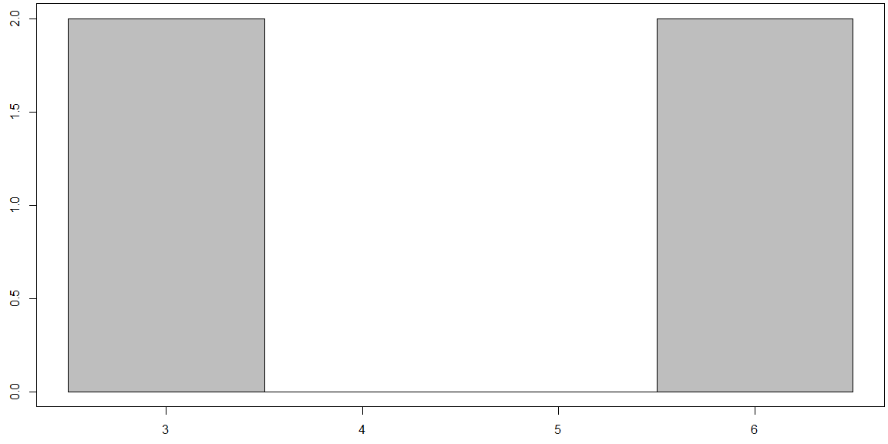<!-- -->

How does the picture above change if the weights (areas) of the two objects are different? Suppose the first rectangle has an area of $A_1= 2$ centered at $x_1=3$, and the second object has an area of $A_2=4$ centered at $x_2=6$ (see the image below). 


``` r
x <- c(3,6)
num <- c(2,4)
draw_pmf(x,num)
```

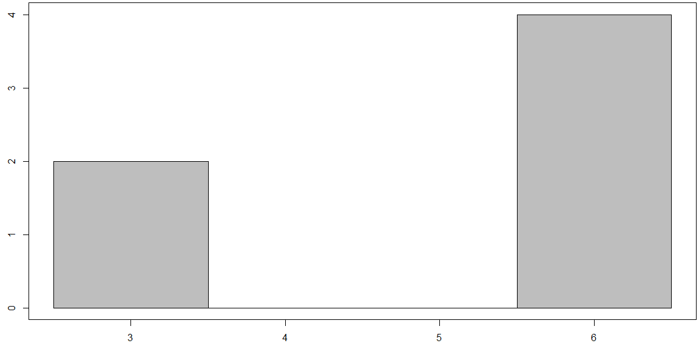<!-- -->

Remember that we've imagined the $x$-axis as a tray holding these rectangles up. If we placed our finger under the point $x=4.5$, the larger rectangle would cause the tray to tilt to the right. At what point $\bar x$ would we place our finger to balance the system? We call this point the centroid of the system (technically this will only give us the $x$-coordinate of the centroid, but we'll continue to refer to it as the centroid). 

* One way to tackle this problem is to think of the first rectangle as being two 1 by 1 rectangles, and second rectangle as four 1 by 1 rectangles. This means we have 6 total rectangles all with the same area. Note that $n_1=2$ of these rectangles are centered at $x_1=3$, while $n_2 =4$ of the rectangles are located at $x_2=6$.  We can just average together these 6 values, in any of the ways done in the previous section, to obtain $$\bar x = \frac{3+3+6+6+6+6}{6} = \frac{3(2)+6(4)}{6} = 3\left(\frac{2}{6}\right)+6\left(\frac{4}{6}\right)=5.$$

If we place our finger under the $x$-axis at the centroid $\bar x = 5$, then the system is perfectly balanced. Here's a video that walks through this entire computation and visually shows the result using legos. 

* https://www.loom.com/share/b16f6b4aa3dd4816812780272a35f2c1

The exercise above can be done with any number of rectangles. In general, the centroid of a bunch of objects with area $A_i$ whose individual centroids are located at $x_i$ is given by 
$$\bar x = \frac{\sum x_iA_i}{\sum A_i}.$$ We can use this same geometric idea to locate the average exam score, from the opening example. With 4 rectangles centered at $x_1=70$, $x_2 = 85$, $x_3 = 90$, $x_4 = 95$, with areas $A_1 = 3$, $A_2 = 5$, $A_3 = 1$, $A_4 = 2$, the picture below shows the geometric object whose centroid is given by $\bar x \approx 83.18$. 


``` r
x <- c(70,85,90,95)
num <- c(3,5,1,2)
draw_pmf(x,num)
```

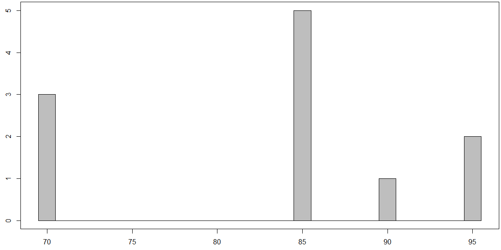<!-- -->

Instead of using counts for area (as in $A_1 = 3$, $A_2 = 5$, $A_3 = 1$, $A_4 = 2$), we could instead use the proportion of the total located at each point (so $A_1 = \frac{3}{11}$, $A_2 = \frac{5}{11}$, $A_3 = \frac{1}{11}$, $A_4 = \frac{2}{11}$). Using these proportions for area gives the following geometric object. 


``` r
x <- c(70,85,90,95)
num <- c(3/11,5/11,1/11,2/11)
draw_pmf(x,num)
```

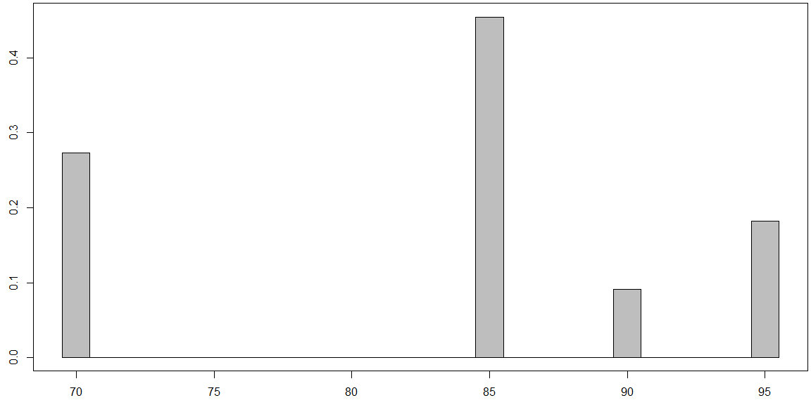<!-- -->

If we ignore the $y$-axis, this second image looks almost identical to the first, and has the exact same centroid along the $x$-axis.
With a total area of $\sum A_i = 1$, the centroid formula simplifies to $$\bar x = \frac{\sum x_i A_i}{\sum A_i} = \frac{\sum x_i A_i}{1} = \sum x_i A_i.$$ 
We use the word centroid when referring to a geometric center. In the next section, we'll start calling this the expected value of a random variable, written $\text{E}[X]$ (or $\mu$). 


### Exercises {-}

1. Find centroid of 2 rectangles centered at $x_1=-1$ and $x_2=3$ with corresponding areas $A_1=7$ and $A_2=2$. 
2. Find centroid of 4 rectangles centered at $x$-values 0,1,2,3 with corresponding areas 1,3,3,1. 
3. Find centroid of 6 rectangles centered at $x$-values 1,2,3,4,5,6 with areas 1,2,3,4,5,6. 
4. Repeat the three previous exercises by first turning the areas into proportions. For example, the first problem consists of 2 rectangles centered at -1,3 with areas 7/9,2/9. 
 
Each of these exercises computes an expected value for the next section. 

## Discrete Random Variables

Let's turn our attention to discrete random variables and probability. We'll see that the centroid discussed above gives us additional insight into understanding random variables. 

## Tossing a coin three times and counting heads

Suppose we toss a coin three times and record the number of heads. Let the random variable $X$ represent this total number of heads.Note that possible outcomes of counting the number of heads are $0,1,2,3$ (these are discrete values, hence we call this a discrete random variable). These outcomes arise from the 8 possible results of tossing a coin three times (TTT,TTH,THT, THH,HTT,HTH,HHT, HHH). 

* There is only one way to get 0 heads (toss 3 tails in a row) which means the outcome of 0 heads has a probability of $P(X=0) = \frac{1}{8} = 0.125$. 
* Similarly, there is only one way to get 3 heads which means $P(X=3) = \frac{1}{8} = 0.125$.  
* There are three ways to get 1 head, and 3 ways to get 2 heads, which means $P(X=1) = P(X=2) = \frac{3}{8} = 0.375$. 

This gives us a function (called a probability mass function) which we can summarize in the table and graphs below. 


``` r
x <- c(0,1,2,3)
p <- c(1/8,3/8,3/8,1/8)
tbl <- data.frame(outcome=x, probability = p )
kable(tbl, align = "c")
```


| outcome | probability |
|:-------:|:-----------:|
|    0    |    0.125    |
|    1    |    0.375    |
|    2    |    0.375    |
|    3    |    0.125    |

``` r
plot(x,p)
```

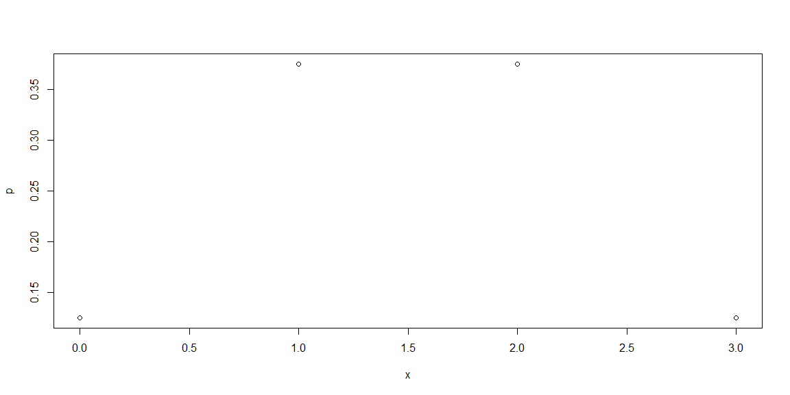<!-- -->

``` r
draw_pmf(x,p)
```

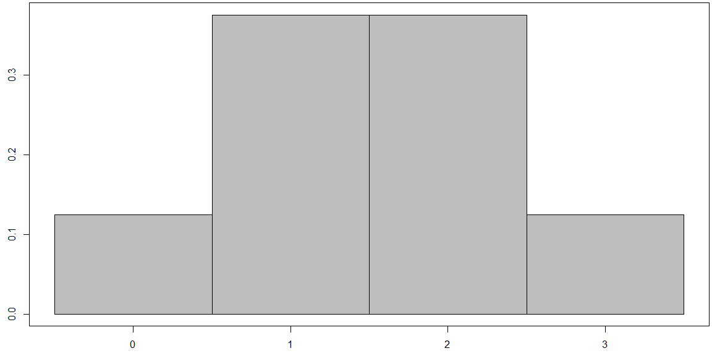<!-- -->
Note that in the graph above, we've given each rectangle a width of 1 unit so that areas match probabilities. To connect this theoretical model to something physical, we can think of this graphical representation as a target, made by sewing 4 different length rectangles to the $x$-axis. 
The centroid of said target is located directly in the center of the graph at $x=1.5$. We can obtain this via the computation 
$$\bar x = \sum x_i A_i = 0(\frac{1}{8})+1(\frac{3}{8})+2(\frac{3}{8})+3(\frac{1}{8}) = 1.5.$$

We computed the above in the context of a physical target, and the word centroid and symbol $\bar x$ are appropriate in this context.  For a random variable, the vocabulary and notation change, but the computations are the same.

> The **expected value** of a discrete random variable $X$ with outcomes $x_i$ having probability $p_i$ is given by $$\text{E}[X] = \sum x_i p_i.$$

We compute the expected value below for the random variable $X$ representing tossing 3 coins and counting the number of heads.


``` r
x <- c(0,1,2,3)
p <- c(1/8,3/8,3/8,1/8)
sum(x*p)
```

```
## [1] 1.5
```

The expected value of a random variable provides a measure of what would happen if we repeated something many times, and then averaged the results.  If we were to run this experiment 8 million times, then about 1 million times we would have 0 heads, 3 million times we'd have 1 head, 3 million times we'd have 2 heads, and 1 million times we'd have 3 heads.  The mean of these values is 
$$\bar x = 0(\frac{1000000}{8000000}) + 1(\frac{3000000}{8000000}) + 2(\frac{3000000}{8000000}) + 3(\frac{1000000}{8000000}).$$
This simplifies to the same computation we had before, resulting in $\bar x = 1.5$  When we write $\text{E}[x]$ instead of $\bar x$, we're referring to a distribution average. We can think of this as a limit of averages as we increase the number of times we repeat an experiment. We use $\bar x$ to represent a sample mean (or mean of the data) and $\text{E}[X]$ to represent the population mean (or mean of the distribution).

Before we move on to the next example, let's pause and notice another key fact about all discrete random variables. 

* Notice that sum of the probabilities equals 1. Why is this true for all probability mass functions?
* Notice that sum of the areas of the rectangles equals 1. 
Having made the observation above, let's compute the probability $P(X\leq 2)$. We'll do this in two ways. 

  * To have $X\leq 2$, we can have $X$ be 0, 1, 2. The corresponding probabilities are $\frac{1}{8}$, $\frac{3}{8}$, $\frac{3}{8}$. Summing these gives $P(X \leq 2)=\frac{7}{8}$. We could also think of this as summing the areas of the three targets located above 0,1, and 2.
  * Because the total probabilities sum to 1, we know that $P(X\leq 2) = 1-P(X > 2) = 1-P(X=3)$, where the last equality occurs because $X=3$ is the only option if $X>2$.  We know $P(X=3)=\frac{1}{8}$. This gives $P(X\leq 2) = 1-\frac{1}{8} = \frac{7}{8}$. 

The process above, of computing the probability that a random variable takes on any value less than or equal to some given value, is so common that we've given it a name and most software programs have a simple way to compute it. 

> The **cumulative distribution function** (CDF) of a random variable $X$ is the function $F(x) = P(X\leq x)$. The domain of the CDF is all real numbers. The CDF computes the probability that $X$ takes on a value less than or equal to $x$. We'll often use a capital $F$ to denote the CDF of $X$. 

Above we computed $F(2)$. We can use the cumsum() function in R to rapidly compute the CDF at a few value for this discrete random variable, and then display the results in the table below.


``` r
x <- c(0,1,2,3)
p <- c(1/8,3/8,3/8,1/8)
cdf <- cumsum(p)
tbl <- data.frame(outcome=x, probability = p, CDF = cdf )
kable(tbl,  align = "c")
```


| outcome | probability |  CDF  |
|:-------:|:-----------:|:-----:|
|    0    |    0.125    | 0.125 |
|    1    |    0.375    | 0.500 |
|    2    |    0.375    | 0.875 |
|    3    |    0.125    | 1.000 |

### Exercises {-}

1. Verify by hand that $F(1) = 0.5$. 
2. Locate $F(2)$ in the table above.
3. Compute $F(1.7)$. Explain.
4. What is $F(3)$? Give several reasons for your answer. 
5. The table tells us $F(0) = 0.125$.  Compute $P(X>0)$ using this fact. 
6. What is $F(23.6)$?  What is $F(-113)$?

## Rolling two dice and summing them

We now let $X$ be the discrete random variable obtained by rolling two 6-sided dice and recording their sum.  The possible outcomes are the integers from 2 up to 12. (If you've played Settler's of Catan before, then the dots on the number cards provide a visual of the probability mass function). There are 36 results for rolling two six-sided fair dice, and the probability mass function for $X$ is given in the table and diagram below. 

``` r
x <- seq(2,12)
p <- c(1/36,2/36,3/36,4/36,5/36,6/36,5/36,4/36,3/36,2/36,1/36)
tbl <- data.frame(outcome=x, prob = p)
kable(tbl,  align = "c")
```


| outcome |   prob    |
|:-------:|:---------:|
|    2    | 0.0277778 |
|    3    | 0.0555556 |
|    4    | 0.0833333 |
|    5    | 0.1111111 |
|    6    | 0.1388889 |
|    7    | 0.1666667 |
|    8    | 0.1388889 |
|    9    | 0.1111111 |
|   10    | 0.0833333 |
|   11    | 0.0555556 |
|   12    | 0.0277778 |

``` r
draw_pmf(x,p)
```

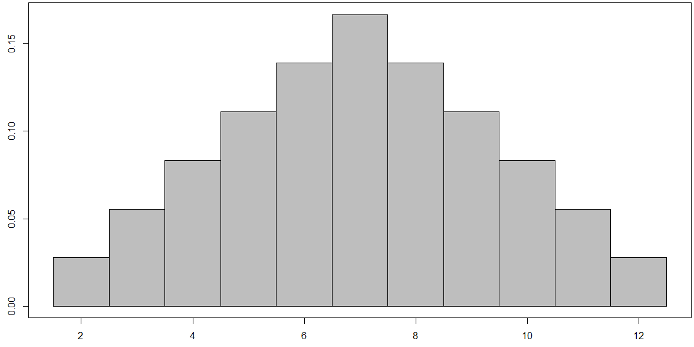<!-- -->

### Exercises {-}

1. What is the expected value of this random variable? Try to spot the value both visually (locating a centroid) and the verify your computation is correct using $\text{E}[X] = \sum x_ip_i$. 
2. Recall that $F(x) = P(X\leq x)$ is the cumulative distribution function for $X$. Compute $F(x)$ for each $x$ from 2 up to 12. 
3. Why do we know $F(12)=1$.
3. What is $F(15)$?
4. State $P(X\leq 4)$ and $P(X\leq 9)$ from the CDF table. Explain why $P(4<X\leq 9)= P(X\leq 9)-P(X\leq 4)$. 

Some Solutions:
The table below provides some of the values of the CDF of $X$. 

``` r
x <- seq(2,12)
p <- c(1/36,2/36,3/36,4/36,5/36,6/36,5/36,4/36,3/36,2/36,1/36)
cdf <- cumsum(p)
tbl <- data.frame(outcome=x, prob = p, CDF = cdf)
kable(tbl,  align = "c")
```


| outcome |   prob    |    CDF    |
|:-------:|:---------:|:---------:|
|    2    | 0.0277778 | 0.0277778 |
|    3    | 0.0555556 | 0.0833333 |
|    4    | 0.0833333 | 0.1666667 |
|    5    | 0.1111111 | 0.2777778 |
|    6    | 0.1388889 | 0.4166667 |
|    7    | 0.1666667 | 0.5833333 |
|    8    | 0.1388889 | 0.7222222 |
|    9    | 0.1111111 | 0.8333333 |
|   10    | 0.0833333 | 0.9166667 |
|   11    | 0.0555556 | 0.9722222 |
|   12    | 0.0277778 | 1.0000000 |
The expected value is computed below. 

``` r
x <- seq(2,12)
p <- c(1/36,2/36,3/36,4/36,5/36,6/36,5/36,4/36,3/36,2/36,1/36)
sum(x*p)
```

```
## [1] 7
```

## Avoid Gambling

Gambling can be phrased in terms of probability. We can mathematically give a reason why gambling is a bad idea. As a humor aside, in *The True Meaning of Smekday* by Adam Rex (the book behind DreamWorks Animation's 2015 movie *Home*), we find the quote 

>At one point, an alien searching for a casino shouts: "I WAS TOLD TO GO TO THE LARGE OFFENSIVELY COLORED BUILDING WHERE HUMANS WHO ARE BAD AT MATH GIVE AWAY THEIR MONEY."

Here's a simple gambling game we'll explore. You pay 1 dollar to play. Your roll two dice and multiply the result together. If you roll a product of 20 or more, you get \$4 (your dollar back, plus 3 more).  Otherwise, you get nothing (you lost a dollar). There are two outcomes, namely you lose a buck, or you gain 3 bucks. We'll let $X$ be the random variable with outcomes of $-1$ and $3$ resulting from this game. 

To get a probability mass function, we need the probability of getting a product of 20 or above. Let $Y$ be the random variable which is the product of rolling two dice. The probability mass function for $Y$ is shown below.

``` r
x <- c(1,2,3,4,5,6,8,9,10,12,15,16,18,20,24,25,30,36)
p <- c(1/36,2/36,2/36,3/36,2/36,4/36,2/36,1/36,2/36,4/36,2/36,1/36,2/36,2/36,2/36,1/36,2/36,1/36)
cdf <- cumsum(p)
tbl <- data.frame(outcome=x, prob = p, CDF = cdf)
kable(tbl,  align = "c")
```


| outcome |   prob    |    CDF    |
|:-------:|:---------:|:---------:|
|    1    | 0.0277778 | 0.0277778 |
|    2    | 0.0555556 | 0.0833333 |
|    3    | 0.0555556 | 0.1388889 |
|    4    | 0.0833333 | 0.2222222 |
|    5    | 0.0555556 | 0.2777778 |
|    6    | 0.1111111 | 0.3888889 |
|    8    | 0.0555556 | 0.4444444 |
|    9    | 0.0277778 | 0.4722222 |
|   10    | 0.0555556 | 0.5277778 |
|   12    | 0.1111111 | 0.6388889 |
|   15    | 0.0555556 | 0.6944444 |
|   16    | 0.0277778 | 0.7222222 |
|   18    | 0.0555556 | 0.7777778 |
|   20    | 0.0555556 | 0.8333333 |
|   24    | 0.0555556 | 0.8888889 |
|   25    | 0.0277778 | 0.9166667 |
|   30    | 0.0555556 | 0.9722222 |
|   36    | 0.0277778 | 1.0000000 |

``` r
draw_pmf(x,p)
```

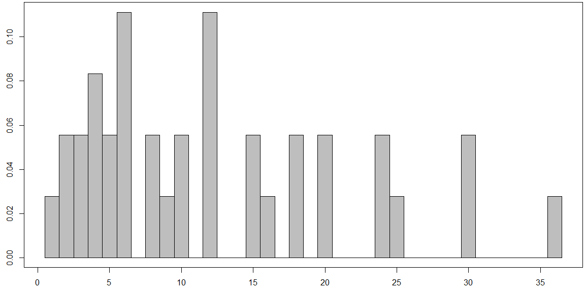<!-- -->
From the table above, we quickly see that $F_Y(18) = P(Y\leq 18)= 0.777778$, with exact value $F_Y(18) = \frac{7}{9}$. Because 19 is not a possible product of two dice, we know that $$P(Y\geq 20)=1-P(Y<20) =1-P(Y\leq 18)= 1-\frac79 = 2/9.$$ 

We now have the details we need to examine the gambling game represented by the random variable $X$, since we now have $P(X=-1) = \frac{7}{9}$ and $P(X=3) = \frac{2}{9}$. 

### Exercises {-}

1. Verify that for $X$, the sum of the probabilities is 1.
2. Give the probability mass function for $X$ as a table and as a target diagram (draw it by hand, then verify the result using code from above). 
3. Compute the expected value of $X$. (Solution: $\text{E}[X] =  -0.11\bar 1$). This means that if you play the game many times, you can expect to lose on average about 11 cents each game. Casinos make money because they arrange the games to guarantee a negative expected value for the people playing. Yes, occasionally someone will walk away having won more than they paid (which the casino wants advertised), but the truth is that when you look at the long term average of all played games, the casino comes out ahead. 
4. Compute $E[Y]$. Plot this value on the graph of $Y$ (provided above) to see if the notion of balancing point makes sense. (This isn't needed to answer the gambling question, but $Y$ is its own random variable and has its own expected value.)

The code below can be used to help you verify some of your work above. 

``` r
x <- c(-1,3)
p <- c(7/9,2/9)
cdf <- cumsum(p)
tbl <- data.frame(outcome=x, prob = p, CDF = cdf)
kable(tbl,  align = "c")
```


| outcome |   prob    |    CDF    |
|:-------:|:---------:|:---------:|
|   -1    | 0.7777778 | 0.7777778 |
|    3    | 0.2222222 | 1.0000000 |

``` r
draw_pmf(x,p)
```

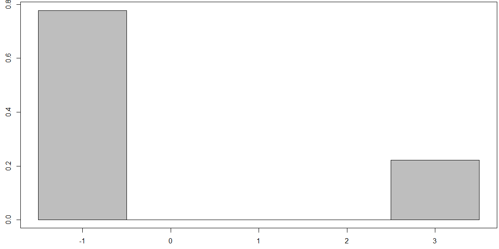<!-- -->

``` r
c(sum_of_prob = sum(p), expected_value = sum(x*p))
```

```
##    sum_of_prob expected_value 
##      1.0000000     -0.1111111
```

``` r
y <- c(1,2,3,4,5,6,8,9,10,12,15,16,18,20,24,25,30,36)
py <- c(1/36,2/36,2/36,3/36,2/36,4/36,2/36,1/36,2/36,4/36,2/36,1/36,2/36,2/36,2/36,1/36,2/36,1/36)
c(sum_of_prob = sum(py), expected_value = sum(y*py))
```

```
##    sum_of_prob expected_value 
##           1.00          12.25
```


## How many tropical storms - Poisson

We'll look at another example related to the tropical storms example we did earlier this semester. Let $X$ represent the number of tropical storms in a year that make landfall in Florida. We already saw that this discrete random variable follows a Poison distribution $f(x;\lambda) =\lambda^x \frac{e^{-\lambda}}{x!}$, and we estimated the parameter to be $\lambda \approx 5.904762$.  The follow code computes and graphs the first 20 values of the probability mass function (it only displays the first 10 in the table).  


``` r
lambda <- 5.904762
x <- seq(0,20)
p <- lambda^x *exp(-lambda)/factorial(x)
n <-10
tbl <- data.frame(outcome=x[1:n], prob = p[1:n])
kable(tbl,  align = "c")
```


| outcome |   prob    |
|:-------:|:---------:|
|    0    | 0.0027264 |
|    1    | 0.0160989 |
|    2    | 0.0475302 |
|    3    | 0.0935514 |
|    4    | 0.1380997 |
|    5    | 0.1630892 |
|    6    | 0.1605005 |
|    7    | 0.1353882 |
|    8    | 0.0999294 |
|    9    | 0.0655621 |

``` r
draw_pmf(x,p)
```

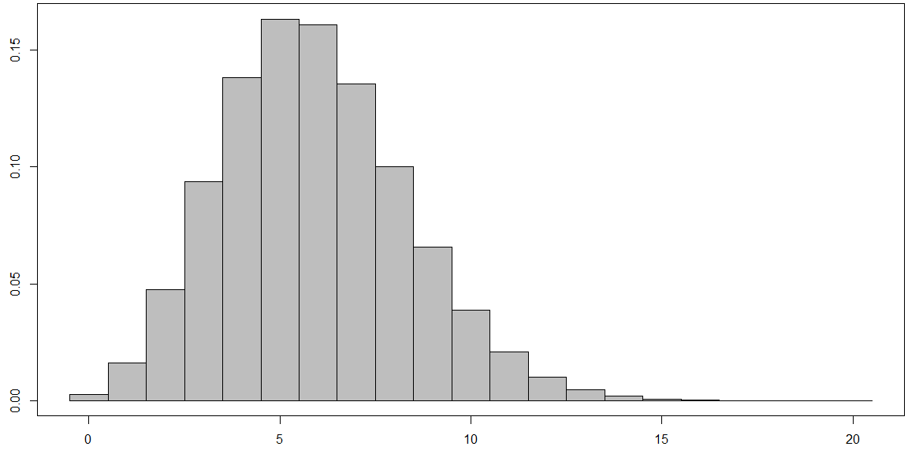<!-- -->

``` r
sum(x*p)
```

```
## [1] 5.904738
```

### Exercises {-}

1. Use the $x$-vales from 0 to 20 to estimate $\text{E}[X]$.
    a. How many possible $x$-values are there for $X$?
    b. Adjust the code to use the $x$-vales from 0 to 30 to estimate $\text{E}[X]$.
    c. Adjust the code to use the $x$-vales from 0 to 50 to estimate $\text{E}[X]$.
    d. What do you notice?
2. Compute $F(7)$, the probability that the number of tropical storms in Florida will be less than or equal to 7 in a year. Then compute $P(X>7)$. 
3. Compute the probability that there will be 10 or more tropical storms in Florida in a given year.  
4. Make up your own probability questions about how many tropical storms there might be, and answer them. 


## Rolling a single fair die
<!---
Not sure if needed anymore.  Or this can be wrapped up into an exercise. Leave here, but this one is not as crucial. 
-->

We now let $X$ be the random variable that returns the result of rolling a single 6 sided fair die. There are 6 possible outcomes, and they each have an equal probability (hence the die is fair). 


``` r
x <- seq(1,6)
p <- rep(1/6,6)
draw_pmf(x,p)
```

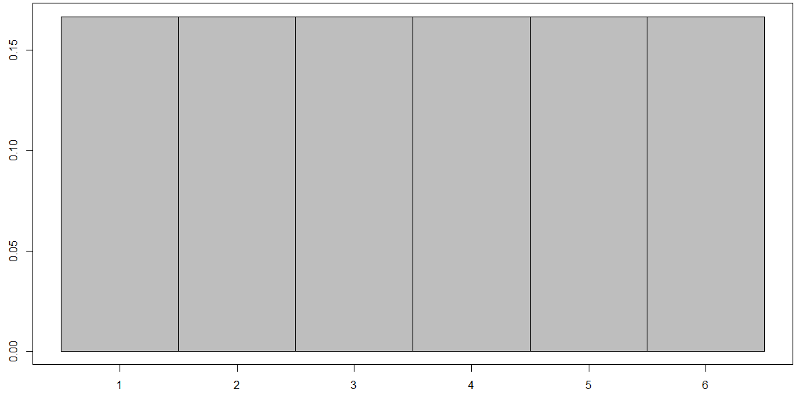<!-- -->

### Exercises {-}

1. Visually estimate the centroid of the shaded region above. Explain. 
2. Compute $\text{E}[X]$, the expected value of $X$. 
3. Compute $F(2)$ and then $F(5)$.  Use these values to compute $P(2<x\leq 5)$.

## Rolling a single weighted die

We now let $X$ be the random variable that returns the result of rolling a single 6 sided unfair die. There are 6 possible outcomes, but this time the probabilities of rolling each number depend on the number. Rolling a 2 is twice a likely as rolling a 1.  Rolling a 3 is 3 times as likely as rolling a 1. Rolling $n$ is $n$ times as likely as rolling a 1. A graph of the probability mass function is given below.    


``` r
x <- seq(1,6)
p <- c(1/21,2/21,3/21,4/21,5/21,6/21)
draw_pmf(x,p)
```

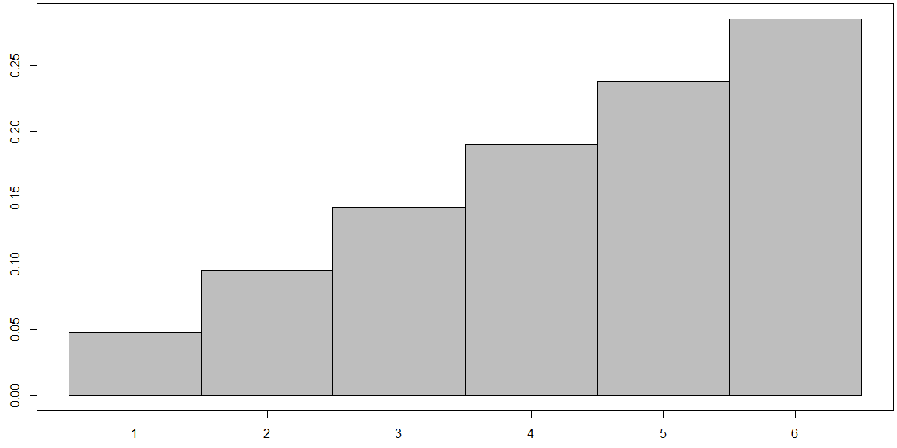<!-- -->

### Exercises {-}

1. Use the graph and area arguments to explain why "Rolling $n$ is $n$ times as likely as rolling a 1."
2. Visually guess the centroid of the shaded region above. Your answer may be incorrect, but explain why you made you guess. 
3. Compute $\text{E}[X]$, the expected value of $X$, which is the centroid from the previous part. 
4. Compute $F(2)$ and then $F(5)$.  Use these values to compute $P(2<x\leq 5)$.

# Targets for Continous Random Variables
## A Rectangular Target

In the discrete probability (random variable) examples above, we were able to attach a probability to each individual event. Our goal now is to generalize what we did above to work with continuous probabilities. We can reframe every probability problem into the context of throwing a dart at a random spot on a target. The target diagrams we construct will be very similar to the ones in the discrete case, but the computational approach will change.  

Let's suppose for a minute that we have a target. 

``` r
g <- function(x){2+x*0}
draw_target(g,0,5)
```

<!-- -->

We throw a dart at a random spot on the target. The target is oriented on the coordinate plane with the lower left corner at the origin and the bottom side of the target along the $x$-axis. (We will always think of our targets as having the bottom side of the target along the $x$-axis.) Each point on the target has the same probability of being hit as any other. 

When a dart hits the point $(x,y)$,  we'll record just the $x$-coordinate (so a number between 0 and 5 for this example), and let $X$ represent this random variable. Answer each of the following questions (most of them have answers that appear later on) by considering the area of the target related to the question.


1. Give several different possible outcomes for $X$. How many outcomes are there?
1. Compute each of the following probabilities, and explain how you obtained your answer by comparing areas.
    a. $P(X \leq 1)$ [Solution: $2/10 =0.2$]
    a. $P(X \leq 3)$
    a. $P(X \leq 2.1)$ [Solution: $4.2/10 = 0.42$]
    a. $P(X \leq 7)$ [Solution: 1]
    a. $P(X \leq -1.5)$ [Solution: 0]
    a. $P(1 \leq X \leq 5)$
    a. $P(1 \leq X \leq 3)$ [Solution: 0.4]
1. Change the height of the target from 2 to 3. Then verify that each of the computations above result in the same probability. 
1. If the area of the target is 1, then we can skip dividing by area when computing probabilities. The function describing the top of the target is currently $g(x) = 2$, and the total area under the target is $A=10$. We can multiply a function by a constant $k$ so that the target under $f(x) = kg(x)$ has area 1. We'll call this a **normalized** target function, and reserve using the variable $f$ only when we have a normalized target function. Explain why we want $k=1/10$ in this problem, which means our normalized target function is $f(x) = \frac{1}{10}2 = \frac{1}{5}$ for $0\leq x\leq 5$. 
1. Given an $x$-value, recall that the cumulative distribution function $F(x)$ for the random variable $X$ computes the probability that $X$ takes on any value up to and including $x$. We computed $F(1) = P(X\leq 1) = 0.2$ and $F(3) = P(X \leq 3) = 0.6$ above.
    a. Compute $P(X \leq 2)$.
    a. Compute $P(X \leq 1.5)$. [Solution: 0.3]
    a. If $0<x<5$, explain why $P(X \leq x) = x/5$.
    a. If $x<0$, why does $P(X\leq x)=0$?
    a. If $x>5$, what is $P(X\leq x)$? (You should get a number.) Explain. 
1. From the above computations, we have $F(x)=\begin{cases}0&x<0\\x/5&0\leq x\leq 5\\1&x>5\end{cases}$.  Compute the derivative of $F(x)$. Then compare $F'(x)$ to the normalized target function $f(x)$ and the original target function $g(x)$.
1. Imagine that we threw 1000 darts at this target, and recorded each of their $x$ values. What would the mean $x$-value be?  Explain. 

We can use a simulation to analyze the last question. Below we pick 1000 random numbers between 0 and 5, and then find their mean. We can also view the first 10 numbers, just to verify that they are not discrete integers, but rather take on any value between 0 and 5 (which is why we call this a continuous random variable).

``` r
n <- 1000
x <- runif(n, min = 0, max = 5)
#Here are 10 of the values. 
x[1:10]
```

```
##  [1] 0.2476878 4.0351163 4.6013142 1.5199139 2.8414501 0.4010767 2.2742902
##  [8] 2.5275489 4.0644518 4.2853806
```

``` r
#And here is the mean of all 1000. 
mean(x)
```

```
## [1] 2.5556
```


``` r
n <- 1000000
x <- runif(n, min = 0, max = 5)
#This gives the mean of 1000000
mean(x)
```

```
## [1] 2.500184
```

We computed the mean $x$-value in several samples. As the sample size increases, the mean approaches a limit, which we call the expected value of the random variable, and denote using $\text{E}[X]$ (or $\mu$).  The expected value gives us a way of discussing a theoretical mean when the possible outcomes is infinite. 

For this rectangular target, notice that the centroid (geometric center) of the target is at the point $(x,y) = (2.5,1)$. The fact that the expected value of our random variable $X$ matched the $x$-coordinate of the centroid of our target is more than just a coincidence. In general, we can find the expected value of a random variable by obtaining the geometric center. 

We chose a rectangular target to start with for a reason. Many connections to geometry will generalize quickly as we move away from a rectangular target. Here are some key points. 

* Probabilities and area computations are directly connected. 
* The cumulative distribution function gives a ratio of areas to the left of a desired spot, divided by the total area of the target. 
* If we pick a value $k$ to that the total area under $f(x) = kg(x)$ is one, then we can compute probabilities by just computing an area (no division needed).
* Expected value can be found by locating the $x$-coordinate of the centroid. 

### Exercises {-}

Let $g(x)=\begin{cases}5 & 0\leq x\leq 6\\ 0 &\text{otherwise}\end{cases}$. Consider a target that lies under this function and above the $x$-axis.  Let $X$ represent the random variable that we obtain by throwing a dart at the target and recording the $x$-value, where each spot on the target has an equal chance of being hit. 

1. Draw the target function $g(x)$. 
1. Geometrically explain why $\text{E}[X]=3$. 
1. Find a constant $k$ so that the area under $f(x) = kg(x)$ equals 1. In other words, find the normalized target function. 
1. Compute $F(2.5)$, and $F(4)$.  Then compute $P(2.5<X\leq 4)$. 
1. Show that $F(x) = \begin{cases}0 & x<0\\x/6 & 0\leq x\leq 6\\ 1 &x>6\end{cases}.$
1. Compute $F'(x)$ and compare it to the normalized target function $f(x)$. 

## A Triangular target

We now swap to a triangular target. The target is shown below, and lies below the function $g(x) = x$ for $0\leq x\leq 5$. 


``` r
g <- function(x){x}
draw_target(g,0,5) 
```

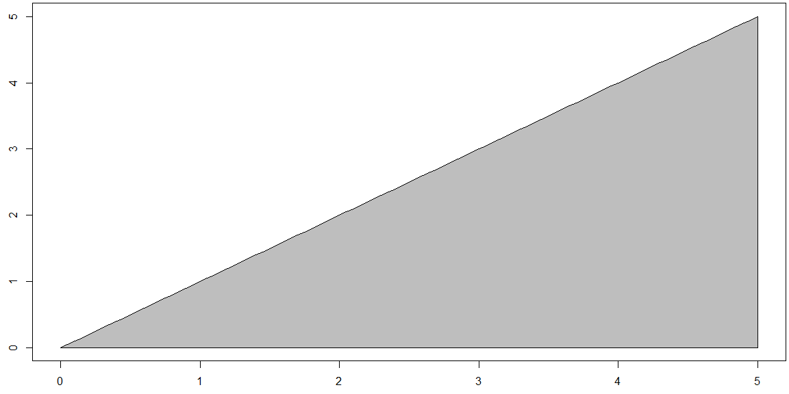<!-- -->

Each spot on the target has the same probability of being hit as any other. When a dart hits the point $(x,y)$,  we'll record just the $x$-coordinate (so a number between 0 and 5), and let $X$ represent this random variable. Answer the following questions by considering area arguments. 

1. What is the total area of the target?
2. Explain why points on the right side of the target are more likely to be hit by a dart than points on the left side of the target? 
    a. Explain why $P(X\leq 2.5) = 1/4$. 
    b. Compute $P(X > 2.5)$. 
3. Find a value $k$ so that the area of the target that lies under the function $f(x) = kg(x)$ is equal to 1. This is our normalized target function. [Solution: $k=\frac{2}{25} = 0.08$. How does this connect to the first question.]
4. The fact that $P(X\leq 2.5) = 1/4$ means the cumulative distribution function (CDF) of $X$ has the value $$F(2.5) = P(X\leq 2.5) =  \frac{1}{4}.$$ 
    a. Verify that  $F(1) = \frac{1}{25}$ and $F(2)=\frac{4}{25}$. 
    b. Compute $F(3)$ and $F(4)$. 
    c. What are $F(5)$ and $F(6)$?
    d. For $0\leq x\leq 5$, explain why $F(x) = \frac{x^2}{25}$. 
    e. If $x<0$, explain why $F(x)=0$. 
    f. If $x>5$, explain why $F(x)=1$. 
5. Give a formula for $F(x)$ using piecewise function notation. 
6. Compute the derivative of $F(x)$ and compare your answer to the normalized target function $f(x) = kg(x)$.  They should be equal.  
6. We have already seen that it's more likely for the dart to land on the right side the target than the left. The centroid of the target (geometric center) also lies to the right.  We can look up the centroid of a right triangle from various sources online (for examples Wikipedia has a [list of centroids](https://en.wikipedia.org/wiki/List_of_centroids)). These sources generally include both the $x$ and $y$ coordinates of the centroid, along with the area. Use such a list to explain why the $x$-coordinate of the centroid of this right triangular target is $\frac{10}{3} \approx 3.333$.  
7. State $\text{E}[X]$. [If you're asking, "Did we just do this in the previous question?", then you're doing this correctly.]

### Exercises {-}

Let $g(x)=\begin{cases}2x & 0\leq x\leq 6\\ 0 &\text{otherwise}\end{cases}$. Consider a target that lies under this function and above the $x$-axis.  Let $X$ represent the random variable that we obtain by throwing a dart at the target and recording the $x$-value, where each spot on the target has an equal chance of being hit.   

1. Draw the target function $g(x)$. 
1. Use a table of centroids to explain why $\text{E}[X]=4$. 
1. Find a constant $k$ so that the area under $f(x) = kg(x)$ equals 1. In other words, find the normalized target function. 
1. Compute $F(2.5)$, and $F(4)$.  Then compute $P(2.5<X\leq 4)$. 
1. Show that $F(x) = \begin{cases}0 & x<0\\x^2/36 & 0\leq x\leq 6\\ 1 &x>6\end{cases}.$
1. Compute $F'(x)$ and compare it to the normalized target function $f(x)$. 

## A Parabolic target 

We now swap to a parabolic target. The target is shown below, and lies below the function $g(x) = x^2$ for $0\leq x\leq 4$. We call this shape a "parabolic spandrel," language we'll need to look up areas and centroids. 


``` r
g <- function(x){x^2}
draw_target(g,0,4)
```

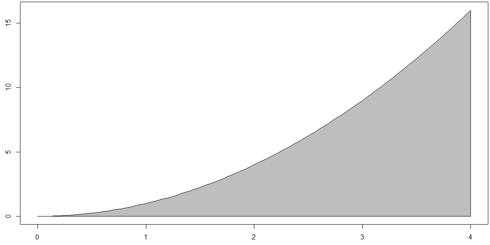<!-- -->

Each spot on the target has the same probability of being hit as any other. When a dart hits the point $(x,y)$,  we'll record just the $x$-coordinate (so a number between 0 and 5), and let $X$ represent this random variable.

Download this [list of centroids of common shapes](https://faculty.utrgv.edu/constantine.tarawneh/Fluid%20Mechanics/Centroid%20Locations.pdf). The bottom of the first page includes a parabolic spandrel (the shape of our target above).

1. Find the expected value of $X$ (so $\text{E}[X]$) by locating the centroid of the target. [Solution: With $a=4$, we have $\text{E}[X] = \frac{3(4)}{4} = 3$.]
1. Use the resource above (which includes facts about area in addition to centroids) to explain why the total area of the target is $\frac{64}{3}$. 
    a. Show that $P(X\leq 2) = \frac{8/3}{64/3} = \frac{1}{8}$. 
    a. Compute $P(X \leq 3)$. 
    a. Explain why $P(2<X\leq 3) = P(X \leq 3)-P(X\leq 2)$. 
1. The fact that $P(X\leq 2) = 1/8$ means the cumulative distribution function (CDF) of $X$ has the value $F(2) = \frac{1}{8}.$ 
    a. Compute $F(1.5)$. 
    a. For $0\leq x\leq 4$, explain why $F(x) = \frac{x^3}{64}$. 
    a. If $x<0$, what is $F(x)$. 
    a. If $x>4$, state $F(x)$. 
    a. Finish by stating $F(x)$ using piecewise function notation. 
1. Give the normalized target function (so find $k$ so that the target under $f(x) = kg(x)$ for $0\leq x\leq 4$ has area 1.) [Solution: $k = \frac{1}{A} = \frac{3}{64}$, so $f(x) = \frac{3x^2}{64}$ for $0\leq x\leq 4$ and $f(x) = 0$ otherwise.]
1. Compare the normalized target function $f(x) = kg(x)$ to $F'(x)$, the derivative of the cumulative distribution function. What do you notice? 

### Exercises {-}

Let $g(x)=\begin{cases}5x^2 & 0\leq x\leq 2\\ 0 &\text{otherwise}\end{cases}$. Consider a target that lies under this function and above the $x$-axis.  Let $X$ represent the random variable that we obtain by throwing a dart at the target and recording the $x$-value, where each spot on the target has an equal chance of being hit. 

1. Draw the target function $g(x)$. 
1. Use a table of centroids to explain why $\text{E}[X]=\frac{3}{2}$. 
1. Find a constant $k$ so that the area under $f(x) = kg(x)$ equals 1. In other words, find the normalized target function. 
1. Compute $F(0.5)$, and $F(1)$.  Then compute $P(0.5<X\leq 1)$. 
1. Show that $F(x) = \begin{cases}0 & x<0\\x^3/8 & 0\leq x\leq 2\\ 1 &x>2\end{cases}.$
1. Compute $F'(x)$ and compare it to the normalized target function. 


## Probability Density Functions

In all three of the preceding examples, we started with a function $g(x)$ and considered the random variable $X$ that arose from selecting the $x$-coordinate of a point randomly chosen from the area under the function $g(x)$.  We then computed the cumulative distribution function $F(x)$ of $X$, as well as created a normalized target function $f(x) = kg(x)$ by selecting a value for $k$ so that the area under $kg(x)$ equaled 1.  In all cases, we found that the derivative of the cumulative distribution function equaled the normalized target function, in other words $$F'(x) = kg(x) = f(x).$$ In all these examples, we started with a given target function and then computed $F(x)$ from it. In practice, we'll start with a given random variable $X$, from which we have the cumulative distribution function $F(x) = P(X\leq x)$. Taking the derivative of the CDF gives us a function $f(x) = F'(x)$ that we can think of as a normalized target function. This leads to the following definition. 

> The **probability density** function f(x) of a random variable $X$ with cumulative distribution function $F(x)$ is the derivative of $F(x)$. 

As the derivative of $F(x)$ will always yield a normalized target function, then the following two properties will always hold for probability density functions. 

1. Every probability density function is non-negative, in other words $f(x)\geq 0$.
2. The entire area under a probability density function always equals 1.  

It turns out that any function $f(x)$ that satisfies the two properties above can be interpreted as the probability density function of a random variable. If the function is non-negative, and the area under the function is finite, then we can normalize the function (divide by the area) to make it a PDF. 

We'll discuss the reason for the name probability *density* function after the next section.

### Exercises {-}

1. Suppose a random variable $X$ has cumulative distribution function $F(x) = \begin{cases}0 & x<0\\x/3 & 0\leq x\leq 3\\ 1 &x>3\end{cases}.$ Compute the derivative of $F$ to obtain the probability density function of $X$.  Then draw a target that lies under this PDF. Explain why $\text{E}[X] = 1.5$. 
1. Suppose a random variable $X$ has cumulative distribution function $F(x) = \begin{cases}0 & x<0\\x^2/16 & 0\leq x\leq 4\\ 1 &x>4\end{cases}.$ Compute the derivative of $F$ to obtain the probability density function of $X$.  Then draw a target that lies under this PDF. Use a table of centroids to explain why $\text{E}[X] = \frac{8}{3}$. 
1. Refer to the two properties to be a PDF to answer the following. 
    a. Explain why $f(x) = \begin{cases}2 & 0\leq x \leq 6\\ 0 &\text{otherwise}\end{cases}$ is not a PDF. 
    a. Explain why $f(x) = \begin{cases}\frac{2x}{9} & 0\leq x \leq 3\\ 0 &\text{otherwise}\end{cases}$ is a PDF. 
    a. Explain why $f(x) = \begin{cases}-\frac{1}{4} & 0\leq x \leq 4\\ 0 &\text{otherwise}\end{cases}$ is not a PDF. 
    a. Explain why $f(x) = \begin{cases}\frac{3}{8}x^2 & 0\leq x \leq 2\\ 0 &\text{otherwise}\end{cases}$ is a PDF. 
3. For each function $g(x)$ below, find a value $k$ so that $f(x) = kg(x)$is a PDF. You may need to consult a table of centroids to obtain the areas for some of these functions. 
    a. $g(x) = \begin{cases}2 & 0\leq x \leq 6\\ 0 &\text{otherwise}\end{cases}$
    a. $g(x) = \begin{cases}3x & 0\leq x \leq 4\\ 0 &\text{otherwise}\end{cases}$
    a. $g(x) = \begin{cases}5x^2 & 0\leq x \leq 2\\ 0 &\text{otherwise}\end{cases}$


# Rectanglar Approximations

We'll now focus on continuous random variables related to targets that are formed by sewing together several rectangular targets. 

## Two rectangular targets of different sizes. 

Our next example is a target that can be thought of as two different targets, sewn together at $x=2.5$.  One target is 2.5 units wide by 2 units tall, while the other is 1.5 units wide by 4 units tall. 


``` r
g <- function(x){ifelse(x<2.5,2,4)}
draw_target(g,0,4,num_points=1000)  
```

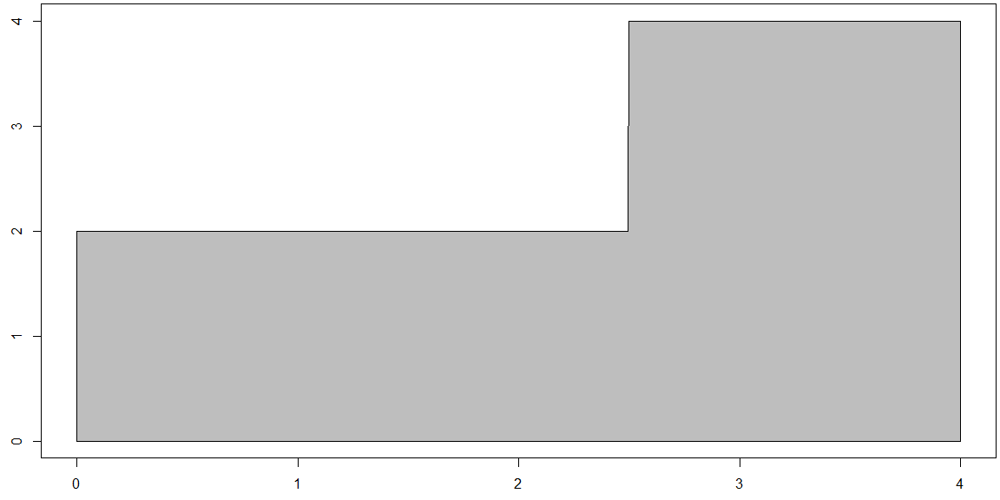<!-- -->

``` r
#The 1000 is needed to cause R to plot enough points 
#to avoid a visual glitch with drawing piecewise defined functions.
```

Again we'll let the random variable $X$ be the $x$-coordinate of a dart's location with an equal chance of hitting any point on the target. 

Let's start by computing the expected value of $X$. We can do so by finding the $x$-coordinate of the centroid of this target. One option is to chop the target into two targets (split it at 2.5), find the centroid of each, and then use $\frac{\sum x_i A_i}{\sum A_i}$ to obtain the result.  

* The left target has a center of mass at $x_1=\frac{2.5-0}{2} = 1.25$, with an area of $A_1=hw=(2)(2.5)=5$.  
* The right target has a center of mass at $x_2=\frac{4-2.5}{2}=3.25$, with an area of $A_2=hw=(4)(1.5)=6$.

We then compute the center of mass of the two targets, shown below. 


``` r
xi <- c(1.25,3.25)
Ai <- c(5,6)
c(total_area =sum(Ai),  
  expected_value = sum(xi*Ai)/sum(Ai))
```

```
##     total_area expected_value 
##      11.000000       2.340909
```

Another option is to chop the target into 8 targets with equal width, shown below. Note that the width of each rectangle is $\Delta x = \frac{4}{8} = 0.5$.


``` r
g <- function(x){ifelse(x<2.5,2,4)}
draw_rect_approx(g,0,4,8) 
```

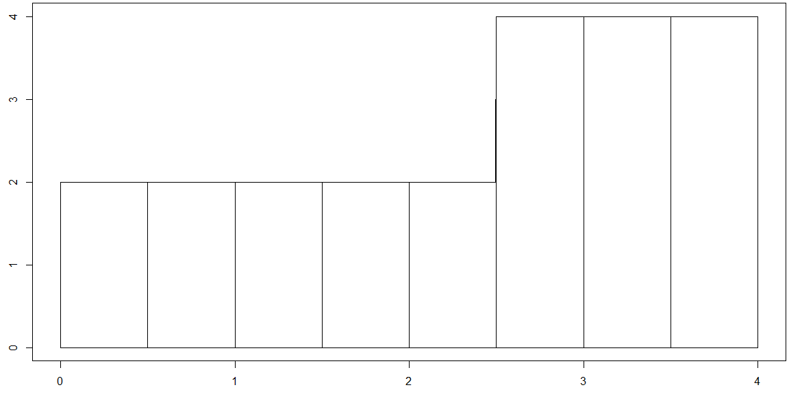<!-- -->

We now use the same weighted average formula $\frac{\sum x_i A_i}{\sum A_i}$ to compute the $x$-coordinate of the centroid. The benefit of using equally spaced rectangles is that we have a simple formula for computing the width of each rectangle, namely the total width divided by the number of rectangles. By letting $x_i$ be the $x$-coordinate of the centroid of each rectangle, we have that the area of the $i$th target is $A_i = g(x_i) \Delta x$. The code below gives $x_i$ and $A_i$ in a table, followed by the total area and expected value (centroid).  


``` r
dx <- 0.5
xi <- seq(dx/2,4,dx)
Ai <- g(xi)*dx
tbl <- data.frame(x_i = xi, A_i = Ai)
kable(tbl,  align = "c")
```


| x_i  | A_i |
|:----:|:---:|
| 0.25 |  1  |
| 0.75 |  1  |
| 1.25 |  1  |
| 1.75 |  1  |
| 2.25 |  1  |
| 2.75 |  2  |
| 3.25 |  2  |
| 3.75 |  2  |

``` r
c(total_area =sum(Ai),  
  expected_value = sum(xi*Ai)/sum(Ai))
```

```
##     total_area expected_value 
##      11.000000       2.340909
```

The latter method, using targets of equal width, allows us to use similar code when we doubled the number of rectangles. Note that this makes the width of each rectangle smaller, so for this example we have $\Delta x = 4/16 = 0.25$.  


``` r
draw_rect_approx(g,0,4,n=16) 
```

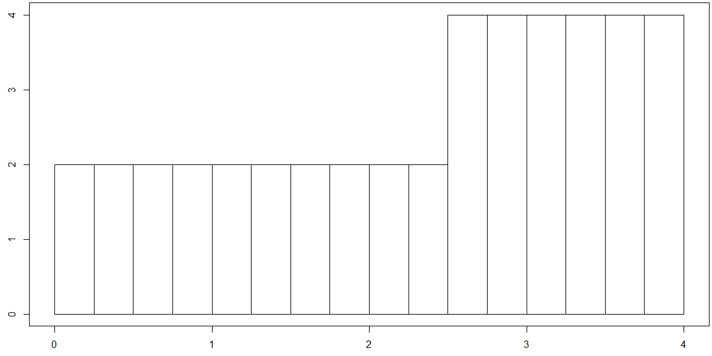<!-- -->

``` r
dx <- 0.25
xi <- seq(dx/2,4,dx)
Ai <- g(xi)*dx
tbl <- data.frame(x_i = xi, A_i = Ai)
kable(tbl,  align = "c")
```


|  x_i  | A_i |
|:-----:|:---:|
| 0.125 | 0.5 |
| 0.375 | 0.5 |
| 0.625 | 0.5 |
| 0.875 | 0.5 |
| 1.125 | 0.5 |
| 1.375 | 0.5 |
| 1.625 | 0.5 |
| 1.875 | 0.5 |
| 2.125 | 0.5 |
| 2.375 | 0.5 |
| 2.625 | 1.0 |
| 2.875 | 1.0 |
| 3.125 | 1.0 |
| 3.375 | 1.0 |
| 3.625 | 1.0 |
| 3.875 | 1.0 |

``` r
c(total_area =sum(Ai),  
  expected_value = sum(xi*Ai)/sum(Ai))
```

```
##     total_area expected_value 
##      11.000000       2.340909
```

Why care about adding more rectangles? The answer is because for just about anything that isn't a rectangle, we can approximate with rectangles. Let's illustrate this using two examples we've already explored, namely the triangular target, and the target under a parabola. Note that in general, if there are $n$ rectangles between $a$ and $b$, then we have $\Delta x = \frac{b-a}{n}$. 

For the triangular target from the previous section, approximating the target by using 20 rectangles (so $\Delta x = \frac{5-0}{20} = 0.25$), yields the exact area and an expected value of 3.33125, rather than the exact value $\text{E}[X] = 3.3333\bar3$. Our approximation is pretty close. To get a more accurate approximation, we can increase the number of rectangles in our approximation, as shown below. 


``` r
g <- function(x){x}
a <- 0
b <- 5
n <- 20
dx <- (b-a)/n
draw_rect_approx(g,a,b,n) 
```

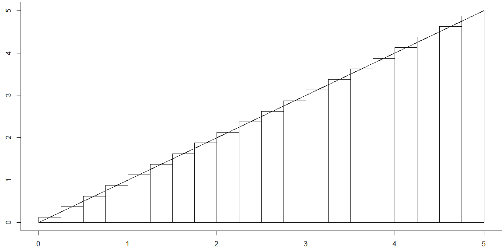<!-- -->

``` r
xi <- seq(a+dx/2,b,dx)
Ai <- g(xi)*dx
c(total_area =sum(Ai),  
  expected_value = sum(xi*Ai)/sum(Ai))
```

```
##     total_area expected_value 
##       12.50000        3.33125
```

For our parabola function, approximating the target by using 50 rectangles yields an area approximation of 21.3312 instead of the exact area of $A = 21.333\bar 3$, and expected value approximation of 2.9997 which is only 0.0003 away from the actual value of $\text{E}[X] = 3$.


``` r
g <- function(x){x^2}
a <- 0
b <- 4
n <- 50
dx <- (b-a)/n
draw_rect_approx(g,a,b,n) 
```

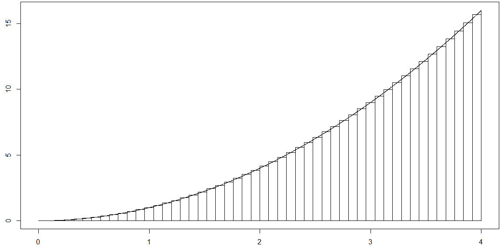<!-- -->

``` r
xi <- seq(a+dx/2,b,dx)
Ai <- g(xi)*dx
c(total_area =sum(Ai),  
  expected_value = sum(xi*Ai)/sum(Ai))
```

```
##     total_area expected_value 
##        21.3312         2.9997
```

By using thin rectangles, we can use the approach above to approximate area under most functions. This enables us to compute probabilities, as well as find expected values, of the corresponding random variables. If the approximation isn't good enough, we increase the number of rectangles. 

Let's end the unit by looking at some examples that are not just targets that lie under lines or parabolas. We can approximate almost anything with thin rectangles. For example, if our target is the region under the function $g(x) = -x^4+2x^3-2x^2+3x+4$ for $0\leq x\leq 2$, then with 25 rectangles (show below) we get a decent approximation at the total area under $f$, as well as the $x$-coordinate of the centroid. 


``` r
g <- function(x){-x^4+2*x^3-2*x^2+3*x+4}
a <- 0
b <- 2
n <- 25
dx <- (b-a)/n
draw_rect_approx(g,a,b,n) 
```

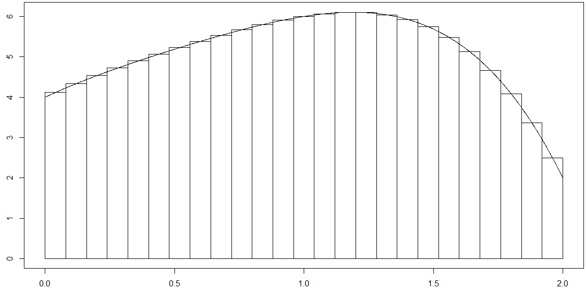<!-- -->

``` r
xi <- seq(a+dx/2,b,dx)
Ai <- g(xi)*dx
c(total_area =sum(Ai),  
  expected_value = sum(xi*Ai)/sum(Ai))
```

```
##     total_area expected_value 
##     10.2709309      0.9873295
```

While the area and expected value approximations are not exact, we can obtain more precision by increasing the number of rectangles.  

Some distributions, such as the exponential, normal, or gamma distribution, allow ends of the target to stretch to $\pm\infty$. For these targets, we can do similar rectangular approximations, though the subtle details are a tad more involved. The example below illustrates using 1000 rectangles for the exponential distribution $f(x) = 3 e^{-3x}$ with $x\geq 0$, where we've restricted the function to $x\leq 30$.


``` r
f <- function(x){3 * exp(-3*x)}
a <- 0
b <- 30
n <- 1000
dx <- (b-a)/n
draw_rect_approx(f,a,b,n) 
```

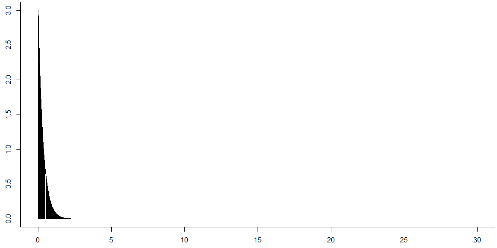<!-- -->

``` r
xi <- seq(a+dx/2,b,dx)
Ai <- f(xi)*dx
c(total_area =sum(Ai),  
  expected_value = sum(xi*Ai)/sum(Ai))
```

```
##     total_area expected_value 
##      0.9996626      0.3335583
```

The total exact area under the exponential distribution with PDF $f(x) = 3 e^{-3x}$ is 1 (which we approximated as $A\approx 0.9996626$) with expected value $\text{E}[X] = \frac{1}{3} = 0.333\bar 3$ (which we approximated as $\text{E}[X] \approx 0.3335583$). Not too bad for an approximation that resulted from just using lots of rectangles. 

So how did people compute the expected value exactly?  They took a limit as the number of rectangles increased to infinity. This process goes by the name of "Riemann Sums" and leads to the "Definite Integral." This is precisely the content of the next section. 

Which kind of functions can we apply this process to? We'll restrict ourselves to a specific set of functions that help us analyze probability. We will require that $g(x)\geq 0$, as we don't want negative probabilities. In addition, we will require that the area under $g(x)$ is finite (but we may allow left and right bounds to become infinite, provided the total area under the $g(x)$ remains finite). To simplify probability computations, we'll sometimes require that the total area under our function is 1. If the area $A$ under a function $g(x)$ is not 1, note that letting $k=1/A$ means the area under the normalized function $f(x) = kg(x)$ is 1. This leads us again to the properties that define probability density functions. 

### Exercises {-}

1. Consider a target that lies under the function $g(x) = 4-x$ for $0\leq x\leq 4$, with corresponding random variable $X$ obtained by taking the $x$-coordinate of a randomly chosen point on the target. The code below uses 8 rectangles to approximate the area under $g$, as well as the expected value of $X$. Increase the number of rectangles to 20, and then 100.  Then use geometric arguments to find the exact values for the area and expected value. 

    
    ``` r
    g <- function(x){4-x}
    a <- 0
    b <- 4
    n <- 8
    dx <- (b-a)/n
    draw_rect_approx(g,a,b,n) 
    ```
    
    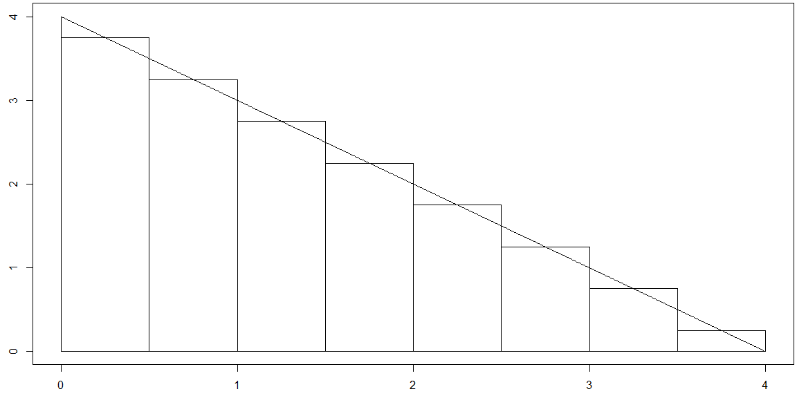<!-- -->
    
    ``` r
    xi <- seq(a+dx/2,b,dx)
    Ai <- g(xi)*dx
    c(total_area =sum(Ai),  
      expected_value = sum(xi*Ai)/sum(Ai))
    ```
    
    ```
    ##     total_area expected_value 
    ##        8.00000        1.34375
    ```
  
1. Repeat the previous problem using the function $g(x) = 9-x^2$ for $0\leq x\leq 3$. 
1. Repeat the previous problem using the function $g(x) = \sqrt{25-x^2}$ for $0\leq x\leq 5$. Note that the target is the region in the first quadrant that lies inside the circle $x^2+y^2 =25$ (so a quarter of the circle). This geometric fact will help you identify the exact values for the area and expected value from a list of known centroids.  
1. Repeat the previous problem using a function of your choice, obtaining just an approximation for the area and expected value. You can pick a function from a list of known centroids if you want to compare your approximation to the exact value.   

## Why Probabiility *Density*?

Why do we use the words probability density? The word density comes from a notion of talking about mass per length.  A thin rope made of twine has a lower mass per length than a steel wire of the same thickness. 
<!---Knowing the mass per length allows us to compute the same length. ---> 

We've connected probabilities to areas. A normalized target function $f(x)$ provides just the height of thin rectangles. We must multiply the height by a width $\Delta x$ in order to get a probability $p=f(x) \Delta x$. This means $f(x) = \frac{p}{\Delta x}$ is a probability $p$ per length $\Delta x$,  so a probability density.

### Exercises {-}

1. Verify that $f(x) = \begin{cases}\frac{1}{10} & 0\leq x \leq 10\\ 0 &\text{otherwise}\end{cases}$ is a probability density function. (What two things must we check).  
    a. The distance from $x=2$ to $x=5$ is a length of $\Delta x = 3$ units. Compute $P(2\leq X\leq 5)$. 
    a. The distance from $x=2$ to $x=2.5$ is a length of $\Delta x = 0.5$ units.  Compute $P(2\leq X\leq 2.5)$. 
    a. The distance from $x=2$ to $x=2.1$ is a length of $\Delta x = 0.1$ units.  Compute $P(2\leq X\leq 2.1)$. 
    a. The distance from $x=2$ to $x=2.01$ is a length of $\Delta x = 0.01$ units.  Compute $P(2\leq X\leq 2.01)$. 
    a. The distance from $x=2$ to $x=2+\Delta x$ is a length of $\Delta x$ units.  Compute $P(2\leq X\leq 2+\Delta x)$. 
    a. Organize your work above into a table that helps illustrate $\lim_{\Delta x\to 0}P(2\leq X\leq 2+\Delta x)$.
    a. Explain why $P(X=2) = 0$.
    a. What is the area of a target whose height is $\frac{1}{10}$ of a unit but whose width is 0 units?  (Do we even have a target?)
    
Remember that a probability density function alone does not give us a probability. We need an interval of $x$-values (a width) to provide meaningful probabilities.  

<!---
This is clearly false if we want to explore the dirac-delta distribution. 
I don't think this is appropriate for this audience. 
--->


# Riemann Sums and the Definite Integral

From here on out we'll use $f(x)$ to represent any function, not just normalized target functions. 

## Riemann Sums
In the previous section we approximated the area under a function $f(x)$ from $a\leq x \leq b$ by using rectangles. We chose the number $n$ of equal width rectangles which gave the width as $\Delta x = \frac{b-a}{n}$. We then chose the height of each rectangle to be the value of the function at the midpoint $x_i$ of the rectangle. The area of each rectangle is hence $A_i = f(x_i)\Delta x$. Our approximation for the area is then the sum of these values, namely 
$$\sum_{i=1}^n A_i = \sum_{i=1}^n f(x_i)\Delta x.$$ 
This sum is an example of a more general concept, namely a Riemann sum.

> Let $f(x)$ be defined on $a\leq x\leq b$. Let $n$ be a positive integer, and divide the interval $[a,b]$ into $n$ subintervals of equal width. From each subinterval choose a point $x_i$. We call $$\sum_{i=1}^n f(x_i)\Delta x$$ a Riemann sum for $f$.

<!---
I have specifically avoided naming the endpoints of each subinterval. This allows us to ignore the $x_i^*$ notation that is often found in other texts. 
We may decide to revisit this.  If we do so, then we may want to go back and replace the xi's in the previous section with mi's. I've chosen to let xi be an arbitrary point in the ith interval, on purpose. It was a conscious choice. 
--->

In the definition above, each subinterval has an equal width of $\Delta x = \frac{b-a}{n}$. A more general definition of Riemann sums exists that allows the widths of the intervals to change, but for simplicity we will keep the width constant.

Another observation is that we can choose the point $x_i$ as *any* point inside the $i$th subinterval. Up till now, we always chose the midpoint of each subinterval, as that point corresponded to the rectangle's centroid. Other common choices are to use the left endpoint, or the right endpoint, of each subinterval. Let's briefly explore these two alternatives. 

Let $f(x) = 7-x$ for $1\leq x\leq 5$. We can think of this as a target, drawn below, and a quick check with geometry reveals that the area of the target is $A=16$. 

``` r
f <- function(x){7-x}
a <- 1
b <- 5
draw_target(f,a,b)
```

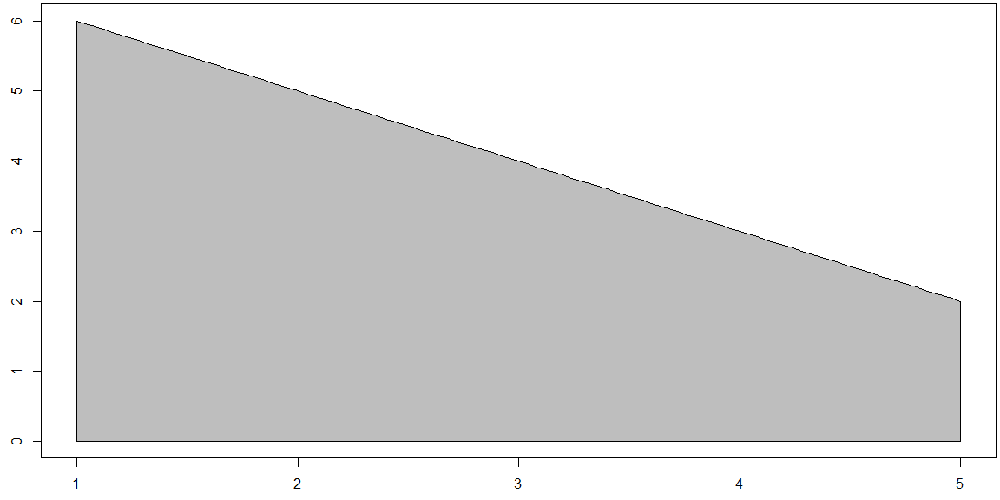<!-- -->

Let's approximate this area using Riemann sums.  With $n=8$ rectangles, we have $\Delta x = \frac{5-1}{8} = 0.5$. If we let $x_i$ be the left end point of each subinterval and then use $f(x_i)$ as the height of each rectangle we obtain the following rectangular approximation to the area under $f$. Notice how the left edge of each rectangle ends precisely on the function. 


``` r
f <- function(x){7-x}
a <- 1
b <- 5
n <- 8
draw_rect_approx(f,a,b,n,method = "left")
```

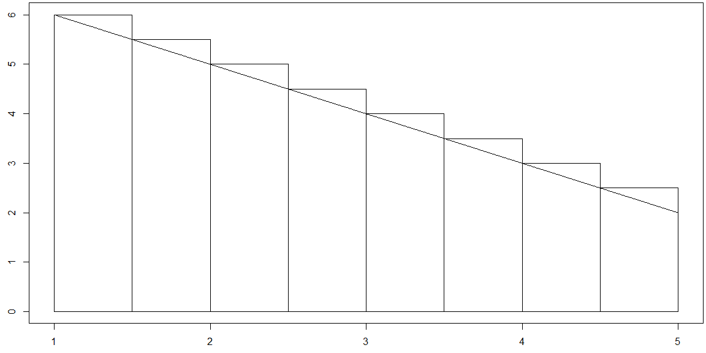<!-- -->

Each of the 8 rectangles above has the same width, but the height or the $i$th rectangle is equal to $f(x_i)$ where $x_i$ is the left point $x$-value of the $i$th rectangle. The points $x_i$, heights $f(x_i)$, and corresponding areas $A_i = f(x_i)\Delta x$, along with the Riemann sum $\sum f(x_i)\Delta x_i$ are displayed with the code below. Notice that the approximation is greater than $A=16$, which occurs precisely because each rectangle is larger than the region it is approximating. 


``` r
dx <- (b-a)/n
xi <- seq(a,b-dx,dx)
kable(data.frame(left_point = xi, function_at_xi = f(xi), area_i = f(xi)*dx))
```


| left_point| function_at_xi| area_i|
|----------:|--------------:|------:|
|        1.0|            6.0|   3.00|
|        1.5|            5.5|   2.75|
|        2.0|            5.0|   2.50|
|        2.5|            4.5|   2.25|
|        3.0|            4.0|   2.00|
|        3.5|            3.5|   1.75|
|        4.0|            3.0|   1.50|
|        4.5|            2.5|   1.25|

``` r
c(riemann_sum_using_left_endpoints = sum(f(xi)*dx))
```

```
## riemann_sum_using_left_endpoints 
##                               17
```

Let's repeat the above, but this time we'll let $x_i$ be the right most point of each rectangle. Notice in the diagram below that the right edge of each rectangle touches the function. 


``` r
xi <- seq(a+dx,b,dx)
draw_rect_approx(f,a,b,n,method = "right")
```

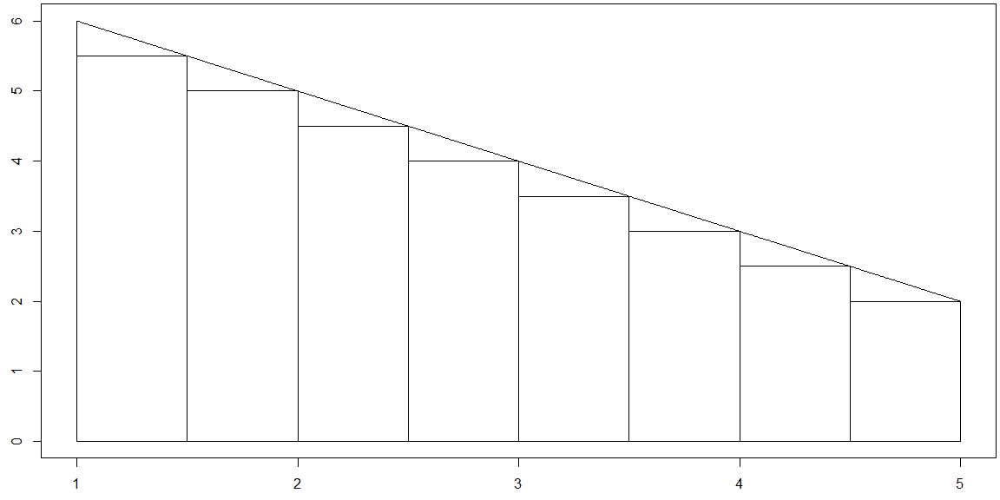<!-- -->

Now each rectangle has an area that is less than the region the rectangle is trying to approximates. The height of each rectangle is now determined by the the right most $x$-value of each rectangle. Because each area $A_i = f(x_i)\Delta x$ is an under approximation, the Riemann sum computed below will be less than the the true area $A=16$. 


``` r
kable(data.frame(right_point = xi, function_at_xi = f(xi), area_i = f(xi)*dx))
```


| right_point| function_at_xi| area_i|
|-----------:|--------------:|------:|
|         1.5|            5.5|   2.75|
|         2.0|            5.0|   2.50|
|         2.5|            4.5|   2.25|
|         3.0|            4.0|   2.00|
|         3.5|            3.5|   1.75|
|         4.0|            3.0|   1.50|
|         4.5|            2.5|   1.25|
|         5.0|            2.0|   1.00|

``` r
c(riemann_sum_using_right_endpoints = sum(f(xi)*dx))
```

```
## riemann_sum_using_right_endpoints 
##                                15
```

When we use the midpoint as our choice for $x_i$ and because the function $f(x) = 7-x$ represents a line, then each rectangle happens to have the exact same area as the trapezoid it approximates. As such, we will get an exact area from a Riemann sum that uses midpoints, as seen below. 


``` r
xi <- seq(a+dx/2,b,dx)
draw_rect_approx(f,a,b,n,method = "mid")
```

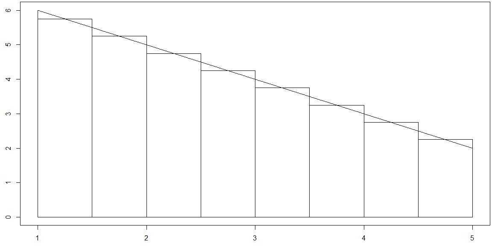<!-- -->

``` r
c(riemann_sum_using_midpoints = sum(f(xi)*dx))
```

```
## riemann_sum_using_midpoints 
##                          16
```

<!---
There may be too much focus on area here.  Should I include expected value as well? I could.  Perhaps I should, as then we won't get an exact answer with the midpoint method on the riemann sum. 

Do I want to conflate the centroid formula here with the Riemann sum formula.  
TECHNICALLY, we will never use  sum(xi*f(xi)) with left or right for computing expected values. If we chose left, then it would be sum( (xi+dx/2)f(xi)dx ), and sum( (x_i-dx/2) f(xi)dx ).  

We of course end up with the same answer whether we use 
sum( (xi+dx/2)f(xi)dx ) or 
sum( (xi f(xi)dx ) 
even if we stick with left sums.  But that's now more analysis related, and we digress. 
So I guess the answer here is, "Don't do left/right Riemann sums with expected value."
--->

### Exercises {-}

1. Let $f(x) = 9-x^2$ for $-2\leq x\leq 3$.  Using $n=20$ subintervals and $x_i$ chosen as the midpoint of each subinterval, the code below provides 33.35938 as an approximation to the area under $f$ above $[-2,3]$. Adapt the code to use right endpoints (obtaining approximate area 32.65625) Then adapt the code to use left endpoints (obtaining approximate area 33.90625). 

``` r
f <- function(x){9-x^2}
a <- -2
b <- 3
n <- 20
draw_rect_approx(f,a,b,n,method = "mid")
dx <- (b-a)/n
xi <- seq(a+dx/2,b,dx)
c(riemann_sum = sum(f(xi)*dx))
```

2. Using the same function and adapting the code above, complete the table below using midpoints as the choice for $x_i$, and then explain why the exact area under $f$ above $[a,b]$ appears to be $A = 33.\bar3$. 
$$\begin{array}{c|c}
n&\sum_{i=1}^nf(x_i)\Delta x\\ \hline
5 & 33.75 \\
10 & 33.4375 \\
20 & 33.35938\\
100 &  \\
1000&  \\
10000&
\end{array}$$

## The Definite Integral - A Limit of Riemann Sums

Let's examine what happens as we increasing the number $n$ of subintervals used in a Riemann sum. Using the function $f(x) = 7-x$ for $1\leq x\leq 5$, with 20 subintervals and picking right endpoints for our $x_i's$, we obtain the following diagram and Riemann sum of 15.6 (an underestimate to the total area). 


``` r
f <- function(x){7-x}
a <- 1
b <- 5
n <- 20
draw_rect_approx(f,a,b,n,method = "right")
```

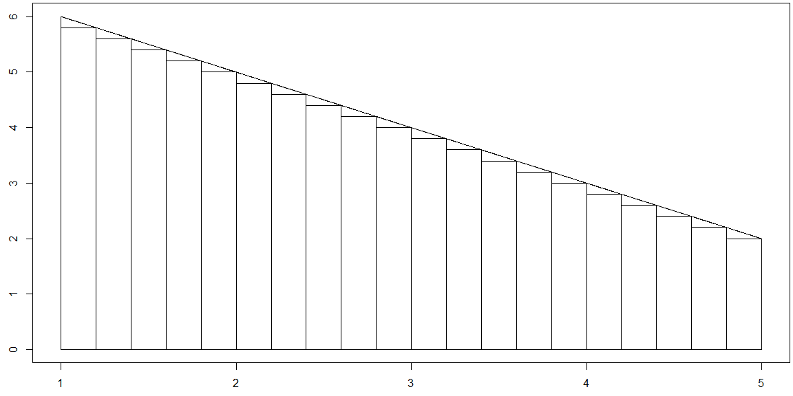<!-- -->

``` r
dx <- (b-a)/n
xi <- seq(a+dx,b,dx)
c(riemann_sum_using_right_endpoints = sum(f(xi)*dx))
```

```
## riemann_sum_using_right_endpoints 
##                              15.6
```

The following table shows the Riemann sum (using right endpoints) as we increase $n$. 
$$\begin{array}{c|c}
n&\sum_{i=1}^nf(x_i)\Delta x\\ \hline
8 & 15 \\
20 & 15.6 \\
100 & 15.92 \\
1000& 15.992 \\
10000& 15.9992 \\
100000& 15.99992
\end{array}$$
From this table it appears that 
$$\lim_{n\to \infty }\sum_{i=1}^nf(x_i)\Delta x = 16.$$
By computing a limit of Riemann sums we were able to extract the exact area of $A = 16$. A limit of Riemann sums we call a definite integral. 

> For a fuction $f(x)$ defined on $a\leq x\leq b$, the definite integral of $f$ from $a$ to $b$ is $$\int_a^b f(x) dx = \lim_{n\to \infty }\sum_{i=1}^nf(x_i)\Delta x,$$ provided the limit exists. If the limit exists, we say that $f$ is integrable on $[a,b]$. 

There are several names attached to pieces of a definite integral $\displaystyle\int_a^b f(x) dx$.

* The integrand is $f(x)$.  
* The variable of integration is $x$.  
* The lower bound is $a$. 
* The upper bound is $b$.

Note that R is not designed to compute definite integrals exactly, rather we can approximate them quite well using Riemann sums. Most computer algebra systems can perform these computations quite easily. We'll use Mathematica in our course to compute definite integrals.  For example, to compute $\displaystyle\int_1^5 (7-x) dx$ in Mathematica, we type the following code.


``` mathematica
Integrate[7-x,{x,1,5}]
```

<!---  We decided to NOT use WolframAlpha. We can revisit this decision later. 

WolframAlpha is a web front end to Mathematica that tries to correctly guess what you mean when inputting code. Any of the following, when entered into WolframAlpha, provide the same result. 

* [Integrate[6-x,{x,0,4}]](https://www.wolframalpha.com/input/?i=Integrate%5B6-x%2C%7Bx%2C0%2C4%7D%5D)
* [integrate 6-x from 0 to 4](https://www.wolframalpha.com/input/?i=integrate+6-x+from+0+to+4)
* [definite integral of 6-x on [0,4]](https://www.wolframalpha.com/input/?i=definite+integral+of+6-x+on+%5B0%2C4%5D)

For simple functions, WolframAlpha generally returns the result we're after, but sometimes WolframAlpha times out and won't return an answer. We'll need to learn to interact with Mathematica directly. Let's compute a few definite integrals with Mathematica, and review the connected vocabulary.
--->


<!---
What kind of examples. 
1. Simple, just type it in and verify. 
2. Change the variable to t, not x, and make the function gross.  
3. Exponential with a specific parameter. Perfect for focusing on infinite bounds. 
4. Exponential with a variable parameter. Perfect for focusing on the variable of integration.  That should be sufficient reading. 
--->

Let's now look at several examples. 
For the definite integral $\displaystyle\int_0^4 x^2 dx$, the integrand is $f(x)=x^2$, the variable of integration is $x$, the lower bound is $a=0$, and the upper bound is $b=4$.  The corresponding Mathematica code is 

``` mathematica
Integrate[x^2,{x,0,4}]
```
Typing this into Mathematica yields $\displaystyle\int_0^4 f(x) dx = \frac{64}{3}.$ Note that is this the area of the parabolic target shown below. 

``` r
f <- function(x){x^2}
draw_target(f,0,4)
```

<!-- -->

Note that the functions $f(x) = x^2$ and $f(t) = t^2$, both defined over all real numbers, are the same function. The name we attach to the input variable does not change the nature of the function.  As such, we sometimes call the variable of integration a "dummy" variable.  We get $\displaystyle\int_0^4 f(t) dt = \frac{64}{3}$ and $\displaystyle\int_0^4 f(x) dx = \frac{64}{3}.$

Verify each of the following with Mathematica. 

* $\displaystyle\int_{0}^{5} 2 dx = 10$ (the area under a target of height 2 for $0\leq x\leq 10$)
* $\displaystyle\int_{-2}^{3} 9-x^2 dx = \frac{100}{3}$
* $\displaystyle\int_{0}^{4} 5 e^{-5 t} dt = 1-\frac{1}{e^{20}}$ (Type "5 Exp[-5 t]" for the integrand).
* $\displaystyle\int_{0}^{\infty} 5 e^{-5 t} dt = 1$ (Type "{t, 0, Infinity}" for the bounds).
* $\displaystyle\int_{a}^{b} c x^2 dx = c \left(\frac{b^3}{3}-\frac{a^3}{3}\right)$ (Mathematica can handle symbolic integration).
* $\displaystyle\int_{a}^{b} c x^2 dc =x^2 \left(\frac{b^2}{2}-\frac{a^2}{2}\right)$ 

The last two examples above show that  for a function with various inputs, such as $f(c,x) = cx^2$, specifying which variable is the variable of integration matters. 

Consider now the function $$f(x) = \begin{cases}3x & 0\leq x \leq 2\\ 0 &\text{otherwise}\end{cases}.$$ 
This function is defined for all real numbers, but is only nonzero for $0\leq x \leq 2$.  To compute $\displaystyle\int_{0}^{5} f(x) dx$, we note that $f(x) = 0$ for $2\leq x\leq 5$, and as such $$\displaystyle\int_{0}^{5} f(x) dx = \displaystyle\int_{0}^{2} f(x) dx = \displaystyle\int_{0}^{2} 3x dx = 6.$$
The last step of the computation we performed in Mathematica. In a similar fashion, with infinite limits we obtain the same result
$$\displaystyle\int_{-\infty}^{\infty} f(x) dx = \displaystyle\int_{0}^{2} f(x) dx = \displaystyle\int_{0}^{2} 3x dx = 6.$$

Consider now the function $$f(x;\lambda) = \lambda e^{-\lambda x} = 
\begin{cases}\lambda e^{-\lambda x} & x\geq 0\\ 0 & x<0\end{cases},$$ 
Where $\lambda$ is assumed to be some positive real number. 
We compute 
$$\displaystyle\int_{-\infty}^{\infty} f(x) dx = \displaystyle\int_{0}^{\infty} f(x) dx = \displaystyle\int_{0}^{\infty} \lambda e^{-\lambda x} dx = 1,$$
where the last step is obtained in Mathematica using the code below. 

``` mathematica
Assuming[\[Lambda] > 0, Integrate[\[Lambda] Exp[-\[Lambda] x], {x, 0, Infinity}]]
```

Note two things above. 

* We added the assumption that $\lambda>0$, using the "Assuming" command.
* To get $\lambda$ to appear as a symbol in Mathematica, we use `\[Lambda]`. This is merely a typesetting issue, and not crucial to computations.

Try running the following lines of code in Mathematica to see what happens if we leave either of the above off. 

``` mathematica
Integrate[\[Lambda] Exp[-\[Lambda] x], {x, 0, Infinity}]
Assuming[lambda > 0, Integrate[lambda Exp[-lambda x], {x, 0, Infinity}]]
```

<!---
I can probably insert a few geometric problems... Maybe. 
--->

To finish this section, remember that for a non-negative function $f(x)$ defined over the interval $[a,b]$, a Riemann $\sum f(x) \Delta x$ provides an approximation to the area under $f(x)$ above $[a,b]$ which is given by the  definite integral $\displaystyle\int_a^b f(x)dx$. As such, we can often compute a definite integral by giving a geometric argument, as shown in the following examples. 

* We know $\displaystyle\int_3^7 5 dx = 20$ because the region under $f(x) =5$ for $3\leq 7$ is a rectangle of width 4 and height 5, hence area $A = (4)(5) = 20$. 
* We know $\displaystyle\int_0^3 2x dx = 9$ because the region under $f(x) =2x$ for $0\leq 3$ is a triangle with width 3 and height $f(2) = 6$, which gives $A = \frac{1}{2}(3)(6) = 9$. 
* We know that $x^2+y^2 = 9$ is a circle of radius 3. Solving for $y$ gives the top half of the circle as $y = \sqrt{9-x^2}$. This means that $\displaystyle\int_{-3}^3\sqrt{9-x^2}dx$ gives the area above the $x$-axis that lies under the top half of the circle. The area inside a quarter of the circle would be, $\displaystyle\int_{0}^3\sqrt{9-x^2}dx = \frac{9\pi}{4}.$
* Note that $(x-4)^2+y^2 = 9$ is the same circle as above, but moved right 3 units. Solving for $y$ gives the top half of this circle as $y = \sqrt{9-(x-4)^2}$. Note that the left end of the circle is at $x=1$, and the right end is at $x=7$, which means the area of half the circle is given by $\displaystyle\int_{1}^7\sqrt{9-(x-4)^2}dx = \frac{9\pi}{2}.$ 

Use the code below to check the last computation with Mathematica. 

``` mathematica
Integrate[Sqrt[9 - (x - 4)^2], {x, 1, 7}]
```


### Exercises {-}
<!---
In this section, the goal is to just practice computing definite integrals. I don't know that they need to do any Riemann sum tables. If we decide otherwise, I have a few exercises almost ready. 
1. Compute a table of Riemann sums, using right endpoints, for the same function in the example. 
1. Compute a table of Riemann sums, using left endpoints, for a different function (parabolic?) where we can check our answer.  Maybe one from a previous section. 
--->
1. If you have not yet, go back through the section and use Mathematica to verify each definite integral computation. 

1. Use an area argument, rather than software or Riemann sums, to state the value of each definite integral. Check your solution with software. 
    a. $\displaystyle\int_2^5 7 dx$
    a. $\displaystyle\int_0^4 (4-x) dx$  triangle
    a. $\displaystyle\int_0^4 \sqrt{16-x^2} dx$
    a. $\displaystyle\int_0^{10} \sqrt{25-(x-5)^2} dx$
    a. $\displaystyle\int_0^7 f(x) dx$ where $f(x) = \begin{cases}3 & 0\leq x\leq 4 \\ 1 & 4< x< 7\end{cases}$
    a. $\displaystyle\int_0^5 f(x) dx$ where $f(x) = \begin{cases}2x & 0\leq x\leq 3 \\ 6 & 3 < x \leq 5\end{cases}$
    a. $\displaystyle\int_0^4 f(x) dx$ where $f(x) = \begin{cases}3x & 0\leq x\leq 1 \\ 4-x & 1\leq x \leq 4\end{cases}$

<!---
How much time do we want to spend on the geometry here?
--->


## PDF, Expected Value, Variance, Standard Deviation

With the definite integral defined, we now return our attention to probability and continuous random variables. We state several definitions, two of which we've seen before but now we state in terms of definite integrals. 

> A **probability density function** $f(x)$ is a nonnegative ($f(x)\geq 0$) function that satisfies $\displaystyle\int_{-\infty}^{\infty}f(x)dx = 1$. 

Note that if a function is zero everywhere except on an interval $a\leq x\leq b$, then the above simplifies to $\displaystyle\int_a^b f(x) dx = 1$. This same principle applies to the next 3 definitions. 

> The **expected value** of a continuous random variable $X$ with probability density function $f(x)$ is $$\text{E}[X] = \int_{-\infty}^{\infty} x f(x) dx.$$ 

> The **variance** of a continuous random variable$X$ with probability density function $f(x)$ is $$\text{Var}[X] = \int_{-\infty}^{\infty} (x-\text{E}[X])^2 f(x) dx.$$ 

> The **standard deviation** of a continuous random variable  $X$ with probability density function $f(x)$ is equal to the square root of the variance, so $\sigma_X = \sqrt{\text{Var}[X]}$. 

When the context is clear, we'll drop the subscript an simply use $\sigma$ for the standard deviation.  

Note that for a discrete random variable $X$ where outcome $x_i$ has probability $p_i$, we defined the expected value to be $\text{E}[X] = \sum x_i p_i$. For a continous random variable with probability *density* function $f(x)$, multiplying the density $f(x)$ by a length $dx$ gives a probability. Replacing $\sum$ with $\int_a^b$, then $x_i$ with $x$, and finally $p_i$ with $f(x)dx$ shows how $$\sum x_i p_i \quad\text{becomes}\quad \underbrace{\int_a^b}_{\sum} \underbrace{x}_{x_i}\underbrace{f(x) dx}_{p_i}.$$
Using this same correspondence, we could obtain formulas for the variance and standard deviation of discrete random variables. You may encounter the expected value, variance, and standard deviation of random variables in future courses. The goal in this section is to just practice using definite integrals to compute them. 

Time to practice. Remember to use Mathematica to compute all definite integrals.  

1. For the function $g(x) = \begin{cases}5-x&0\leq x\leq 5\\0&\text{otherwise}\end{cases}$, we will first find a value $k$ so that $f(x) = kg(x)$ is a probability density function for a random variable $X$. We will then compute the expected value, variance, and standard deviation of $X$.  
    * A graph of $g(x)$ reveals that $g(x)\geq 0$ (one part of being a PDF). The function $g$ is zero everywhere except for $0\leq x\leq 5$, which means $$\int_{-\infty}^{\infty}g(x)dx = \int_{0}^{5}(5-x)dx = \frac{25}{2}.$$ We let $k = \frac{2}{25}$ and obtain $\displaystyle \int_{0}^{5}\frac{2}{25}(5-x)dx = 1.$ This means $f(x) = kg(x) = \begin{cases}\frac{2}{25}(5-x)&0\leq x\leq 5\\0&\text{otherwise}\end{cases}$ is a probability density function for a random variable $X$.   
    * The expected value of $X$ is $$\text{E}[X] = \int_{-\infty}^{\infty} x f(x) dx = \int_{0}^{5}x\frac{2}{25}(5-x)dx = \frac{5}{3}\approx 1.66667.$$
    * The variance of $X$ is $$\text{Var}[X] = \int_{-\infty}^{\infty} (x-\text{E}[X])^2 f(x) dx = \int_{0}^{5}\left(x-\frac{5}{3}\right)^2\frac{2}{25}(5-x)dx = \frac{25}{18}\approx 1.38889.$$
    * The standard deviation of $X$ is $\sigma_X = \sqrt{\text{Var}[X]} = \sqrt{\frac{25}{18}}\approx 1.17851$
  
2. For the function $g(x) = \begin{cases}e^{-7x}&0\leq x < \infty\\0&\text{otherwise}\end{cases}$, we will first find a value $k$ so that $f(x) = kg(x)$ is a probability density function for a random variable $X$. We will then compute the expected value, variance, and standard deviation of $X$.  
    * A graph of $g(x)$ reveals that $g(x)\geq 0$ (one part of being a PDF). The function $g$ is zero everywhere except for $0\leq x<\infty$, which means $$\int_{-\infty}^{\infty}g(x)dx = \int_{0}^{\infty}e^{-7x}dx = \frac{1}{7}.$$ We let $k =7$ and obtain $\displaystyle \int_{0}^{\infty}7e^{-7x}dx = 1.$ This means $f(x) = kg(x) = \begin{cases}7e^{-7x}&0\leq x<\infty\\0&\text{otherwise}\end{cases}$ is a probability density function for a random variable $X$.   
    * The expected value of $X$ is $$\text{E}[X] = \int_{-\infty}^{\infty} x f(x) dx = \int_{0}^{\infty}x7e^{-7x}dx = \frac{1}{7}.$$
    * The variance of $X$ is $$\text{Var}[X] = \int_{-\infty}^{\infty} (x-\text{E}[X])^2 f(x) dx = \int_{0}^{\infty}\left(x-\frac{1}{7}\right)^27e^{-7x}dx = \frac{1}{49}.$$
    * The standard deviation of $X$ is $\sigma_X = \sqrt{\text{Var}[X]} = \sqrt{\frac{1}{49}} = \frac{1}{7}$. 
    
### Exercises {-}

1. For each function $g(x)$ below, suppose $X$ is a random variable with probability density function $f(x) = kg(x)$. Start by finding the value $k$ that makes $kg(x)$ a probability density function. Then compute (1) the expected value $\text{E}[X]$, (2) the variance $\text{Var}[X]$, and (3) the standard deviation $\sigma$.   
    a. $g(x) = \begin{cases}x^2 & 0\leq x\leq 7\\ 0 & \text{otherwise}\end{cases}$
    a. $g(x) = \begin{cases}e^{-3x} & 0\leq x<\infty\\ 0 & \text{otherwise}\end{cases}$ 
    a. For $\lambda>0$, let $g(x) = \begin{cases}e^{-\lambda x} & 0\leq x<\infty\\ 0 & \text{otherwise}\end{cases}$ (See the previous section to review how to use Mathematica's  `Assuming[]` command. )
    a. $g(x) = \begin{cases}1 & 2\leq x\leq 7\\ 0 & \text{otherwise}\end{cases}$ 
    a. $g(x) = \begin{cases}1 & a\leq x\leq b\\ 0 & \text{otherwise}\end{cases}$ 


<!---

8. Computations requiring the students to compute $F(x)$ for specific values of a function.  We WON'T be getting the general formula for $F(x)$ yet. We'll let that appear when we get the fundamental theorem of calculus. 

I'm thinking of skipping 8 for now.  I think adding it in when we do the accumulation function is the right spot.  Then we can discuss the different variable t vs x at that point in time. 

I have not discussed the huge list of properties related to piecewise functions.  Should we do that another time, or mix it in above.  I think that can take on its own day.


So this section is NOT about computing CDFs exactly. Or maybe it can be, using software.  Do we include Mathematica commands here?  We easily could (that way they can check if their Riemann sums are close to the exact answer). Should we wait?  This seems like the right spot to add examples of the circle and trapezoid, as well as maybe a cubic or something else that they cannot look up on a chart or easily compute from two other things that can be looked up. 


# Day 5: CDFs, Accumulation Functions, Probability between values, FTOC 

Note that we can state the FTOC without ever needing to discuss anti derivatives.  WE can even use it, if we have the students practice using the accumulation function (rather than an antiderivative).  I'm game with that. 

# Day 6: Piecewise defined functions

# Day 7: Antiderivatives and Indefinite Integrals

We hold off on this as long as possible, and it's not even really that crucial to the understanding in the class. 

--->
